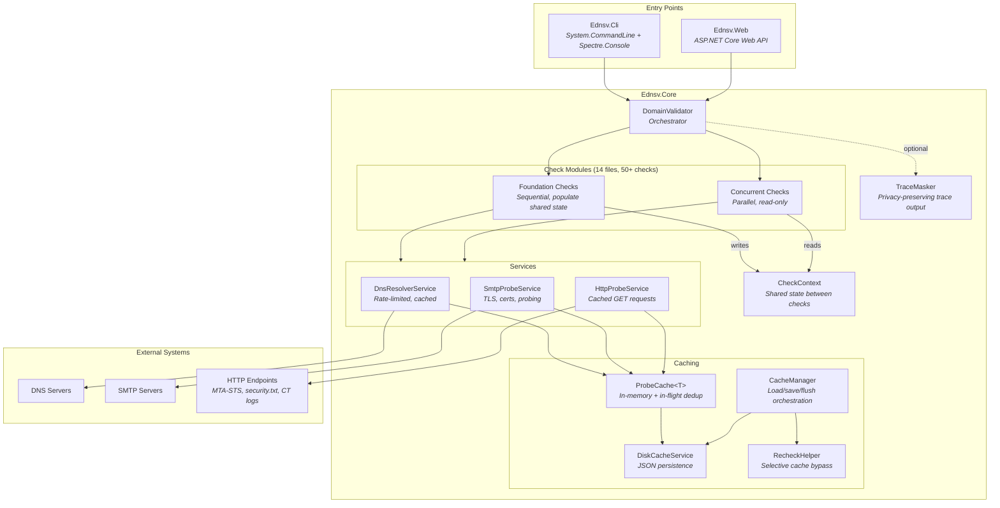

# System Architecture Overview

EDNSV (Email DNS Validator) is a comprehensive DNS and email infrastructure validation tool that performs 80+ automated checks on domains to assess deliverability, security, and compliance. It is built on .NET 8.0 and can be run as a CLI tool or a web service.

## High-Level Architecture



## Project Structure

```
ednsv.sln
├── src/
│   ├── Ednsv.Core/                    # Core validation engine (class library)
│   │   ├── DomainValidator.cs         # Main orchestrator — pipeline phases
│   │   ├── CheckDescriptions.cs       # Built-in check category descriptions
│   │   ├── Models/
│   │   │   └── CheckResult.cs         # CheckResult, ValidationReport, enums
│   │   ├── Checks/                    # Check implementations
│   │   │   ├── ICheck.cs              # ICheck interface, CheckContext, ValidationOptions
│   │   │   ├── BasicRecordChecks.cs   # A, AAAA, CNAME
│   │   │   ├── DelegationChecks.cs    # NS delegation chain, consistency
│   │   │   ├── DkimChecks.cs          # DKIM selectors, ARC
│   │   │   ├── DmarcChecks.cs         # DMARC policy, inheritance, reporting
│   │   │   ├── ExtendedChecks.cs      # CAA, DANE, TLSA, security.txt
│   │   │   ├── HighValueChecks.cs     # MTA-STS, TLS-RPT, BIMI, DNSSEC
│   │   │   ├── MiscChecks.cs          # Wildcard, TTL, TXT hygiene
│   │   │   ├── MxChecks.cs            # MX records, IP detection, null MX
│   │   │   ├── NsChecks.cs            # NS records, lame delegation, diversity
│   │   │   ├── PtrAndBlacklistChecks.cs # PTR, FCrDNS, DNSBL
│   │   │   ├── SecurityChecks.cs      # DNSSEC validation, SMTP TLS
│   │   │   ├── SmtpChecks.cs          # SMTP banner, EHLO, TLS, timing
│   │   │   └── SpfChecks.cs           # SPF parsing, lookup limits, macros
│   │   └── Services/
│   │       ├── DnsResolverService.cs  # DNS queries, rate limiting, caching
│   │       ├── SmtpProbeService.cs    # SMTP probing, TLS, certificates
│   │       ├── HttpProbeService.cs    # HTTP/HTTPS GET with caching
│   │       ├── ProbeCache.cs          # Generic cache with in-flight dedup
│   │       ├── DiskCacheService.cs    # JSON-based disk persistence
│   │       ├── DnsCacheSerializer.cs  # DNS response serialization
│   │       ├── CacheManager.cs        # Cache load/save/flush orchestration
│   │       ├── RecheckHelper.cs       # Selective cache bypass for recheck
│   │       └── TraceMasker.cs         # SHA256 hashing of sensitive trace data
│   │
│   ├── Ednsv.Cli/                     # CLI application
│   │   └── Program.cs                 # System.CommandLine entry point
│   │
│   └── Ednsv.Web/                     # Web service
│       ├── Program.cs                 # ASP.NET Core API + ValidationTracker
│       └── wwwroot/index.html         # Single-page web UI
│
├── tests/
│   └── Ednsv.Core.Tests/             # xUnit tests
│       ├── DiskCacheTests.cs          # Cache round-trip persistence
│       ├── InMemoryCacheTests.cs      # Cache behavior, dedup, hit tracking
│       └── TraceMaskerTests.cs        # Privacy masking determinism
│
└── .github/workflows/ci.yml          # CI: build, test, integration tests
```

## Component Overview

| Component | Responsibility |
|-----------|---------------|
| **DomainValidator** | Orchestrates the 4-phase validation pipeline (prefetch, foundation, concurrent, deferred retry). Creates CheckContext with shared state and coordinates check execution. |
| **ICheck implementations** | 50+ individual checks organized into 14 files. Each check receives a domain and CheckContext, returning a list of CheckResult objects. |
| **CheckContext** | Thread-safe shared state populated by foundation checks (MxHosts, NsHosts, SpfRecord, DmarcRecord, etc.) and read by concurrent checks. Also holds per-validation SMTP probe cache and error tracking. |
| **DnsResolverService** | Executes DNS queries with rate limiting (40 tokens/sec, max 50 concurrent), in-memory caching, and unreachable server tracking. Supports custom nameservers. |
| **SmtpProbeService** | Connects to SMTP servers, performs STARTTLS handshake, extracts TLS/certificate details. Supports port probing (587, 465), RCPT verification, and relay testing. |
| **HttpProbeService** | Performs HTTP/HTTPS GET requests with caching. Used for MTA-STS policies, security.txt, and Certificate Transparency logs. |
| **ProbeCache\<T\>** | Generic in-memory cache using MemoryCache with in-flight request deduplication via `Lazy<Task<T>>`. Supports TTL, recheck bypass, and disk export. |
| **DiskCacheService** | Persists cache to 11 JSON files in `.ednsv-cache/` with per-entry timestamps and merge-on-save strategy. |
| **CacheManager** | Coordinates disk cache load at startup, periodic background flush, and on-completion save. Determines recheck dependencies from previous results. |
| **RecheckHelper** | Maps check categories to cache dependency flags. Uses `AsyncLocal<CacheDep>` to selectively bypass service caches per-validation without clearing shared entries. |
| **TraceMasker** | SHA256-hashes hostnames, IPs, email addresses, and DKIM selectors in trace output for privacy. Supports deterministic salt for consistent hashes across runs. |
| **ValidationTracker** | (Web only) Manages async validation jobs with progress tracking, real-time severity counters, and service stats via baseline snapshots. |

## Technology Stack

| Layer | Technology |
|-------|-----------|
| Runtime | .NET 8.0 |
| DNS queries | [DnsClient](https://www.nuget.org/packages/DnsClient) 1.7.0 |
| CLI parsing | [System.CommandLine](https://www.nuget.org/packages/System.CommandLine) 2.0.0-beta4 |
| CLI rich output | [Spectre.Console](https://www.nuget.org/packages/Spectre.Console) 0.48.0 |
| Web framework | ASP.NET Core (built-in) |
| In-memory cache | Microsoft.Extensions.Caching.Memory 8.0.1 |
| Serialization | System.Text.Json 10.0.5 |
| Testing | xUnit 2.4.2, coverlet (code coverage) |

## Key Design Decisions

### Foundation vs. Concurrent Check Split

Foundation checks (AuthoritativeNs, A, AAAA, MX, SPF, DMARC) run **sequentially** because they populate shared state in CheckContext that all other checks depend on. This ordering is required — for example, MX checks need NS resolution to have completed, and SPF/DMARC parsing feeds into dozens of downstream checks.

Concurrent checks (~50) run in **parallel** (max 12) because they only **read** from the shared state established by foundation checks. This design maximizes throughput while keeping the shared state model simple and race-free.

### Service Sharing Across Validations

The three core services (DNS, SMTP, HTTP) are designed as singletons with thread-safe caches. When validating multiple domains (CLI batch mode or Web API concurrent requests), services are shared so that overlapping infrastructure queries (e.g., same MX host across domains) benefit from cached results.

### Per-Validation Isolation

While services are shared, each validation gets its own CheckContext with isolated error tracking (`QueryErrors`), SMTP probe cache, and recheck context (`AsyncLocal<CacheDep>`). This prevents cross-validation interference in concurrent web scenarios.
