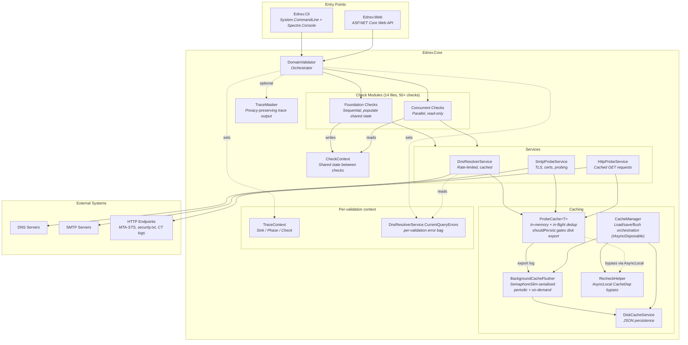

# System Architecture Overview

EDNSV (Email DNS Validator) is a comprehensive DNS and email infrastructure validation tool that performs 80+ automated checks on domains to assess deliverability, security, and compliance. It is built on .NET 8.0 and can be run as a CLI tool or a web service.

## High-Level Architecture



## Project Structure

```
ednsv.sln
├── src/
│   ├── Ednsv.Core/                    # Core validation engine (class library)
│   │   ├── DomainValidator.cs         # Main orchestrator — pipeline phases
│   │   ├── CheckDescriptions.cs       # Built-in check category descriptions
│   │   ├── Models/
│   │   │   └── CheckResult.cs         # CheckResult, ValidationReport, enums
│   │   ├── Checks/                    # Check implementations
│   │   │   ├── ICheck.cs              # ICheck interface, CheckContext, ValidationOptions
│   │   │   ├── BasicRecordChecks.cs   # A, AAAA, CNAME
│   │   │   ├── DelegationChecks.cs    # NS delegation chain, consistency
│   │   │   ├── DkimChecks.cs          # DKIM selectors, ARC
│   │   │   ├── DmarcChecks.cs         # DMARC policy, inheritance, reporting
│   │   │   ├── ExtendedChecks.cs      # CAA, DANE, TLSA, security.txt
│   │   │   ├── HighValueChecks.cs     # MTA-STS, TLS-RPT, BIMI, DNSSEC
│   │   │   ├── MiscChecks.cs          # Wildcard, TTL, TXT hygiene
│   │   │   ├── MxChecks.cs            # MX records, IP detection, null MX
│   │   │   ├── NsChecks.cs            # NS records, lame delegation, diversity
│   │   │   ├── PtrAndBlacklistChecks.cs # PTR, FCrDNS, DNSBL
│   │   │   ├── SecurityChecks.cs      # DNSSEC validation, SMTP TLS
│   │   │   ├── SmtpChecks.cs          # SMTP banner, EHLO, TLS, timing
│   │   │   └── SpfChecks.cs           # SPF parsing, lookup limits, macros
│   │   └── Services/
│   │       ├── DnsResolverService.cs  # DNS queries, rate limiting (token bucket + concurrency cap)
│   │       ├── SmtpProbeService.cs    # SMTP probing, TLS, certificates
│   │       ├── HttpProbeService.cs    # HTTP/HTTPS GET with caching + concurrency cap (20)
│   │       ├── ProbeCache.cs          # Generic cache with in-flight dedup + shouldPersist
│   │       ├── DiskCacheService.cs    # JSON persistence + BackgroundCacheFlusher
│   │       ├── DnsCacheSerializer.cs  # DNS response serialization
│   │       ├── CacheManager.cs        # Cache load/save/flush orchestration (IAsyncDisposable)
│   │       ├── RecheckHelper.cs       # AsyncLocal-based selective cache bypass for recheck
│   │       ├── TraceContext.cs        # AsyncLocal sink + Phase/Check labels for structured tracing
│   │       ├── TraceMasker.cs         # SHA256 hashing of sensitive trace data
│   │       ├── AuthService.cs         # Web auth (token hash + per-user files)
│   │       └── ConfigService.cs       # Live admin config (categories, DKIM selectors)
│   │
│   ├── Ednsv.Cli/                     # CLI application
│   │   └── Program.cs                 # System.CommandLine entry point
│   │
│   └── Ednsv.Web/                     # Web service
│       ├── Program.cs                 # ASP.NET Core API + ValidationTracker (IDisposable, 1h job retention)
│       └── wwwroot/index.html         # Single-page web UI
│
├── tests/
│   └── Ednsv.Core.Tests/             # xUnit tests
│       ├── DiskCacheTests.cs          # Cache round-trip persistence
│       ├── InMemoryCacheTests.cs      # Cache behavior, dedup, hit tracking
│       └── TraceMaskerTests.cs        # Privacy masking determinism
│
└── .github/workflows/ci.yml          # CI: build, test, integration tests
```

## Component Overview

| Component | Responsibility |
|-----------|---------------|
| **DomainValidator** | Orchestrates the 4-phase validation pipeline (prefetch, foundation, concurrent, deferred retry). Creates CheckContext with shared state and coordinates check execution. |
| **ICheck implementations** | 50+ individual checks organized into 14 files. Each check receives a domain and CheckContext, returning a list of CheckResult objects. |
| **CheckContext** | Thread-safe shared state populated by foundation checks (MxHosts, NsHosts, SpfRecord, DmarcRecord, etc.) and read by concurrent checks. Also holds per-validation SMTP probe cache and error tracking. |
| **DnsResolverService** | Executes DNS queries with rate limiting (40 tokens/sec via token bucket, max 50 concurrent), in-memory caching, and unreachable-server tracking with 5-minute time-decay. Routes per-validation errors via an AsyncLocal bag. Supports custom nameservers. |
| **SmtpProbeService** | Connects to SMTP servers, performs STARTTLS handshake, extracts TLS/certificate details. Supports port probing (587, 465), RCPT verification, and relay testing. |
| **HttpProbeService** | Performs HTTP/HTTPS GET requests with caching, 10 s timeout per request, and a `SemaphoreSlim(20)` outbound concurrency cap. Used for MTA-STS policies, security.txt, BIMI, Certificate Transparency, autodiscover, and DoH propagation. |
| **ProbeCache\<T\>** | Generic in-memory cache using MemoryCache with in-flight request deduplication via `Lazy<Task<T>>`. Supports TTL, recheck bypass via AsyncLocal, a `shouldPersist` predicate (transient errors stay in-memory only), and an `onHit` callback for hit counting. |
| **DiskCacheService** | Persists cache to JSON files under `<DataDir>/cache/` with per-entry timestamps and merge-on-save. Domain-result writes are serialised with a static `SemaphoreSlim`. |
| **BackgroundCacheFlusher** | Periodic disk flusher with `SemaphoreSlim(1, 1)` lock so timer ticks, manual flushes, and on-completion saves never run concurrently. Implements `IAsyncDisposable` and performs a final flush on shutdown. |
| **CacheManager** | Coordinates disk cache load at startup, routes flushes through the flusher's lock, and exposes `RequestFlush` for fire-and-forget calls. Determines recheck dependencies from previous results. `IAsyncDisposable`. |
| **RecheckHelper** | Maps check categories to cache dependency flags. `CurrentRecheckDeps` is an `AsyncLocal<CacheDep>` that selectively bypasses service caches per-validation without clearing shared entries. CLI and Web API both use this same mechanism. |
| **TraceContext** | Static AsyncLocal holder for the per-validation trace `Sink`, `Phase` label (PREFETCH / FOUNDATION / CONCURRENT), and `Check` name. Lets singleton services emit trace lines that automatically carry the right job/phase/check identifiers. |
| **TraceMasker** | SHA256-hashes hostnames, IPs, email addresses, and DKIM selectors in trace output for privacy. Supports deterministic salt for consistent hashes across runs. |
| **ValidationTracker** | (Web only) Manages async validation jobs with progress tracking, real-time severity counters, and service stats via baseline snapshots. `IDisposable` — runs a 5 min cleanup timer that evicts jobs older than 1 hour. |

## Technology Stack

| Layer | Technology |
|-------|-----------|
| Runtime | .NET 8.0 |
| DNS queries | [DnsClient](https://www.nuget.org/packages/DnsClient) 1.7.0 |
| CLI parsing | [System.CommandLine](https://www.nuget.org/packages/System.CommandLine) 2.0.0-beta4 |
| CLI rich output | [Spectre.Console](https://www.nuget.org/packages/Spectre.Console) 0.48.0 |
| Web framework | ASP.NET Core (built-in) |
| In-memory cache | Microsoft.Extensions.Caching.Memory 8.0.1 |
| Serialization | System.Text.Json 10.0.5 |
| Testing | xUnit 2.4.2, coverlet (code coverage) |

## Key Design Decisions

### Foundation vs. Concurrent Check Split

Foundation checks (AuthoritativeNs, A, AAAA, MX, SPF, DMARC) run **sequentially** because they populate shared state in CheckContext that all other checks depend on. This ordering is required — for example, MX checks need NS resolution to have completed, and SPF/DMARC parsing feeds into dozens of downstream checks.

Concurrent checks (~50) run in **parallel** (max 12) because they only **read** from the shared state established by foundation checks. This design maximizes throughput while keeping the shared state model simple and race-free.

### Service Sharing Across Validations

The three core services (DNS, SMTP, HTTP) are designed as singletons with thread-safe caches. When validating multiple domains (CLI batch mode or Web API concurrent requests), services are shared so that overlapping infrastructure queries (e.g., same MX host across domains) benefit from cached results.

### Per-Validation Isolation

While services are shared, each validation gets its own CheckContext with isolated SMTP probe cache and a set of `AsyncLocal` slots that flow through `await` boundaries into the singleton services. This prevents cross-validation interference in concurrent web scenarios:

| AsyncLocal | Owner | Effect |
|------------|-------|--------|
| `RecheckHelper.CurrentRecheckDeps` | static | `ProbeCache.TryGet` returns a miss for cache types in the flag set, forcing fresh fetches for the matching categories without disturbing other concurrent users. |
| `DnsResolverService.CurrentQueryErrors` | static | DNS errors raised inside the singleton resolver are routed into the per-validation `CheckContext.QueryErrors` bag instead of a shared one. |
| `TraceContext.Sink` / `Phase` / `Check` | static | Trace lines from the shared services land in the originating validation's logger scope, with the correct phase/check labels. |

All four are written at the top of `DomainValidator.ValidateAsync` and cleared in the cleanup block at the end of the method.

### CancellationToken-driven timeouts

Every check invocation now runs under a `CancellationTokenSource` (45 s for foundation/concurrent, 30 s for the deferred retry phase). The token is passed into `ICheck.RunAsync(domain, ctx, ct)` so cancellable awaits inside checks (and the LookupClient paths they reach) tear down promptly when the timeout fires. The older `Task.WhenAny(check, Task.Delay(timeout))` pattern was removed because it left timed-out work running in the background, holding sockets and rate-limit tokens until natural completion.

### Concurrent-write safety

Every shared write surface in the cache layer is now serialised:

- `BackgroundCacheFlusher._lock` (`SemaphoreSlim(1, 1)`) gates `SaveAsync` calls. Timer flushes use `WaitAsync(0)` and skip when one is already in progress; explicit and dispose-time flushes block.
- `DiskCacheService._domainResultsLock` (static `SemaphoreSlim(1, 1)`) gates the read-modify-write on `domain-results.json`, with `temp file → File.Move(overwrite=true)` for atomic publication.
- `CacheManager.FlushAsync` routes through the flusher's lock when one exists, so manual and background flushes can never overlap.
