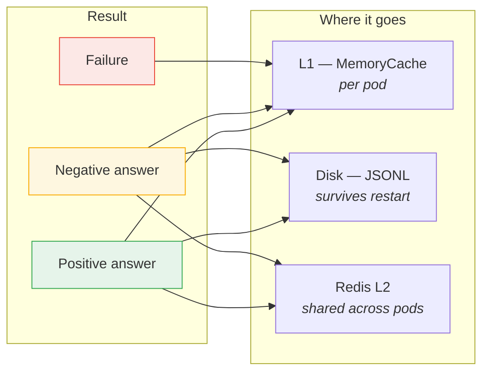

# Cache Behaviour Map

One page for the question "this check gave me an odd answer — how long will it stay
that way, and where else has it gone?"

[caching-architecture.md](caching-architecture.md) describes the machinery. This maps it
onto what the checks actually ask for: which record types, what the resolver can reply,
and what each reply costs you if it is wrong.

---

## 1. The only classification that matters

Every DNS reply lands in exactly one of three buckets, and they are cached on completely
different terms. Almost every caching surprise in this codebase has come from two of
them being confused.


| | Positive answer | Negative answer | Failure |
|---|---|---|---|
| **Meaning** | "here are the records" | "this name/type does not exist" | "I could not tell you" |
| **Is it an answer?** | yes | **yes** | no |
| **RCODE** | `NoError` + records | `NXDomain`, or `NoError` with no records (NODATA) | `SERVFAIL`, `REFUSED`, timeout, socket error |
| **TTL source** | minimum record TTL in the answer | SOA `MINIMUM` in the authority section (RFC 2308 §5) | none — nothing was published |
| **Ceiling** | `CacheTtlHours` | **`min(CacheTtlHours, DnsNegativeTtlCapSeconds)`** | 30s, fixed |
| **Persisted to disk** | yes | yes | **no** |
| **Shared via Redis** | yes | yes | **no** |
| **Republished on re-warm** | yes | yes | **no** |
| **If it is wrong, you get** | a stale record | **a false finding** | a check that says "not checked" |

---

## 2. `DnsNegativeTtlCapSeconds` — a TTL for a *positive non-result*

**This is the setting most likely to be misread, so it is worth being blunt about.**

`DnsNegativeTtlCapSeconds` does **not** govern timeouts, unreachable servers, or errors.
It governs **successful lookups that positively established a non-result**.

> The resolver answered. The answer was "no such thing". That is a *result* — the zone
> published it, signed it if DNSSEC is on, and attached an SOA saying how long to
> believe it. It is cached and persisted exactly like a record, because it *is* an
> answer.

Every one of these is a positive non-result, and all of them are governed by this cap:

- `selector1._domainkey.example.com` **TXT** → NXDOMAIN — *the selector does not exist*
- `5.4.3.2.in-addr.arpa` **PTR** → NXDOMAIN — *this IP has no reverse DNS*
- `4.3.2.1.zen.spamhaus.org` **A** → NXDOMAIN — *not listed on this blocklist*
- `example.com` **CAA** → NODATA — *the name exists, but publishes no CAA*
- `_dmarc.sub.example.com` **TXT** → NXDOMAIN — *no subdomain DMARC override*

If instead the query **timed out** or came back **SERVFAIL**, none of the above applies:
that is a *failure*, it gets 30 seconds, and it never leaves the pod.

### Why the ceiling is far below `CacheTtlHours`

The asymmetry is deliberate, and it is about blast radius rather than freshness:

- A stale **positive** answer means you report an IP or a record that has since changed.
  Annoying, self-correcting, rarely alarming.
- A stale **negative** answer means you report that something **does not exist**. That is
  what turns into `No PTR record — many receivers reject mail from IPs without reverse
  DNS`: a confident, actionable, *wrong* finding.

A resolver under load can return a spurious NXDOMAIN. Zones routinely publish generous
SOA minimums — `cnn.com`'s reverse zones publish **86400** (the Route 53 default) — so
honouring it verbatim meant one bad reply was believed for the full `CacheTtlHours`,
written to disk, and shared with every pod in the fleet. Ten minutes bounds that to
something that self-corrects before anyone finishes reading the report.

Resolvers generally cap negative caching well below positive for the same reason;
RFC 2308 §5 recommends 1–3 hours as a *maximum* and notes shorter is safer.

### Edge cases and nuance

| Situation | What happens | Why |
|---|---|---|
| **Gating is off** (`DnsCacheMinTtlSeconds=0`, the default) | The cap **still applies**. Negatives get 600s; positives get `CacheTtlHours`. | It is a ceiling, not part of the gating. The damage it bounds does not depend on whether record-TTL gating is enabled — and gating ships off, so this *is* the default path. |
| **SOA minimum is shorter than the cap** (e.g. 60s) | 60s wins. | A ceiling, never a floor. A zone asking for less gets less. |
| **SOA minimum is shorter than `DnsCacheMinTtlSeconds`** | Raised to the floor. | The floor applies to negatives exactly as to positives — it exists to stop refetch storms, and a 5-second NXDOMAIN would cause one. |
| **Negative answer with no SOA at all** | Takes the cap (600s), *not* `CacheTtlHours`. | A narrow exception to "no published TTL → inherit `CacheTtlHours`". The code only reaches this branch once the reply is confirmed an *answer* with an empty answer section, so it is still a negative — and the cap is the safer of the two readings. |
| **`DnsNegativeTtlCapSeconds` > `CacheTtlHours`** | `CacheTtlHours` wins. | It remains the outer ceiling for everything. The sweep deletes a record file at `fileTime + CacheTtlHours`, so a longer-lived entry could be swept while still considered live. |
| **`DnsNegativeTtlCapSeconds=0`** | Cap removed. Negatives are bounded by `CacheTtlHours` like anything else. | The pre-existing behaviour, for anyone who wants it back. |
| **A recheck** | Bypasses it entirely. | The cap shortens an entry's life; a recheck ignores its life altogether — `TryGet` returns a miss for the flagged types and the L2 read is skipped too. "Recheck all" always reaches the network. |
| **`CacheTtlHours=0`** (no expiry) | The cap still applies to negatives. | `min(∞, 600s)` = 600s. Turning expiry off is a statement about positive results. |
| **The CLI** | Same rules. The CLI usually runs without a cache TTL, so the cap is often the only ceiling a negative answer has. | |

### What it does *not* fix

The cap limits how long a wrong negative answer survives. **It cannot make a resolver
answer correctly.** If your resolver returns a spurious NXDOMAIN every time, you will see
the finding every time — just in a window that closes in ten minutes rather than two
hours, and without it propagating to disk or to peers.

To tell a bad resolver from a genuine non-result, compare inside and outside:

```
dig -x 52.101.9.17            # your resolver
dig -x 52.101.9.17 @1.1.1.1   # a public one
```

---

## 3. What each check family asks for, and what it costs

87 checks across 27 categories. Grouped by the cache they land in and the record types
they query. **"Non-result meaning"** is what a negative answer means for that family —
i.e. what the 600s cap is protecting you from believing for too long.

### DNS-record checks → `_queryCache` (L1 + disk + Redis)

| Category | Checks | Record types | Non-result meaning |
|---|---|---|---|
| A / AAAA | 2 | `A`, `AAAA` | host does not resolve |
| MX | 8 | `MX`, `A`, `AAAA`, `CNAME`, `PTR` | no mail exchanger |
| SPF | 10 | `TXT`, `A` | no SPF policy |
| DMARC | 9 | `TXT`, `A` | no DMARC policy / no subdomain override |
| DKIM | 2 | `TXT`, `CNAME` *(speculative)* | **selector does not exist** — the bulk of all negatives |
| TXT | 3 | `TXT` | no verification records |
| NS / SOA / Delegation | 13 | `NS`, `SOA`, `A`, `CNAME` | no delegation, no glue |
| DNSSEC | 2 | `DNSKEY`, `DS`, `RRSIG`, `NSEC3PARAM` | zone unsigned |
| CAA | 2 | `CAA`, `A`, `AAAA`, `PTR` | no issuer restriction |
| DANE | 2 | `TLSA`, `DS` | no TLSA record |
| SRV / Autodiscover | 2 | `SRV`, `A`, `AAAA`, `CNAME` | service not advertised |
| IPv6 / TTL / Wildcard / CNAME | 5 | `A`, `AAAA`, `MX`, `TXT`, `CNAME` | no AAAA / no wildcard |
| DNSBL / DomainBL | 4 | `A` | **not listed** — a negative is the *good* outcome |

### Reverse lookups → `_ptrCache` (L1 + disk + Redis)

| Category | Checks | Record types | Non-result meaning |
|---|---|---|---|
| PTR | 2 | `PTR` (+ `A`/`AAAA` to confirm) | **IP has no reverse DNS** |
| FCrDNS | 1 | `PTR`, `A`, `AAAA` | forward confirmation impossible |

The PTR path is the one where a mis-cached negative is most expensive, because the
finding it produces (`Gmail/Outlook will reject mail`) reads as urgent. It is also the
only cache with an explicit **failure sentinel**: a lookup that could not complete
returns a distinguished empty list, and the checks report `reverse lookup failed — not
checked` rather than counting it. See *Failure is not absence* in
[caching-architecture.md](caching-architecture.md).

### Per-nameserver queries → `_serverQueryCache` (L1 + disk + Redis)

| Category | Checks | Record types | Extra mechanism |
|---|---|---|---|
| NS / Delegation / Propagation | ~7 | `SOA`, `A`, `MX`, `NS` | **Unreachable-server breaker** — 3 failures within 5 minutes short-circuits that nameserver. The *only* place occurrence-counting exists. |

### Not DNS at all

| Category | Checks | Cache | Notes |
|---|---|---|---|
| SMTP | 13 | `_probeCache`, `_portCache`, `_rcptCache`, `_relayCache` | Port probes are an `ExpiringMap`/value cache: **L1 + disk, never Redis** |
| MTA-STS / TLSRPT / BIMI / security.txt | 4 | `_getCache`, `_getWithHeadersCache` | HTTP; any status code counts as definitive, only status-0 network failures are transient |
| ZoneTransfer | 1 | `_axfrCache` | `ExpiringMap`, verdict persisted, response never |

---

## 4. Which tier holds what



A failure reaching disk or Redis would be a bug — it is gated in three places
independently: the write bag, the L2 write-through, and the shared-cache key index that
`WarmSharedCache` reads.

---

## 5. Settings that move these numbers

| Setting | Default | Governs |
|---|---|---|
| `CacheTtlHours` | `2` | The outer ceiling on everything, and the lifetime of anything without a tighter rule |
| `DnsCacheMinTtlSeconds` | `0` (off) | **Floor** on published TTLs. Off = published TTLs are ignored entirely and everything gets `CacheTtlHours` |
| `DnsNegativeTtlCapSeconds` | `600` | **Ceiling** on negative answers only. Applies whether or not gating is on |
| `ProbeCachePolicy.TransientLifetime` | `30s` (constant) | Failures. Not configurable — it only needs to span one validation |
| `UnreachableDecayMinutes` | `5` | The per-nameserver breaker window (`_serverQueryCache` only) |

Full reference: [configuration.md](configuration.md).
