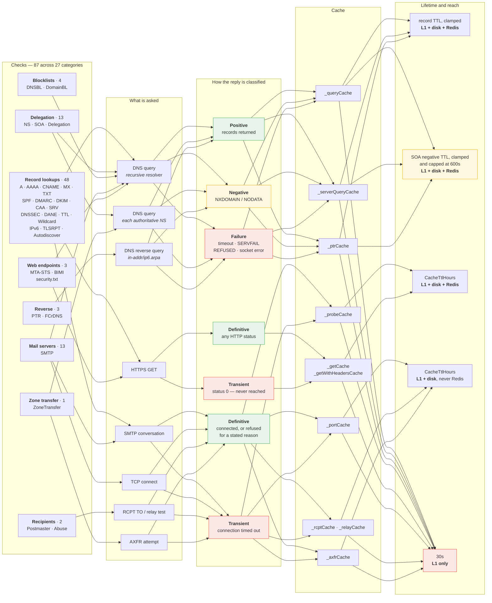
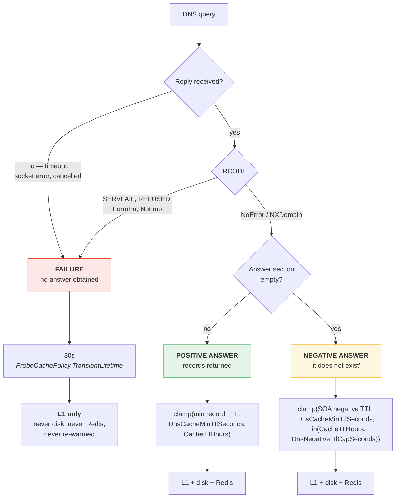
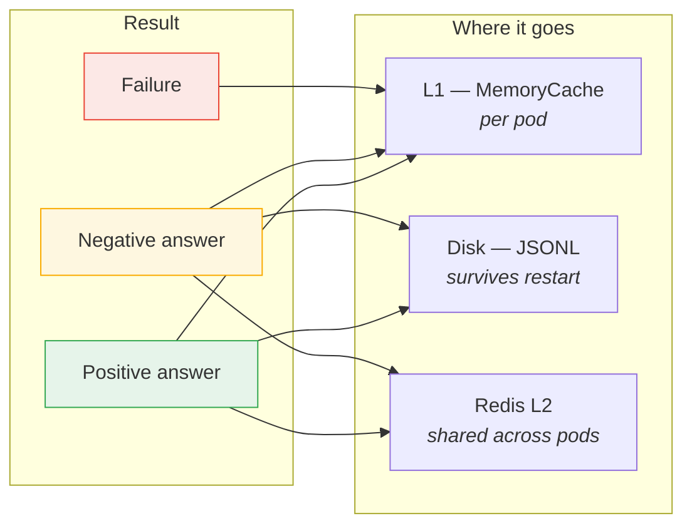

# Cache Behaviour Map

What each check asks for, what the network can answer, and how long each kind of answer
is kept. [caching-architecture.md](caching-architecture.md) covers the machinery — tiers,
flushing, the recheck bypass; this maps it onto the checks.

---

## 1. The whole picture

Left to right: the 87 checks, grouped by what they probe → the record or protocol they
use → how the reply is classified → which cache holds it → how long, and how far it
travels.

A few record-lookup checks reach past DNS — Certificate Transparency fetches the CT
logs over HTTPS, and the DANE and IPv6 checks open an SMTP conversation to inspect the
certificate — which is why that group has edges to more than one probe.

Three things to read off it:

- **Every probe family has a transient class**, and it always lands in the same place —
  30 seconds, L1 only, never disk, never Redis, never republished on a re-warm.
- **Only DNS has a *negative* class.** SMTP, HTTP and AXFR are binary: it worked or it
  did not. DNS alone can answer "that does not exist" as a fact worth keeping, which is
  why it gets its own ceiling.
- **Four caches never reach Redis.** `_portCache`, `_rcptCache`, `_relayCache` and
  `_axfrCache` are L1 and disk only, so those verdicts do not cross between pods.

---

## 2. DNS results — the three kinds

DNS is where most of the work happens and where the classification matters most, so it
is worth stating precisely.

| | Positive answer | Negative answer | Failure |
|---|---|---|---|
| **Meaning** | "here are the records" | "this name/type does not exist" | "I could not tell you" |
| **Is it an answer?** | yes | **yes** | no |
| **RCODE** | `NoError` + records | `NXDomain`, or `NoError` with no records (NODATA) | `SERVFAIL`, `REFUSED`, timeout, socket error |
| **TTL source** | minimum record TTL in the answer | SOA `MINIMUM` in the authority section (RFC 2308 §5) | none — nothing was published |
| **Ceiling** | `CacheTtlHours` | `min(CacheTtlHours, DnsNegativeTtlCapSeconds)` | 30s, fixed |
| **Reaches disk** | yes | yes | **no** |
| **Reaches Redis** | yes | yes | **no** |
| **Republished on re-warm** | yes | yes | **no** |
| **If wrong, you get** | a stale record | a false finding | a check that says "not checked" |

**A negative answer is an answer.** The zone published it, with an SOA saying how long to
believe it, so it is cached and persisted exactly like a record. A *failure* is the
absence of an answer — nothing was learned, so nothing is worth keeping or sharing.

Cases that are routinely negative rather than broken: an absent DKIM selector, an IP with
no PTR, a "not listed" blocklist reply, a name that publishes no CAA.

---

## 3. SMTP, HTTP and AXFR results

The other probes have no equivalent of a negative answer — there is no protocol-level way
for a mail server to publish "this port is authoritatively shut for the next hour". They
split two ways instead: **definitive** (persisted, `CacheTtlHours`) or **transient**
(L1 only, 30s).

| Probe | Cache | Definitive — persisted | Transient — L1 only |
|---|---|---|---|
| SMTP handshake | `_probeCache` | connected, or failed with a stated reason | `Connection timed out` |
| Port reachability | `_portCache` | open, or at least one attempt was refused | every attempt timed out |
| RCPT / relay | `_rcptCache`, `_relayCache` | the server gave a verdict | no usable conversation |
| HTTP GET | `_getCache`, `_getWithHeadersCache` | any HTTP status, 4xx and 5xx included | status 0 — the host was never reached |
| Zone transfer | `_axfrCache` | the transfer was allowed or refused | the TCP attempt failed |

Two of these are worth noting:

- **An HTTP 404 is a definitive answer**, not a failure — "there is no MTA-STS policy
  here" is a result. Only a status of 0, meaning the request never got a response at all,
  is transient.
- **A failed zone transfer is never recorded.** Reduced to a boolean, "the TCP attempt
  failed" is indistinguishable from "the transfer was refused", so caching it would
  record *not vulnerable* for a server nobody reached.

---

## 4. Lifetimes

| Setting | Default | Applies to | Role |
|---|---|---|---|
| `CacheTtlHours` | `2` | everything | The outer ceiling, and the lifetime of anything without a tighter rule |
| `DnsCacheMinTtlSeconds` | `0` (off) | DNS answers | **Floor** on published TTLs. At `0` no published TTL is read at all and every answer takes `CacheTtlHours` |
| `DnsNegativeTtlCapSeconds` | `600` | DNS negative answers only | **Ceiling.** Independent of the floor — it applies whether or not gating is on |
| `ProbeCachePolicy.TransientLifetime` | `30s` | every probe family's transient class | Constant. Long enough to stop one validation re-asking what just failed |
| `UnreachableDecayMinutes` | `5` | `_serverQueryCache` only | After `MaxRetries` (3) failures, that nameserver is skipped for this long |

Negative answers are capped well below positive ones because the two fail differently: a
stale positive reports a record that has since changed, while a stale negative reports
that something *does not exist* — which surfaces as a finding rather than a detail.
Zones often publish generous SOA minimums (a day is common), so without a ceiling a
single wrong `NXDOMAIN` would be believed for the full `CacheTtlHours`, persisted, and
shared with every pod. Resolvers generally cap negative caching for the same reason;
RFC 2308 §5 treats 1–3 hours as a maximum.

### Interactions worth knowing

| Situation | Result |
|---|---|
| Gating off (`DnsCacheMinTtlSeconds=0`, the default) | Positives take `CacheTtlHours`; negatives still take the cap. It is a ceiling, not part of the gating |
| SOA minimum shorter than the cap | The SOA wins — the cap is never a floor |
| SOA minimum shorter than `DnsCacheMinTtlSeconds` | Raised to the floor, exactly as a positive TTL would be |
| Negative answer carrying no SOA | Takes the cap, not `CacheTtlHours`. It is still a negative answer, and the cap is the safer reading |
| `DnsNegativeTtlCapSeconds` > `CacheTtlHours` | `CacheTtlHours` wins. The sweep deletes a record file at `fileTime + CacheTtlHours`, so nothing may outlive it |
| `DnsNegativeTtlCapSeconds=0` | Cap removed; negatives are bounded by `CacheTtlHours` like anything else |
| `CacheTtlHours=0` (no expiry) | Negatives still take the cap — `min(∞, 600s)` |
| A recheck | Bypasses every cached read for the flagged types, including the L2. Lifetimes are irrelevant to it |
| CLI | Same rules. It usually runs without a cache TTL, so the negative cap is often the only ceiling in play |

A cap bounds how long a wrong answer survives; it cannot make a resolver answer
correctly. Comparing the configured resolver against a public one (`dig -x <ip>` versus
`dig -x <ip> @1.1.1.1`) is what separates a bad resolver from a genuine non-result.

---

## 5. Every check, its record types, and where its results are cached

All 87 checks. **Record types queried** includes types reached indirectly through
`CheckContext` — a check reading `ctx.MxHosts` depends on the cached `MX` lookup even
though it issues no query itself. **Recheck flags** are the `CacheDep` bits a recheck of
that category bypasses; see *Recheck System* in
[caching-architecture.md](caching-architecture.md).

| Category | Check | Record types queried | Caches used | Recheck flags |
|---|---|---|---|---|
| A | A Records | `A` | `_queryCache` | `Dns` |
| AAAA | AAAA Records | `AAAA` | `_queryCache` | `Dns` |
| Abuse | Abuse Address | `MX` | `_queryCache`, `_rcptCache` | `Rcpt` |
| Autodiscover | Autodiscover | `A`, `CNAME`, `SRV` | `_queryCache` | `Dns, Http` |
| BIMI | BIMI | `TXT` | `_getCache`, `_queryCache` | `Dns, Http` |
| CAA | CAA Records | `CAA` | `_queryCache` | `Dns` |
|  | Certificate Transparency | — | `_getCache` | `Dns` |
| CNAME | CNAME Chain | `CNAME` | `_queryCache` | `Dns` |
| DANE | DANE TLSA Cert Match | `MX`, `TLSA` | `_probeCache`, `_queryCache` | `Dns, Smtp` |
|  | DANE/TLSA | `DS`, `MX`, `TLSA` | `_queryCache` | `Dns, Smtp` |
| DKIM | ARC Selector Records | `TXT` | `_queryCache` | `Dns` |
|  | DKIM Selectors | `A`, `AAAA`, `CNAME`, `NS`, `TXT` | `_axfrCache`, `_queryCache` | `Dns` |
| DMARC | DMARC External Report Auth | `TXT` | `_queryCache` | `Dns` |
|  | DMARC Inheritance | `TXT` | `_queryCache` | `Dns` |
|  | DMARC Percentage (pct) Analysis | `TXT` | `_queryCache` | `Dns` |
|  | DMARC Record | `TXT` | `_queryCache` | `Dns` |
|  | DMARC Report Target MX | `MX`, `TXT` | `_queryCache` | `Dns` |
|  | DMARC Report URI Validation | `A`, `MX`, `TXT` | `_queryCache` | `Dns` |
|  | DMARC Subdomain Policy Analysis | `TXT` | `_queryCache` | `Dns` |
|  | SPF+DMARC Combined | `TXT` | `_queryCache` | `Dns` |
|  | Subdomain DMARC Override | `TXT` | `_queryCache` | `Dns` |
| DNSBL | Extended IP Blocklist Check | `A`, `AAAA` | `_queryCache` | `Dns` |
|  | IP Blocklist Check (DNSBL) | `A`, `AAAA`, `MX` | `_queryCache` | `Dns` |
| DNSSEC | DNSSEC | `DNSKEY`, `DS`, `RRSIG` | `_queryCache` | `Dns` |
|  | NSEC/NSEC3 Zone Walk | `A`, `DS`, `NSEC3PARAM` | `_queryCache` | `Dns` |
| Delegation | Authoritative NS | `A`, `AAAA`, `NS`, `PTR` | `_ptrCache`, `_queryCache` | `Dns, ServerDns, Ptr` |
|  | Delegation Chain | `CNAME`, `NS` | `_queryCache` | `Dns, ServerDns, Ptr` |
|  | Delegation Consistency | `A`, `NS` | `_queryCache`, `_serverQueryCache` | `Dns, ServerDns, Ptr` |
|  | NS Glue Records | `A`, `NS` | `_queryCache`, `_serverQueryCache` | `Dns, ServerDns, Ptr` |
| DomainBL | Domain Blocklist Check | `A` | `_queryCache` | `Dns` |
|  | MX Hostname Blocklist (RHSBL) | `A`, `MX` | `_queryCache` | `Dns` |
| FCrDNS | Forward-Confirmed rDNS (FCrDNS) | `A`, `AAAA`, `PTR` | `_ptrCache`, `_queryCache` | `Dns, Ptr` |
| IPv6 | IPv6 Readiness | `AAAA`, `MX` | `_queryCache` | `Dns, Smtp` |
|  | SMTP IPv6 Connectivity | `AAAA`, `MX` | `_portCache`, `_queryCache` | `Dns, Smtp` |
| MTASTS | MTA-STS | `MX`, `TLSA`, `TXT` | `_getCache`, `_queryCache` | `Dns, Http` |
| MX | MX Backup Security Parity | `MX` | `_probeCache`, `_queryCache` | `Dns, Smtp, Ptr` |
|  | MX CNAME Check | `CNAME`, `MX` | `_queryCache` | `Dns, Smtp, Ptr` |
|  | MX Priority Distribution | `MX` | `_queryCache` | `Dns, Smtp, Ptr` |
|  | MX Private IP Detection | `A`, `AAAA` | `_queryCache` | `Dns, Smtp, Ptr` |
|  | MX Records | `A`, `AAAA`, `MX`, `PTR` | `_probeCache`, `_ptrCache`, `_queryCache` | `Dns, Smtp, Ptr` |
|  | MX-to-IP Detection | `MX` | `_queryCache` | `Dns, Smtp, Ptr` |
|  | Mail Subdomain Survey | `A`, `CNAME` | `_queryCache` | `Dns, Smtp, Ptr` |
|  | Null MX / Duplicates | `MX` | `_queryCache` | `Dns, Smtp, Ptr` |
| NS | DNS Propagation Consistency | `A`, `MX` | `_getCache`, `_queryCache`, `_serverQueryCache` | `Dns, ServerDns` |
|  | Duplicate NS IPs | `A`, `AAAA` | `_queryCache` | `Dns, ServerDns` |
|  | NS Lame Delegation | `A`, `AAAA`, `NS`, `SOA` | `_queryCache`, `_serverQueryCache` | `Dns, ServerDns` |
|  | NS Minimum Count | `NS` | `_queryCache` | `Dns, ServerDns` |
|  | NS Network Diversity | `A`, `AAAA` | `_queryCache` | `Dns, ServerDns` |
|  | NS Records | `NS` | `_queryCache` | `Dns, ServerDns` |
|  | Open Recursive Resolver Detection | `A`, `AAAA`, `NS` | `_queryCache`, `_serverQueryCache` | `Dns, ServerDns` |
| PTR | MX Reverse DNS (PTR) | `A`, `AAAA`, `MX`, `PTR` | `_ptrCache`, `_queryCache` | `Dns, Ptr` |
|  | Reverse DNS (PTR) | `A`, `PTR` | `_ptrCache`, `_queryCache` | `Dns, Ptr` |
| Postmaster | Postmaster Address | `MX` | `_queryCache`, `_rcptCache` | `Rcpt` |
| SMTP | Catch-All Detection | `MX` | `_queryCache`, `_rcptCache` | `Dns, Smtp, Port` |
|  | EHLO Capabilities | `MX` | `_probeCache`, `_queryCache` | `Dns, Smtp, Port` |
|  | Open Relay Test | `MX` | `_queryCache`, `_relayCache` | `Dns, Smtp, Port` |
|  | SMTP Banner Validation | `MX` | `_probeCache`, `_queryCache` | `Dns, Smtp, Port` |
|  | SMTP Banner vs Reverse DNS | `A`, `AAAA`, `MX`, `PTR` | `_probeCache`, `_ptrCache`, `_queryCache` | `Dns, Smtp, Port` |
|  | SMTP Max Message Size | `MX` | `_probeCache`, `_queryCache` | `Dns, Smtp, Port` |
|  | SMTP REQUIRETLS (RFC 8689) | `MX` | `_probeCache`, `_queryCache` | `Dns, Smtp, Port` |
|  | SMTP TLS Certificate | `MX` | `_probeCache`, `_queryCache` | `Dns, Smtp, Port` |
|  | SMTP TLS Certificate Chain | `MX` | `_probeCache`, `_queryCache` | `Dns, Smtp, Port` |
|  | SMTP TLS Version | `MX` | `_probeCache`, `_queryCache` | `Dns, Smtp, Port` |
|  | SMTP Transaction Timing | `MX` | `_probeCache`, `_queryCache` | `Dns, Smtp, Port` |
|  | STARTTLS Enforcement | `MX` | `_probeCache`, `_queryCache` | `Dns, Smtp, Port` |
|  | Submission Ports | `MX` | `_portCache`, `_probeCache`, `_queryCache` | `Dns, Smtp, Port` |
| SOA | SOA Record | `SOA` | `_queryCache` | `Dns, ServerDns` |
|  | SOA Serial Consistency | `A`, `AAAA`, `NS`, `SOA` | `_queryCache`, `_serverQueryCache` | `Dns, ServerDns` |
| SPF | MX Hosts Covered by SPF | `A`, `AAAA`, `MX`, `TXT` | `_queryCache` | `Dns` |
|  | SPF +all in Includes | `TXT` | `_queryCache` | `Dns` |
|  | SPF IP Overlap Detection | `TXT` | `_queryCache` | `Dns` |
|  | SPF Include Depth | `TXT` | `_queryCache` | `Dns` |
|  | SPF Lookup Count | `TXT` | `_queryCache` | `Dns` |
|  | SPF Macros | `TXT` | `_queryCache` | `Dns` |
|  | SPF Record | `TXT` | `_queryCache` | `Dns` |
|  | SPF Record Size | `TXT` | `_queryCache` | `Dns` |
|  | SPF Recursive Expansion | `A`, `AAAA`, `MX`, `TXT` | `_queryCache` | `Dns` |
|  | Subdomain SPF Coverage | `A`, `MX`, `TXT` | `_queryCache` | `Dns` |
| SRV | Mail Service SRV Records | `SRV` | `_queryCache` | `Dns` |
| SecurityTxt | security.txt (RFC 9116) | — | `_getCache` | `Http` |
| TLSRPT | TLS Reporting (TLS-RPT) | `MX`, `TXT` | `_queryCache` | `Dns` |
| TTL | TTL Sanity | `MX`, `TXT` | `_queryCache` | `Dns` |
| TXT | All TXT Records | `TXT` | `_queryCache` | `Dns` |
|  | Duplicate/Conflicting TXT Records | `TXT` | `_queryCache` | `Dns` |
|  | Email Provider Verification TXT | `TXT` | `_queryCache` | `Dns` |
| Wildcard | Wildcard DNS | `A`, `MX`, `TXT` | `_queryCache` | `Dns` |
| ZoneTransfer | AXFR Exposure | `A`, `AAAA`, `NS` | `_axfrCache`, `_queryCache` | `Dns, Axfr` |
### The caches

| Cache | Holds | L1 | Disk | Redis | Notes |
|---|---|---|---|---|---|
| `_queryCache` | DNS answers, keyed `q:domain:type` | yes | yes | yes | The busiest cache. Shared by `QueryAsync`, `QueryDnsblAsync` and `QuerySpeculativeAsync` |
| `_ptrCache` | Reverse lookups, keyed `ptr:ip` | yes | yes | yes | Distinguishes a failed lookup from an absent PTR — see below |
| `_serverQueryCache` | Per-nameserver answers, keyed `sq:server:domain:type` | yes | yes | yes | The only path with the unreachable-server breaker |
| `_probeCache` | SMTP handshakes, keyed `smtp:host:port` | yes | yes | yes | |
| `_portCache` | Port reachability, keyed `port:host:port` | yes | yes | **no** | A `ProbeCacheValue<bool>` |
| `_rcptCache` | RCPT verdicts | yes | yes | **no** | `ExpiringMap` + `WriteBag` |
| `_relayCache` | Open-relay verdicts | yes | yes | **no** | `ExpiringMap` + `WriteBag` |
| `_getCache` / `_getWithHeadersCache` | HTTP GETs, keyed by URL | yes | yes | yes | Any HTTP status is definitive; only a status-0 network failure is transient |
| `_axfrCache` | Zone-transfer verdicts | yes | yes | **no** | The transfer *response* is held in memory only — a whole zone is too large to persist |

All of them honour the recheck bypass: `ProbeCache.TryGet`, `ProbeCacheValue.TryGet` and
`ExpiringMap.TryGetValue` each take the `CacheDep` flag and return a miss for the types
being rechecked, and `GetOrCreateAsync` skips the L2 read as well.

### Families where a negative is the normal answer

| Family | Query | A negative means | Volume per validation |
|---|---|---|---|
| DKIM / ARC selectors | `TXT`, `CNAME` at `<selector>._domainkey.<domain>` | that selector is not published | up to 39 selectors + 7 ARC |
| DNSBL / DomainBL | `A` at `<reversed-ip>.<zone>` | not listed — the good outcome | 21 zones × each MX IP |
| Subdomain probes | `TXT`/`A` at SPF, DMARC, mail-survey and SRV names | no record at that subdomain | 19 + 10 + 9 + 5 |

A clean domain is the heaviest negative-caching case: nothing is listed and nothing
exists, so most answers in the run are negative ones.

### Reverse lookups: failure versus absence

`_ptrCache` holds a `List<string>`, so an absent PTR and a failed lookup would both be
the empty list. A lookup that could not complete returns a distinguished instance,
tested with `DnsResolverService.PtrLookupDidFail`, and its consumers report it as
unchecked rather than as a finding:

| Check | Genuine negative | Failure |
|---|---|---|
| Reverse DNS (PTR) | ⚠ `<ip>: No PTR record` | detail: `reverse lookup failed — not checked` |
| MX Reverse DNS (PTR) | ✗ `No PTR record — many receivers reject mail…` | detail, and the IP drops out of the total |
| Forward-Confirmed rDNS | ✗ `No PTR record — Gmail requires FCrDNS…` | detail, and the IP drops out of the total |
| SMTP Banner vs Reverse DNS | detail: `No PTR record to compare with banner` | detail, and not counted as a mismatch |
| Authoritative NS, MX Records | `No PTR` / `none` in the detail line | `lookup failed` in the detail line |

Elsewhere the two are still separated in the cache — a failure gets 30s and never leaves
the pod — but the check output does not say which it was.

---

## 6. Which tier holds what

A failure reaching disk or Redis would be a bug. It is gated in three places
independently: the write bag, the L2 write-through, and the shared-cache key index that
`WarmSharedCache` reads.

Full setting reference: [configuration.md](configuration.md).
