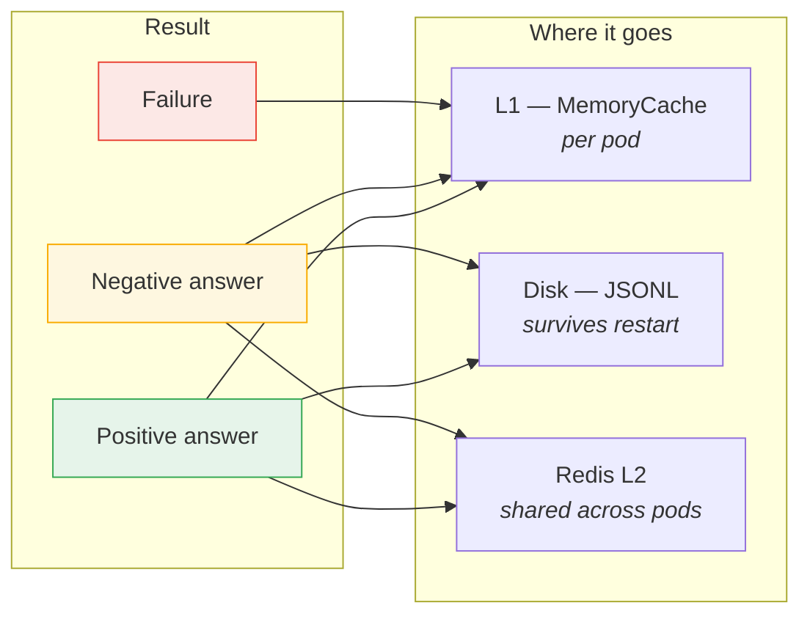

# Cache Behaviour Map

One page for the question "this check gave me an odd answer — how long will it stay
that way, and where else has it gone?"

[caching-architecture.md](caching-architecture.md) describes the machinery. This maps it
onto what the checks actually ask for: which record types, what the resolver can reply,
and what each reply costs you if it is wrong.

---

## 1. The only classification that matters

Every DNS reply lands in exactly one of three buckets, and they are cached on completely
different terms. Almost every caching surprise in this codebase has come from two of
them being confused.


| | Positive answer | Negative answer | Failure |
|---|---|---|---|
| **Meaning** | "here are the records" | "this name/type does not exist" | "I could not tell you" |
| **Is it an answer?** | yes | **yes** | no |
| **RCODE** | `NoError` + records | `NXDomain`, or `NoError` with no records (NODATA) | `SERVFAIL`, `REFUSED`, timeout, socket error |
| **TTL source** | minimum record TTL in the answer | SOA `MINIMUM` in the authority section (RFC 2308 §5) | none — nothing was published |
| **Ceiling** | `CacheTtlHours` | **`min(CacheTtlHours, DnsNegativeTtlCapSeconds)`** | 30s, fixed |
| **Persisted to disk** | yes | yes | **no** |
| **Shared via Redis** | yes | yes | **no** |
| **Republished on re-warm** | yes | yes | **no** |
| **If it is wrong, you get** | a stale record | **a false finding** | a check that says "not checked" |

---

## 2. `DnsNegativeTtlCapSeconds` — a TTL for a *positive non-result*

**This is the setting most likely to be misread, so it is worth being blunt about.**

`DnsNegativeTtlCapSeconds` does **not** govern timeouts, unreachable servers, or errors.
It governs **successful lookups that positively established a non-result**.

> The resolver answered. The answer was "no such thing". That is a *result* — the zone
> published it, signed it if DNSSEC is on, and attached an SOA saying how long to
> believe it. It is cached and persisted exactly like a record, because it *is* an
> answer.

Every one of these is a positive non-result, and all of them are governed by this cap:

- `selector1._domainkey.example.com` **TXT** → NXDOMAIN — *the selector does not exist*
- `5.4.3.2.in-addr.arpa` **PTR** → NXDOMAIN — *this IP has no reverse DNS*
- `4.3.2.1.zen.spamhaus.org` **A** → NXDOMAIN — *not listed on this blocklist*
- `example.com` **CAA** → NODATA — *the name exists, but publishes no CAA*
- `_dmarc.sub.example.com` **TXT** → NXDOMAIN — *no subdomain DMARC override*

If instead the query **timed out** or came back **SERVFAIL**, none of the above applies:
that is a *failure*, it gets 30 seconds, and it never leaves the pod.

### Why the ceiling is far below `CacheTtlHours`

The asymmetry is deliberate, and it is about blast radius rather than freshness:

- A stale **positive** answer means you report an IP or a record that has since changed.
  Annoying, self-correcting, rarely alarming.
- A stale **negative** answer means you report that something **does not exist**. That is
  what turns into `No PTR record — many receivers reject mail from IPs without reverse
  DNS`: a confident, actionable, *wrong* finding.

A resolver under load can return a spurious NXDOMAIN. Zones routinely publish generous
SOA minimums — `cnn.com`'s reverse zones publish **86400** (the Route 53 default) — so
honouring it verbatim meant one bad reply was believed for the full `CacheTtlHours`,
written to disk, and shared with every pod in the fleet. Ten minutes bounds that to
something that self-corrects before anyone finishes reading the report.

Resolvers generally cap negative caching well below positive for the same reason;
RFC 2308 §5 recommends 1–3 hours as a *maximum* and notes shorter is safer.

### Edge cases and nuance

| Situation | What happens | Why |
|---|---|---|
| **Gating is off** (`DnsCacheMinTtlSeconds=0`, the default) | The cap **still applies**. Negatives get 600s; positives get `CacheTtlHours`. | It is a ceiling, not part of the gating. The damage it bounds does not depend on whether record-TTL gating is enabled — and gating ships off, so this *is* the default path. |
| **SOA minimum is shorter than the cap** (e.g. 60s) | 60s wins. | A ceiling, never a floor. A zone asking for less gets less. |
| **SOA minimum is shorter than `DnsCacheMinTtlSeconds`** | Raised to the floor. | The floor applies to negatives exactly as to positives — it exists to stop refetch storms, and a 5-second NXDOMAIN would cause one. |
| **Negative answer with no SOA at all** | Takes the cap (600s), *not* `CacheTtlHours`. | A narrow exception to "no published TTL → inherit `CacheTtlHours`". The code only reaches this branch once the reply is confirmed an *answer* with an empty answer section, so it is still a negative — and the cap is the safer of the two readings. |
| **`DnsNegativeTtlCapSeconds` > `CacheTtlHours`** | `CacheTtlHours` wins. | It remains the outer ceiling for everything. The sweep deletes a record file at `fileTime + CacheTtlHours`, so a longer-lived entry could be swept while still considered live. |
| **`DnsNegativeTtlCapSeconds=0`** | Cap removed. Negatives are bounded by `CacheTtlHours` like anything else. | The pre-existing behaviour, for anyone who wants it back. |
| **A recheck** | Bypasses it entirely. | The cap shortens an entry's life; a recheck ignores its life altogether — `TryGet` returns a miss for the flagged types and the L2 read is skipped too. "Recheck all" always reaches the network. |
| **`CacheTtlHours=0`** (no expiry) | The cap still applies to negatives. | `min(∞, 600s)` = 600s. Turning expiry off is a statement about positive results. |
| **The CLI** | Same rules. The CLI usually runs without a cache TTL, so the cap is often the only ceiling a negative answer has. | |

### What it does *not* fix

The cap limits how long a wrong negative answer survives. **It cannot make a resolver
answer correctly.** If your resolver returns a spurious NXDOMAIN every time, you will see
the finding every time — just in a window that closes in ten minutes rather than two
hours, and without it propagating to disk or to peers.

To tell a bad resolver from a genuine non-result, compare inside and outside:

```
dig -x 52.101.9.17            # your resolver
dig -x 52.101.9.17 @1.1.1.1   # a public one
```

---

## 3. Every check, its record types, and where its results are cached

All 87 checks. **Record types queried** includes types reached indirectly through
`CheckContext` (a check reading `ctx.MxHosts` depends on the cached `MX` lookup even
though it issues no query itself). **Recheck flags** are the `CacheDep` bits that a
recheck of this category bypasses — see *Recheck System* in
[caching-architecture.md](caching-architecture.md).

Read it with §1 in mind: every one of these queries can come back positive, negative or
failed, and the three are cached on entirely different terms. A negative on a DKIM
selector or a blocklist is the *expected* result, not an error.

| Category | Check | Record types queried | Caches used | Recheck flags |
|---|---|---|---|---|
| A | A Records | `A` | `_queryCache` | `Dns` |
| AAAA | AAAA Records | `AAAA` | `_queryCache` | `Dns` |
| Abuse | Abuse Address | `MX` | `_queryCache`, `_rcptCache` | `Rcpt` |
| Autodiscover | Autodiscover | `A`, `CNAME`, `SRV` | `_queryCache` | `Dns, Http` |
| BIMI | BIMI | `TXT` | `_getCache`, `_queryCache` | `Dns, Http` |
| CAA | CAA Records | `CAA` | `_queryCache` | `Dns` |
|  | Certificate Transparency | — | `_getCache` | `Dns` |
| CNAME | CNAME Chain | `CNAME` | `_queryCache` | `Dns` |
| DANE | DANE TLSA Cert Match | `MX`, `TLSA` | `_probeCache`, `_queryCache` | `Dns, Smtp` |
|  | DANE/TLSA | `DS`, `MX`, `TLSA` | `_queryCache` | `Dns, Smtp` |
| DKIM | ARC Selector Records | `TXT` | `_queryCache` | `Dns` |
|  | DKIM Selectors | `A`, `AAAA`, `CNAME`, `NS`, `TXT` | `_axfrCache`, `_queryCache` | `Dns` |
| DMARC | DMARC External Report Auth | `TXT` | `_queryCache` | `Dns` |
|  | DMARC Inheritance | `TXT` | `_queryCache` | `Dns` |
|  | DMARC Percentage (pct) Analysis | `TXT` | `_queryCache` | `Dns` |
|  | DMARC Record | `TXT` | `_queryCache` | `Dns` |
|  | DMARC Report Target MX | `MX`, `TXT` | `_queryCache` | `Dns` |
|  | DMARC Report URI Validation | `A`, `MX`, `TXT` | `_queryCache` | `Dns` |
|  | DMARC Subdomain Policy Analysis | `TXT` | `_queryCache` | `Dns` |
|  | SPF+DMARC Combined | `TXT` | `_queryCache` | `Dns` |
|  | Subdomain DMARC Override | `TXT` | `_queryCache` | `Dns` |
| DNSBL | Extended IP Blocklist Check | `A`, `AAAA` | `_queryCache` | `Dns` |
|  | IP Blocklist Check (DNSBL) | `A`, `AAAA`, `MX` | `_queryCache` | `Dns` |
| DNSSEC | DNSSEC | `DNSKEY`, `DS`, `RRSIG` | `_queryCache` | `Dns` |
|  | NSEC/NSEC3 Zone Walk | `A`, `DS`, `NSEC3PARAM` | `_queryCache` | `Dns` |
| Delegation | Authoritative NS | `A`, `AAAA`, `NS`, `PTR` | `_ptrCache`, `_queryCache` | `Dns, ServerDns, Ptr` |
|  | Delegation Chain | `CNAME`, `NS` | `_queryCache` | `Dns, ServerDns, Ptr` |
|  | Delegation Consistency | `A`, `NS` | `_queryCache`, `_serverQueryCache` | `Dns, ServerDns, Ptr` |
|  | NS Glue Records | `A`, `NS` | `_queryCache`, `_serverQueryCache` | `Dns, ServerDns, Ptr` |
| DomainBL | Domain Blocklist Check | `A` | `_queryCache` | `Dns` |
|  | MX Hostname Blocklist (RHSBL) | `A`, `MX` | `_queryCache` | `Dns` |
| FCrDNS | Forward-Confirmed rDNS (FCrDNS) | `A`, `AAAA`, `PTR` | `_ptrCache`, `_queryCache` | `Dns, Ptr` |
| IPv6 | IPv6 Readiness | `AAAA`, `MX` | `_queryCache` | `Dns, Smtp` |
|  | SMTP IPv6 Connectivity | `AAAA`, `MX` | `_portCache`, `_queryCache` | `Dns, Smtp` |
| MTASTS | MTA-STS | `MX`, `TLSA`, `TXT` | `_getCache`, `_queryCache` | `Dns, Http` |
| MX | MX Backup Security Parity | `MX` | `_probeCache`, `_queryCache` | `Dns, Smtp, Ptr` |
|  | MX CNAME Check | `CNAME`, `MX` | `_queryCache` | `Dns, Smtp, Ptr` |
|  | MX Priority Distribution | `MX` | `_queryCache` | `Dns, Smtp, Ptr` |
|  | MX Private IP Detection | `A`, `AAAA` | `_queryCache` | `Dns, Smtp, Ptr` |
|  | MX Records | `A`, `AAAA`, `MX`, `PTR` | `_probeCache`, `_ptrCache`, `_queryCache` | `Dns, Smtp, Ptr` |
|  | MX-to-IP Detection | `MX` | `_queryCache` | `Dns, Smtp, Ptr` |
|  | Mail Subdomain Survey | `A`, `CNAME` | `_queryCache` | `Dns, Smtp, Ptr` |
|  | Null MX / Duplicates | `MX` | `_queryCache` | `Dns, Smtp, Ptr` |
| NS | DNS Propagation Consistency | `A`, `MX` | `_getCache`, `_queryCache`, `_serverQueryCache` | `Dns, ServerDns` |
|  | Duplicate NS IPs | `A`, `AAAA` | `_queryCache` | `Dns, ServerDns` |
|  | NS Lame Delegation | `A`, `AAAA`, `NS`, `SOA` | `_queryCache`, `_serverQueryCache` | `Dns, ServerDns` |
|  | NS Minimum Count | `NS` | `_queryCache` | `Dns, ServerDns` |
|  | NS Network Diversity | `A`, `AAAA` | `_queryCache` | `Dns, ServerDns` |
|  | NS Records | `NS` | `_queryCache` | `Dns, ServerDns` |
|  | Open Recursive Resolver Detection | `A`, `AAAA`, `NS` | `_queryCache`, `_serverQueryCache` | `Dns, ServerDns` |
| PTR | MX Reverse DNS (PTR) | `A`, `AAAA`, `MX`, `PTR` | `_ptrCache`, `_queryCache` | `Dns, Ptr` |
|  | Reverse DNS (PTR) | `A`, `PTR` | `_ptrCache`, `_queryCache` | `Dns, Ptr` |
| Postmaster | Postmaster Address | `MX` | `_queryCache`, `_rcptCache` | `Rcpt` |
| SMTP | Catch-All Detection | `MX` | `_queryCache`, `_rcptCache` | `Dns, Smtp, Port` |
|  | EHLO Capabilities | `MX` | `_probeCache`, `_queryCache` | `Dns, Smtp, Port` |
|  | Open Relay Test | `MX` | `_queryCache`, `_relayCache` | `Dns, Smtp, Port` |
|  | SMTP Banner Validation | `MX` | `_probeCache`, `_queryCache` | `Dns, Smtp, Port` |
|  | SMTP Banner vs Reverse DNS | `A`, `AAAA`, `MX`, `PTR` | `_probeCache`, `_ptrCache`, `_queryCache` | `Dns, Smtp, Port` |
|  | SMTP Max Message Size | `MX` | `_probeCache`, `_queryCache` | `Dns, Smtp, Port` |
|  | SMTP REQUIRETLS (RFC 8689) | `MX` | `_probeCache`, `_queryCache` | `Dns, Smtp, Port` |
|  | SMTP TLS Certificate | `MX` | `_probeCache`, `_queryCache` | `Dns, Smtp, Port` |
|  | SMTP TLS Certificate Chain | `MX` | `_probeCache`, `_queryCache` | `Dns, Smtp, Port` |
|  | SMTP TLS Version | `MX` | `_probeCache`, `_queryCache` | `Dns, Smtp, Port` |
|  | SMTP Transaction Timing | `MX` | `_probeCache`, `_queryCache` | `Dns, Smtp, Port` |
|  | STARTTLS Enforcement | `MX` | `_probeCache`, `_queryCache` | `Dns, Smtp, Port` |
|  | Submission Ports | `MX` | `_portCache`, `_probeCache`, `_queryCache` | `Dns, Smtp, Port` |
| SOA | SOA Record | `SOA` | `_queryCache` | `Dns, ServerDns` |
|  | SOA Serial Consistency | `A`, `AAAA`, `NS`, `SOA` | `_queryCache`, `_serverQueryCache` | `Dns, ServerDns` |
| SPF | MX Hosts Covered by SPF | `A`, `AAAA`, `MX`, `TXT` | `_queryCache` | `Dns` |
|  | SPF +all in Includes | `TXT` | `_queryCache` | `Dns` |
|  | SPF IP Overlap Detection | `TXT` | `_queryCache` | `Dns` |
|  | SPF Include Depth | `TXT` | `_queryCache` | `Dns` |
|  | SPF Lookup Count | `TXT` | `_queryCache` | `Dns` |
|  | SPF Macros | `TXT` | `_queryCache` | `Dns` |
|  | SPF Record | `TXT` | `_queryCache` | `Dns` |
|  | SPF Record Size | `TXT` | `_queryCache` | `Dns` |
|  | SPF Recursive Expansion | `A`, `AAAA`, `MX`, `TXT` | `_queryCache` | `Dns` |
|  | Subdomain SPF Coverage | `A`, `MX`, `TXT` | `_queryCache` | `Dns` |
| SRV | Mail Service SRV Records | `SRV` | `_queryCache` | `Dns` |
| SecurityTxt | security.txt (RFC 9116) | — | `_getCache` | `Http` |
| TLSRPT | TLS Reporting (TLS-RPT) | `MX`, `TXT` | `_queryCache` | `Dns` |
| TTL | TTL Sanity | `MX`, `TXT` | `_queryCache` | `Dns` |
| TXT | All TXT Records | `TXT` | `_queryCache` | `Dns` |
|  | Duplicate/Conflicting TXT Records | `TXT` | `_queryCache` | `Dns` |
|  | Email Provider Verification TXT | `TXT` | `_queryCache` | `Dns` |
| Wildcard | Wildcard DNS | `A`, `MX`, `TXT` | `_queryCache` | `Dns` |
| ZoneTransfer | AXFR Exposure | `A`, `AAAA`, `NS` | `_axfrCache`, `_queryCache` | `Dns, Axfr` |

### Reading the cache column

| Cache | Holds | L1 | Disk | Redis | Notes |
|---|---|---|---|---|---|
| `_queryCache` | Standard DNS answers, keyed `q:domain:type` | yes | yes | yes | The busiest cache. Shared by `QueryAsync`, `QueryDnsblAsync` and `QuerySpeculativeAsync` |
| `_ptrCache` | Reverse lookups, keyed `ptr:ip` | yes | yes | yes | The only cache with an explicit **failure sentinel** — see below |
| `_serverQueryCache` | Per-nameserver answers, keyed `sq:server:domain:type` | yes | yes | yes | The only path with the **unreachable-server breaker** (3 failures / 5 min) |
| `_probeCache` | SMTP handshakes, keyed `smtp:host:port` | yes | yes | yes | |
| `_portCache` | Port reachability, keyed `port:host:port` | yes | yes | **no** | A `ProbeCacheValue<bool>`; never shared between pods |
| `_rcptCache` | RCPT verdicts | yes | yes | **no** | `ExpiringMap` + `WriteBag` |
| `_relayCache` | Open-relay verdicts | yes | yes | **no** | `ExpiringMap` + `WriteBag` |
| `_getCache` / `_getWithHeadersCache` | HTTP GETs, keyed by URL | yes | yes | yes | Any HTTP status is definitive; only a status-0 network failure is transient |
| `_axfrCache` | Zone-transfer verdicts | yes | yes | **no** | The transfer *response* is cached in memory only — a whole zone is far too large to persist |

**Rechecks reach all of them.** `ProbeCache.TryGet`, `ProbeCacheValue.TryGet` and
`ExpiringMap.TryGetValue` each take the `CacheDep` flag and return a miss for the types
the current validation is rechecking, and `GetOrCreateAsync` skips the L2 read as well.

### Where a non-result is the expected answer

For most checks a negative answer means something is missing. For three families it is
routine, and they are the bulk of all negatives a validation produces:

| Family | Query | A negative means | Volume per validation |
|---|---|---|---|
| DKIM / ARC selectors | `TXT`, `CNAME` at `<selector>._domainkey.<domain>` | that selector is not published | up to **39** selectors + 7 ARC |
| DNSBL / DomainBL | `A` at `<reversed-ip>.<zone>` | **not listed** — the good outcome | 21 zones × each MX IP |
| Subdomain probes | `TXT`/`A` at SPF, DMARC, mail-survey, SRV names | no record at that subdomain | 19 + 10 + 9 + 5 |

Validating a *clean* domain is therefore the heaviest negative-caching case: nothing is
listed and nothing exists, so nearly every answer is a negative one. That is why
`DnsNegativeTtlCapSeconds` governs far more entries than its name suggests.

### The PTR exception

`_ptrCache` is the one place where a failure and a negative are distinguishable to
callers, because the value is a `List<string>` and both would otherwise be the empty
list. A lookup that could not complete returns a distinguished instance, tested with
`DnsResolverService.PtrLookupDidFail`, and the six consumers report `reverse lookup
failed — not checked` instead of counting it as a finding:

| Check | On a genuine negative | On a failure |
|---|---|---|
| Reverse DNS (PTR) | ⚠ `<ip>: No PTR record` | detail: `reverse lookup failed — not checked` |
| MX Reverse DNS (PTR) | ✗ `No PTR record — many receivers reject mail…` | detail, and the IP drops out of the total |
| Forward-Confirmed rDNS | ✗ `No PTR record — Gmail requires FCrDNS…` | detail, and the IP drops out of the total |
| SMTP Banner vs Reverse DNS | detail: `No PTR record to compare with banner` | detail, and it is not counted as a mismatch |
| Authoritative NS, MX Records | `No PTR` / `none` in the detail line | `lookup failed` in the detail line |

Everywhere else the two are still separated in the *cache* — a failure gets 30s and never
leaves the pod — but the check output cannot tell you which it was.

## 4. Which tier holds what



A failure reaching disk or Redis would be a bug — it is gated in three places
independently: the write bag, the L2 write-through, and the shared-cache key index that
`WarmSharedCache` reads.

---

## 5. Settings that move these numbers

| Setting | Default | Governs |
|---|---|---|
| `CacheTtlHours` | `2` | The outer ceiling on everything, and the lifetime of anything without a tighter rule |
| `DnsCacheMinTtlSeconds` | `0` (off) | **Floor** on published TTLs. Off = published TTLs are ignored entirely and everything gets `CacheTtlHours` |
| `DnsNegativeTtlCapSeconds` | `600` | **Ceiling** on negative answers only. Applies whether or not gating is on |
| `ProbeCachePolicy.TransientLifetime` | `30s` (constant) | Failures. Not configurable — it only needs to span one validation |
| `UnreachableDecayMinutes` | `5` | The per-nameserver breaker window (`_serverQueryCache` only) |

Full reference: [configuration.md](configuration.md).
