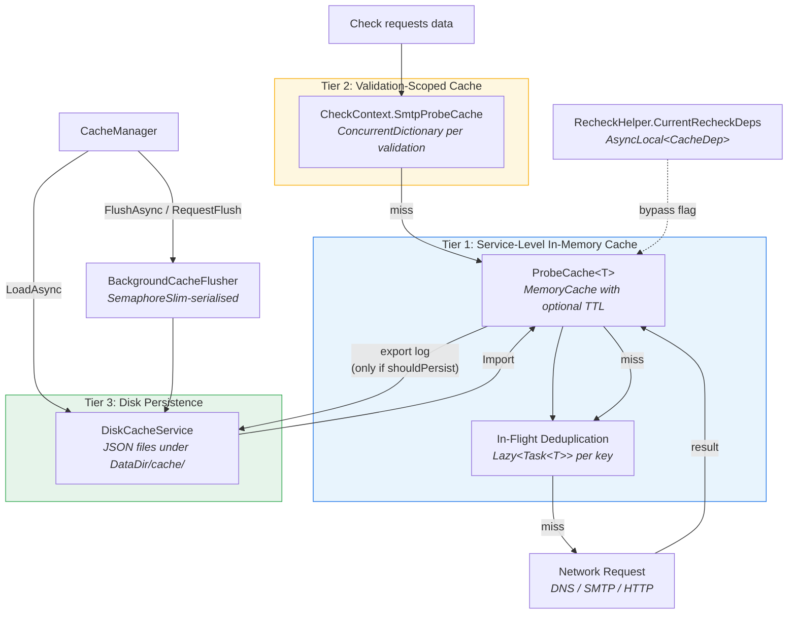
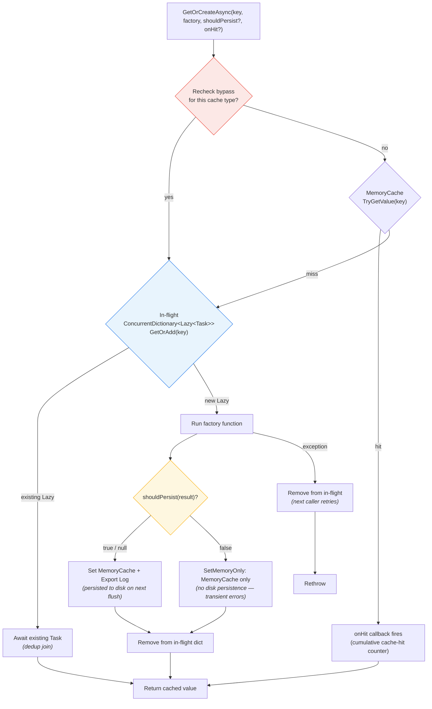

# Caching Architecture

EDNSV uses a multi-tier caching system to minimize redundant network requests across checks and across multiple domain validations. This document covers the caching layers, in-flight deduplication, disk persistence, the recheck bypass mechanism, and how transient failures are handled differently from definitive ones.

## Cache Tiers



## Tier 1: ProbeCache\<T\> (In-Memory)

The core caching primitive, defined in `src/Ednsv.Core/Services/ProbeCache.cs`. Each service maintains multiple ProbeCache instances for different query types.

### How It Works



### In-Flight Deduplication

When multiple checks request the same DNS record simultaneously, only **one** network request is made. The mechanism:

1. `ConcurrentDictionary<string, Lazy<Task<T>>>` holds in-flight requests
2. `GetOrAdd` ensures only one `Lazy` is stored per key (even when `GetOrAdd`'s value-factory is invoked concurrently — only the stored `Lazy.Value` is ever materialised)
3. All concurrent callers for the same key `await` the same `Task`
4. On completion (success or failure), the in-flight entry is removed
5. On failure, the next caller retries with a fresh factory call

### `shouldPersist` Predicate (Always-Cache, Maybe-Persist)

`GetOrCreateAsync` accepts an optional `shouldPersist: Func<TValue, bool>` predicate that decides whether the result is added to the **disk export log**. The predicate does **not** control in-memory caching — every successful factory result is written to MemoryCache so duplicate calls within the same process are still deduped:

| `shouldPersist` returns | MemoryCache | Export log (disk) |
|-------------------------|-------------|-------------------|
| `true` (or predicate is null) | written via `Set()` | written |
| `false` | written via `SetMemoryOnly()` | **skipped** |

This is how transient failures are kept out of the on-disk cache while still avoiding repeated network calls for the rest of the current process. Service-level predicates:

| Service / cache | Persist when |
|-----------------|--------------|
| `DnsResolverService._queryCache` | `response != EmptyResponse.Instance` (skip timeouts/SocketExceptions/DNS errors) |
| `DnsResolverService._serverQueryCache` | same — skip `EmptyResponse` |
| `DnsResolverService._ptrCache` | reverse-lookup actually succeeded |
| `SmtpProbeService._probeCache` | `result.Connected` OR error is not `"Connection timed out"` (cache definitive failures, skip transient timeouts) |
| `SmtpProbeService._portCache` | port was open OR at least one attempt got a definitive refusal |
| `HttpProbeService._getCache` / `_getWithHeadersCache` | `result.Success || result.StatusCode > 0` (any HTTP status counts as definitive; only network-level failures with status 0 are skipped) |

Predicates that aren't supplied (`AXFR`, in-flight RCPT/relay caches that use raw `ConcurrentDictionary`) follow the same intent in their own code: only definitive results are stored.

### `onHit` Callback

`GetOrCreateAsync` also accepts an optional `onHit: Action`. Services use it to drive the cumulative `CacheHits` counter — wiring the increment into the cache itself avoids miscounts when callers (e.g. `QuerySpeculativeAsync`) bypass `GetOrCreateAsync` and call `TryGet` directly.

### Export Log

A separate `ConcurrentDictionary<string, TValue>` tracks values eligible for disk persistence. It's **write-through** in the persisted path (`Set()` writes to both MemoryCache and the export log). `SetMemoryOnly()` writes only to MemoryCache, so the export log records only entries that should survive a process restart. The export log is read on flush; expired MemoryCache entries are filtered out at export time.

### Value-Type Variant

`ProbeCacheValue<TValue>` handles value types (bool, int) using an internal `Box` wrapper, since MemoryCache requires reference types. It carries the same `shouldPersist` semantics as the reference-type variant.

## Tier 2: Validation-Scoped Cache

`CheckContext.SmtpProbeCache` is a `ConcurrentDictionary<string, SmtpProbeResult>` scoped to a single validation. It is:

- **Populated during prefetch** — SMTP probes run during the prefetch phase and results are stored here
- **Read by concurrent checks** — checks call `ctx.GetOrProbeSmtpAsync(host, port)` which checks this cache first
- **Isolated per validation** — each `ValidateAsync()` call gets a fresh CheckContext, preventing cross-validation interference

This tier exists because during recheck mode, the service-level ProbeCache is bypassed. The validation-scoped cache ensures SMTP probes from the current validation's prefetch phase are still reusable by its checks.

## Tier 3: Disk Persistence

`DiskCacheService` (`src/Ednsv.Core/Services/DiskCacheService.cs`) persists cache to JSON files under `<DataDir>/cache/` (`DataDir` defaults to `.ednsv-data`):

| File | Contents |
|------|----------|
| `dns-queries.json` | Standard DNS query responses |
| `dns-server-queries.json` | Server-specific DNS queries |
| `ptr-lookups.json` | Reverse DNS (PTR) lookups |
| `smtp-probes.json` | SMTP handshake results |
| `port-probes.json` | Port reachability results |
| `rcpt-probes.json` | RCPT (address verification) results |
| `relay-tests.json` | Open relay test results |
| `http-get.json` | HTTP GET response bodies |
| `http-get-headers.json` | HTTP GET responses with Content-Type |
| `axfr-results.json` | Zone transfer results |
| `unreachable-servers.json` | Servers that failed MaxRetries (counter only — decay timestamp is recomputed on import) |
| `domain-results.json` | Per-domain validation summaries (for recheck decisions) |

Each entry includes a `CachedAtUtc` timestamp. On load, entries older than the configured TTL (`CacheTtlHours`, default 24 hours) are discarded.

**Merge strategy**: On save, new entries are merged with existing disk cache entries. Older entries are preserved — only updated if a newer entry exists for the same key. `SaveDomainResultAsync` performs an atomic read-modify-write under a static `SemaphoreSlim(1, 1)` and writes via `temp file → File.Move(overwrite)` to keep concurrent web validations from clobbering each other.

### Concurrent flush serialisation

`BackgroundCacheFlusher` owns a `SemaphoreSlim(1, 1)` and exposes:

- `FlushAsync()` — acquires the lock with `WaitAsync(0)` (non-blocking try-acquire) and returns immediately when a flush is already in progress, so timer ticks and on-completion flushes don't pile up.
- `RequestFlush()` — fire-and-forget background flush; safe to call from request paths (`/api/validate` calls it after each domain).
- `DisposeAsync()` — disposes the timer and performs one final blocking flush under the lock.

`CacheManager.FlushAsync()` routes through the flusher's lock when one is active; otherwise it calls `DiskCacheService.SaveAsync` directly. This guarantees there is at most one in-flight disk write at any time across all paths (timer, manual flush, dispose), eliminating concurrent-write races on the JSON files.

## Service Cache Inventory

Each service maintains specific ProbeCache instances:

### DnsResolverService
| Cache | Type | Key Format | Recheck Flag |
|-------|------|-----------|--------------|
| `_queryCache` | `ProbeCache<IDnsQueryResponse>` | `q:domain:queryType` | `CacheDep.Dns` |
| `_ptrCache` | `ProbeCache<List<string>>` | `ptr:ip` | `CacheDep.Ptr` |
| `_serverQueryCache` | `ProbeCache<IDnsQueryResponse>` | `sq:server:domain:queryType` | `CacheDep.ServerDns` |
| `_axfrResponseCache` | `ConcurrentDictionary<(ip,domain), IDnsQueryResponse>` | tuple | (none — unaffected by recheck) |
| `_unreachableServerCounts` | `ConcurrentDictionary<string, (count, lastFailure)>` | server-IP | n/a — see "Unreachable-server decay" below |

### SmtpProbeService
| Cache | Type | Key Format | Recheck Flag |
|-------|------|-----------|--------------|
| `_probeCache` | `ProbeCache<SmtpProbeResult>` | `smtp:host:port` | `CacheDep.Smtp` |
| `_portCache` | `ProbeCacheValue<bool>` | `port:host:port` | `CacheDep.Port` |
| `_rcptCache` | `ConcurrentDictionary<host\|email, (accepted, response)>` | `host\|email` | `CacheDep.Rcpt` (cleared via `RemoveRcptEntries`) |
| `_relayCache` | `ConcurrentDictionary<relay:host\|domain, (isRelay, description)>` | `relay:host\|domain` | `CacheDep.Smtp` |

### HttpProbeService
| Cache | Type | Key Format | Recheck Flag |
|-------|------|-----------|--------------|
| `_getCache` | `ProbeCache<GetResult>` | `url` (or `url\nAccept:<media-type>` for `GetWithAcceptAsync`) | `CacheDep.Http` |
| `_getWithHeadersCache` | `ProbeCache<GetWithHeadersResult>` | `url` | `CacheDep.Http` |

### Unreachable-server decay

`DnsResolverService` tracks server failures in `_unreachableServerCounts` keyed by IP, storing both a failure count and `lastFailure` timestamp. Once a server fails `MaxRetries` (default 3) times, subsequent queries are short-circuited to `EmptyResponse.Instance` — but only while the most-recent failure is within the **5-minute decay window** (`_unreachableDecay`). After the window expires, the next call retries the server normally and the counter is cleared on the first successful response. This prevents transient outages from permanently blacklisting a recursive resolver across the lifetime of a long-running process.

## CacheManager

`CacheManager` (`src/Ednsv.Core/Services/CacheManager.cs`) orchestrates the cache lifecycle and implements `IAsyncDisposable`:

1. **LoadAsync(retryErrors)** — At startup, loads disk cache into service ProbeCache instances via `Import()`. Also reads `domain-results.json` into `_previousResults`. With `retryErrors=true`, drops cached SMTP probes whose stored result indicates a transient failure so they will be reprobed.
2. **FlushAsync()** — Routes through `BackgroundCacheFlusher.FlushAsync` when a flusher is active (so timer flushes, on-completion flushes, and explicit calls all serialise on the same lock); falls back to `DiskCacheService.SaveAsync` when no flusher exists (CLI single-shot mode).
3. **RequestFlush()** — Fires a non-blocking background flush via the flusher. The web API calls this after every job completes.
4. **StartBackgroundFlusher(interval)** — Creates the periodic flusher (default `FlushIntervalSeconds=120`).
5. **GetRecheckDeps(domain, minSeverity)** — Reads `_previousResults` to determine which cache types to bypass for a recheck, based on the previous validation's issue categories and the requested severity threshold. Returns `CacheDep.None` if the domain has no recorded prior result.
6. **SaveDomainResultAsync(domain, summary)** — Updates the in-memory `_previousResults` map and writes `domain-results.json` (under the disk-service lock).
7. **DisposeAsync()** — Disposes the flusher (which performs its final flush) or, if no flusher exists, performs one direct save before returning.

## Recheck System

The recheck feature allows re-running previously failing checks with fresh data, without clearing the entire cache.

```mermaid
flowchart LR
    REQ["--recheck warning"] --> CM["CacheManager.GetRecheckDeps()"]
    CM --> DR["Read domain-results.json<br/><i>Previous issues for domain</i>"]
    DR --> MAP["RecheckHelper.GetDependenciesForIssues()<br/><i>Map categories → CacheDep flags</i>"]
    MAP --> FLAGS["CacheDep flags<br/><i>e.g., Dns | Smtp | Http</i>"]
    FLAGS --> AL["AsyncLocal&lt;CacheDep&gt;<br/><i>Flows through async calls</i>"]
    AL --> BYPASS["ProbeCache.TryGet() bypasses<br/>MemoryCache for flagged types"]
    BYPASS --> FRESH["Fresh network request"]
    FRESH --> WRITE["Write back to MemoryCache<br/><i>Available to other users</i>"]
```



### How It Works

1. **Determine deps**: `CacheManager.GetRecheckDeps()` reads the domain's previous results and maps failing check categories to `CacheDep` flags using `RecheckHelper.GetDependencies()`.

2. **Set context**: `DomainValidator.ValidateAsync` sets `RecheckHelper.CurrentRecheckDeps.Value` (an `AsyncLocal<CacheDep>`) at the start of the validation and clears it back to `CacheDep.None` in the finally section. Because it is `AsyncLocal`, each concurrent validation in the web API gets its own value with no cross-bleed, and the deps automatically flow through `await` boundaries into the singleton DNS/SMTP/HTTP services.

3. **Bypass on read**: `ProbeCache.TryGet()` (and `ProbeCacheValue.TryGet()`) checks `RecheckHelper.CurrentRecheckDeps.Value.HasFlag(recheckFlag)` before consulting MemoryCache. When the flag is set, it returns a miss without touching MemoryCache.

4. **Fresh query**: The factory function runs, making a real network request.

5. **Write back**: The fresh result is stored in MemoryCache (and the export log when `shouldPersist` returns true) — other concurrent validations benefit from the refreshed data, and the next non-recheck request serves the new value from cache.

> **CLI now uses the same mechanism as the web API.** Earlier versions physically deleted matching entries from MemoryCache for CLI rechecks (`ClearImportedEntriesForDomain`). That code path was removed; CLI rechecks now go through the same AsyncLocal bypass as the web API by setting `validator.RecheckDeps`. Fresh results overwrite the old entries on write-back.

### CacheDep Flags

```
None = 0
Dns = 1         — Standard DNS queries
ServerDns = 2   — Server-specific DNS queries
Ptr = 4         — PTR lookups
Smtp = 8        — SMTP handshake probes
Port = 16       — Port reachability
Rcpt = 32       — RCPT verification
Http = 64       — HTTP GET requests
All = 127       — All cache types
```

### Category → Dependency Mapping (examples)

| Category | Dependencies |
|----------|-------------|
| MX | Dns, Smtp, Ptr |
| SPF | Dns |
| DMARC | Dns |
| SMTP | Dns, Smtp, Port |
| MTA-STS | Dns, Http |
| Postmaster | Rcpt |
| Delegation | Dns, ServerDns, Ptr |

### CLI vs Web Behavior

CLI and web API use the **same** AsyncLocal bypass since commit 5277d94. Both flow `validator.RecheckDeps` into `RecheckHelper.CurrentRecheckDeps` and rely on `ProbeCache.TryGet` returning `false` for matching cache types. There is no separate "imported-only" tracking and no physical cache invalidation on the recheck path — fresh results simply overwrite stale ones.
