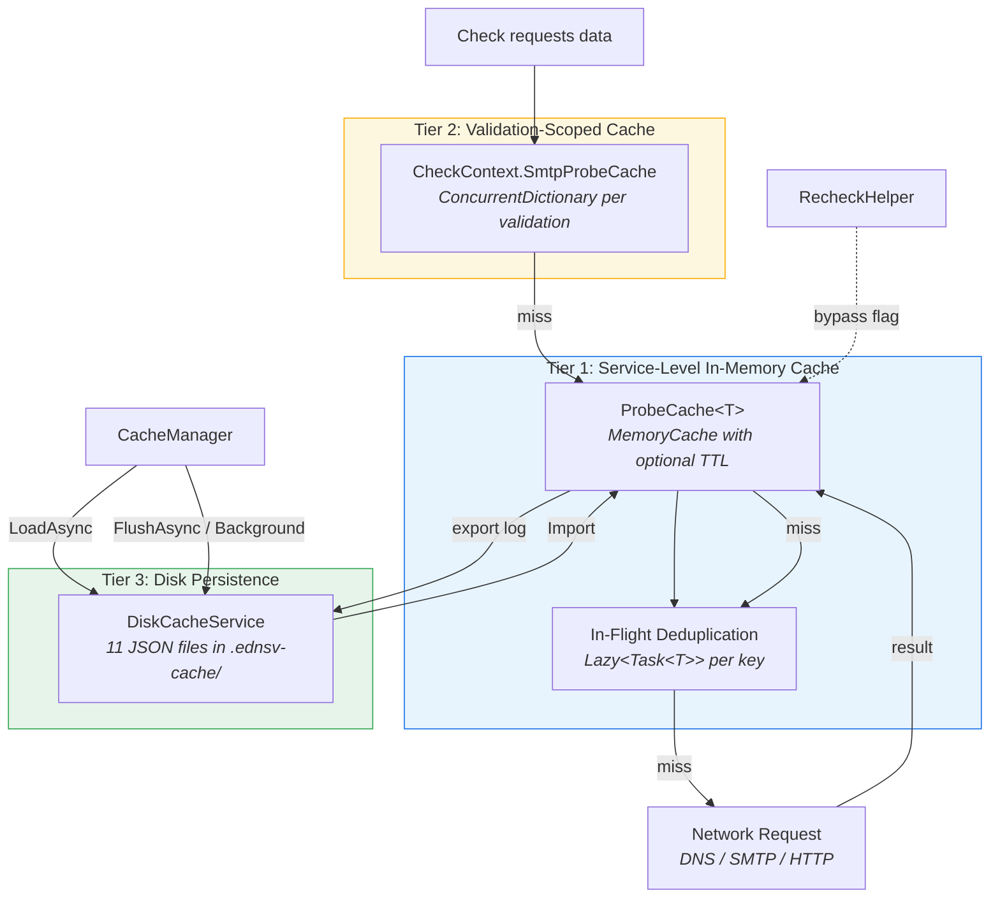
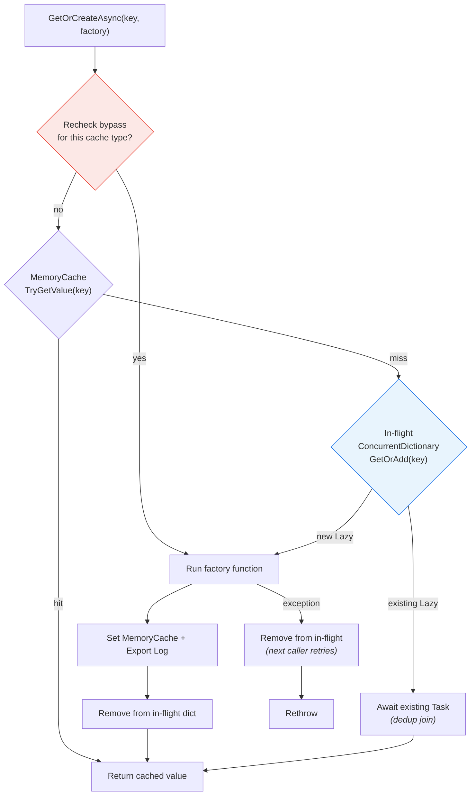

# Caching Architecture

EDNSV uses a multi-tier caching system to minimize redundant network requests across checks and across multiple domain validations. This document covers the caching layers, in-flight deduplication, disk persistence, and the recheck bypass mechanism.

## Cache Tiers



## Tier 1: ProbeCache\<T\> (In-Memory)

The core caching primitive, defined in `src/Ednsv.Core/Services/ProbeCache.cs`. Each service maintains multiple ProbeCache instances for different query types.

### How It Works



### In-Flight Deduplication

When multiple checks request the same DNS record simultaneously, only **one** network request is made. The mechanism:

1. `ConcurrentDictionary<string, Lazy<Task<T>>>` holds in-flight requests
2. `GetOrAdd` ensures only one `Lazy` is stored per key (even with concurrent calls)
3. All concurrent callers for the same key `await` the same `Task`
4. On completion (success or failure), the in-flight entry is removed
5. On failure, the next caller retries with a fresh factory call

### Export Log

A separate `ConcurrentDictionary<string, TValue>` tracks all values for disk persistence. This is **write-through** — every `Set()` writes to both MemoryCache and the export log. The export log is only read during `Export()` for disk flush.

### Value-Type Variant

`ProbeCacheValue<TValue>` handles value types (bool, int) using an internal `Box` wrapper, since MemoryCache requires reference types.

## Tier 2: Validation-Scoped Cache

`CheckContext.SmtpProbeCache` is a `ConcurrentDictionary<string, SmtpProbeResult>` scoped to a single validation. It is:

- **Populated during prefetch** — SMTP probes run during the prefetch phase and results are stored here
- **Read by concurrent checks** — checks call `ctx.GetOrProbeSmtpAsync(host, port)` which checks this cache first
- **Isolated per validation** — each `ValidateAsync()` call gets a fresh CheckContext, preventing cross-validation interference

This tier exists because during recheck mode, the service-level ProbeCache is bypassed. The validation-scoped cache ensures SMTP probes from the current validation's prefetch phase are still reusable by its checks.

## Tier 3: Disk Persistence

`DiskCacheService` (`src/Ednsv.Core/Services/DiskCacheService.cs`) persists cache to JSON files:

| File | Contents |
|------|----------|
| `dns-queries.json` | Standard DNS query responses |
| `dns-server-queries.json` | Server-specific DNS queries |
| `ptr-lookups.json` | Reverse DNS (PTR) lookups |
| `smtp-probes.json` | SMTP handshake results |
| `port-probes.json` | Port reachability results |
| `rcpt-probes.json` | RCPT (address verification) results |
| `relay-tests.json` | Open relay test results |
| `http-get.json` | HTTP GET response bodies |
| `http-get-headers.json` | HTTP GET responses with Content-Type |
| `axfr-results.json` | Zone transfer results |
| `unreachable-servers.json` | Servers that failed MaxRetries |
| `domain-results.json` | Per-domain validation summaries (for recheck decisions) |

Each entry includes a `CachedAtUtc` timestamp. On load, entries older than the configured TTL (default 24 hours) are discarded.

**Merge strategy**: On save, new entries are merged with existing disk cache entries. Older entries are preserved — only updated if a newer entry exists for the same key.

## Service Cache Inventory

Each service maintains specific ProbeCache instances:

### DnsResolverService
| Cache | Type | Key Format | Recheck Flag |
|-------|------|-----------|--------------|
| `_queryCache` | `ProbeCache<IDnsQueryResponse>` | `domain:queryType` | `CacheDep.Dns` |
| `_ptrCache` | `ProbeCache<List<string>>` | `ip` | `CacheDep.Ptr` |
| `_serverQueryCache` | `ProbeCache<IDnsQueryResponse>` | `server:domain:queryType` | `CacheDep.ServerDns` |

### SmtpProbeService
| Cache | Type | Key Format | Recheck Flag |
|-------|------|-----------|--------------|
| `_probeCache` | `ProbeCache<SmtpProbeResult>` | `host:port` | `CacheDep.Smtp` |
| `_portCache` | `ProbeCacheValue<bool>` | `host:port` | `CacheDep.Port` |
| `_rcptCache` | `ProbeCache<RcptResult>` | `host:email` | `CacheDep.Rcpt` |
| `_relayCache` | `ProbeCache<RelayResult>` | `host\|from\|to` | `CacheDep.Smtp` |

### HttpProbeService
| Cache | Type | Key Format | Recheck Flag |
|-------|------|-----------|--------------|
| `_getCache` | `ProbeCache<HttpGetResult>` | `url` | `CacheDep.Http` |
| `_getWithHeadersCache` | `ProbeCache<HttpGetHeadersResult>` | `url` | `CacheDep.Http` |

## CacheManager

`CacheManager` (`src/Ednsv.Core/Services/CacheManager.cs`) orchestrates the cache lifecycle:

1. **LoadAsync()** — At startup, loads disk cache into service ProbeCache instances via `Import()`. Optionally retries previously errored entries.
2. **SaveAsync() / FlushAsync()** — Exports all ProbeCache entries and writes to disk. Called on validation completion and periodically by background flusher.
3. **StartBackgroundFlusher()** — Periodic flush every N seconds (default 120s for web, configurable).
4. **GetRecheckDeps()** — Reads `domain-results.json` to determine which cache types to bypass for a recheck, based on the previous validation's issue categories and the requested severity threshold.
5. **SaveDomainResultAsync()** — Stores per-domain validation summaries for recheck decisions.

## Recheck System

The recheck feature allows re-running previously failing checks with fresh data, without clearing the entire cache.

```mermaid
flowchart LR
    REQ["--recheck warning"] --> CM["CacheManager.GetRecheckDeps()"]
    CM --> DR["Read domain-results.json<br/><i>Previous issues for domain</i>"]
    DR --> MAP["RecheckHelper.GetDependenciesForIssues()<br/><i>Map categories → CacheDep flags</i>"]
    MAP --> FLAGS["CacheDep flags<br/><i>e.g., Dns | Smtp | Http</i>"]
    FLAGS --> AL["AsyncLocal&lt;CacheDep&gt;<br/><i>Flows through async calls</i>"]
    AL --> BYPASS["ProbeCache.TryGet() bypasses<br/>MemoryCache for flagged types"]
    BYPASS --> FRESH["Fresh network request"]
    FRESH --> WRITE["Write back to MemoryCache<br/><i>Available to other users</i>"]
```



### How It Works

1. **Determine deps**: `CacheManager.GetRecheckDeps()` reads the domain's previous results and maps failing check categories to `CacheDep` flags using `RecheckHelper.GetDependencies()`.

2. **Set context**: `DomainValidator` sets `RecheckHelper.CurrentRecheckDeps.Value` (an `AsyncLocal<CacheDep>`) before validation begins.

3. **Bypass on read**: When `ProbeCache.TryGet()` is called, it checks if the current async flow's recheck deps include this cache's flag. If so, it returns a cache miss.

4. **Fresh query**: The factory function runs, making a real network request.

5. **Write back**: The fresh result is stored in MemoryCache and the export log — other concurrent validations (web API) benefit from the refreshed data.

### CacheDep Flags

```
None = 0
Dns = 1         — Standard DNS queries
ServerDns = 2   — Server-specific DNS queries
Ptr = 4         — PTR lookups
Smtp = 8        — SMTP handshake probes
Port = 16       — Port reachability
Rcpt = 32       — RCPT verification
Http = 64       — HTTP GET requests
All = 127       — All cache types
```

### Category → Dependency Mapping (examples)

| Category | Dependencies |
|----------|-------------|
| MX | Dns, Smtp, Ptr |
| SPF | Dns |
| DMARC | Dns |
| SMTP | Dns, Smtp, Port |
| MTA-STS | Dns, Http |
| Postmaster | Rcpt |
| Delegation | Dns, ServerDns, Ptr |

### CLI vs Web Behavior

- **CLI** (`importedOnly = true`): Only clears entries loaded from disk. Entries generated during the current process run are preserved.
- **Web API** (`importedOnly = false`): Clears all matching entries including those from previous requests, since the web process is long-lived.
