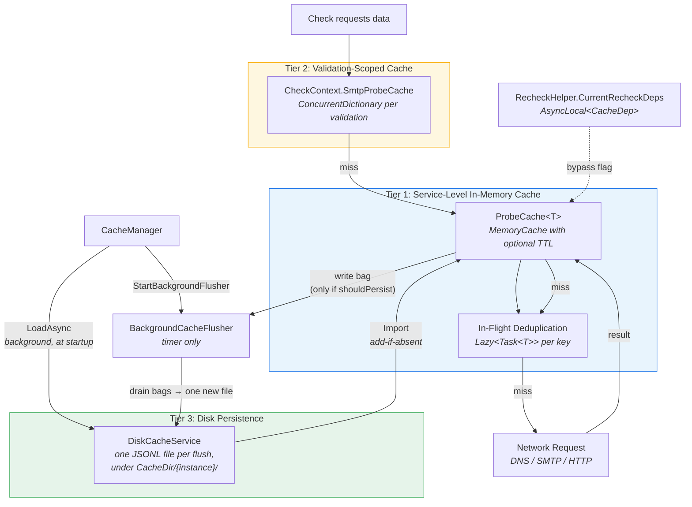
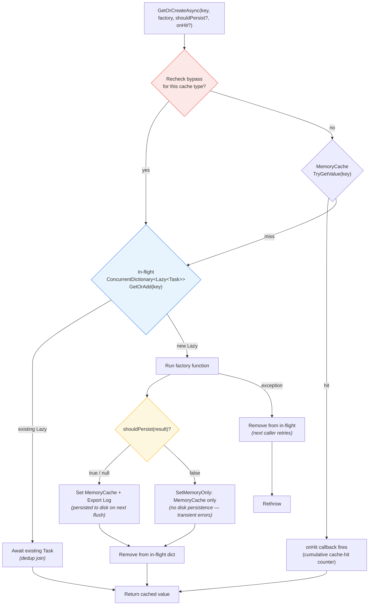

# Caching Architecture

EDNSV uses a multi-tier caching system to minimize redundant network requests across checks and across multiple domain validations. This document covers the caching layers, in-flight deduplication, disk persistence, the recheck bypass mechanism, and how transient failures are handled differently from definitive ones.

## Cache Tiers


```mermaid
flowchart TD
    subgraph Tier1["Tier 1: Service-Level In-Memory Cache"]
        direction TB
        PC["ProbeCache&lt;T&gt;<br/><i>MemoryCache with optional TTL</i>"]
        DEDUP["In-Flight Deduplication<br/><i>Lazy&lt;Task&lt;T&gt;&gt; per key</i>"]
        PC --> DEDUP
    end

    subgraph Tier2["Tier 2: Validation-Scoped Cache"]
        direction TB
        SMTPC["CheckContext.SmtpProbeCache<br/><i>ConcurrentDictionary per validation</i>"]
    end

    subgraph Tier3["Tier 3: Disk Persistence"]
        direction TB
        DCACHE["DiskCacheService<br/><i>one JSONL file per flush,<br/>under CacheDir/{instance}/</i>"]
    end

    CHECK["Check requests data"] --> SMTPC
    SMTPC -->|miss| PC
    PC -->|miss| DEDUP
    DEDUP -->|miss| NET["Network Request<br/><i>DNS / SMTP / HTTP</i>"]
    NET -->|result| PC
    PC -->|"write bag<br/>(only if shouldPersist)"| BG

    CM["CacheManager"] -->|"LoadAsync<br/><i>background, at startup</i>"| DCACHE
    DCACHE -->|"Import<br/><i>add-if-absent</i>"| PC
    CM -->|StartBackgroundFlusher| BG["BackgroundCacheFlusher<br/><i>timer only</i>"]
    BG -->|"drain bags → one new file"| DCACHE

    RH["RecheckHelper.CurrentRecheckDeps<br/><i>AsyncLocal&lt;CacheDep&gt;</i>"] -.->|bypass flag| PC

    style Tier1 fill:#e8f4fd,stroke:#1a73e8
    style Tier2 fill:#fef7e0,stroke:#f9ab00
    style Tier3 fill:#e6f4ea,stroke:#34a853
```

## Tier 1: ProbeCache\<T\> (In-Memory)

The core caching primitive, defined in `src/Ednsv.Core/Services/ProbeCache.cs`. Each service maintains multiple ProbeCache instances for different query types.

### How It Works


```mermaid
flowchart TD
    REQ["GetOrCreateAsync(key, factory, shouldPersist?, onHit?)"] --> RECHECK{"Recheck bypass<br/>for this cache type?"}
    RECHECK -->|yes| INFLIGHT
    RECHECK -->|no| MEMCACHE{"MemoryCache<br/>TryGetValue(key)"}
    MEMCACHE -->|hit| HITCB["onHit callback fires<br/>(cumulative cache-hit counter)"]
    HITCB --> RETURN["Return cached value"]
    MEMCACHE -->|miss| INFLIGHT{"In-flight<br/>ConcurrentDictionary&lt;Lazy&lt;Task&gt;&gt;<br/>GetOrAdd(key)"}
    INFLIGHT -->|existing Lazy| AWAIT["Await existing Task<br/><i>(dedup join)</i>"]
    INFLIGHT -->|new Lazy| FACTORY["Run factory function"]
    FACTORY --> PERSIST{"shouldPersist(result)?"}
    PERSIST -->|true / null| SET["Set MemoryCache + Export Log<br/><i>(persisted to disk on next flush)</i>"]
    PERSIST -->|false| MEMONLY["SetMemoryOnly: MemoryCache only<br/><i>(no disk persistence — transient errors)</i>"]
    SET --> CLEANUP["Remove from in-flight dict"]
    MEMONLY --> CLEANUP
    CLEANUP --> RETURN
    AWAIT --> RETURN

    FACTORY -->|exception| REMOVE["Remove from in-flight<br/><i>(next caller retries)</i>"]
    REMOVE --> THROW["Rethrow"]

    style RECHECK fill:#fce8e6,stroke:#ea4335
    style INFLIGHT fill:#e8f4fd,stroke:#1a73e8
    style PERSIST fill:#fef7e0,stroke:#f9ab00
```

### In-Flight Deduplication

When multiple checks request the same DNS record simultaneously, only **one** network request is made. The mechanism:

1. `ConcurrentDictionary<string, Lazy<Task<T>>>` holds in-flight requests
2. `GetOrAdd` ensures only one `Lazy` is stored per key (even when `GetOrAdd`'s value-factory is invoked concurrently — only the stored `Lazy.Value` is ever materialised)
3. All concurrent callers for the same key `await` the same `Task`
4. On completion (success or failure), the in-flight entry is removed
5. On failure, the next caller retries with a fresh factory call

### `shouldPersist` Predicate (Always-Cache, Maybe-Persist)

`GetOrCreateAsync` accepts an optional `shouldPersist: Func<TValue, bool>` predicate that decides whether the result is added to the **write bag**. The predicate does **not** control in-memory caching — every successful factory result is written to MemoryCache so duplicate calls within the same process are still deduped:

| `shouldPersist` returns | MemoryCache | Export log (disk) |
|-------------------------|-------------|-------------------|
| `true` (or predicate is null) | written via `Set()` | written |
| `false` | written via `SetMemoryOnly()` | **skipped** |

This is how transient failures are kept out of the on-disk cache while still avoiding repeated network calls for the rest of the current process. Service-level predicates:

| Service / cache | Persist when |
|-----------------|--------------|
| `DnsResolverService._queryCache` | `response != EmptyResponse.Instance` (skip timeouts/SocketExceptions/DNS errors) |
| `DnsResolverService._serverQueryCache` | same — skip `EmptyResponse` |
| `DnsResolverService._ptrCache` | reverse-lookup actually succeeded |
| `SmtpProbeService._probeCache` | `result.Connected` OR error is not `"Connection timed out"` (cache definitive failures, skip transient timeouts) |
| `SmtpProbeService._portCache` | port was open OR at least one attempt got a definitive refusal |
| `HttpProbeService._getCache` / `_getWithHeadersCache` | `result.Success || result.StatusCode > 0` (any HTTP status counts as definitive; only network-level failures with status 0 are skipped) |

Predicates that aren't supplied (`AXFR`, in-flight RCPT/relay caches that use raw `ConcurrentDictionary`) follow the same intent in their own code: only definitive results are stored.

### `onHit` Callback

`GetOrCreateAsync` also accepts an optional `onHit: Action`. Services use it to drive the cumulative `CacheHits` counter — wiring the increment into the cache itself avoids miscounts when callers (e.g. `QuerySpeculativeAsync`) bypass `GetOrCreateAsync` and call `TryGet` directly.

### Write Bag

A separate `ConcurrentDictionary<string, BagEntry<TValue>>` holds values **queued for the next flush**. `Set()` writes to both MemoryCache and the bag; `SetMemoryOnly()` writes only to MemoryCache.

What the bag *excludes* is the point of its design. Three kinds of value are cached but never queued:

- results that fail `shouldPersist` (transient errors, which must not outlive the process);
- values read from the shared **Redis L2** — whichever instance fetched them has already written them to its own disk, and persisting them here duplicates that work onto ours;
- entries **imported from disk at startup** — they are on disk by definition.

That last exclusion is the one that mattered. Imports used to feed straight back into the export log, so every entry read at startup was re-serialised and rewritten on every flush for the life of the process.

A flush snapshots the bag, writes those records, and removes **exactly what it wrote**, matched by reference. Nothing leaves the bag until the file has landed, so a failed write simply retries next tick, and a fresher value that arrived for the same key mid-write survives. `BagEntry` states its reference equality explicitly rather than inheriting it: `ConcurrentDictionary.TryRemove(KeyValuePair)` compares values with `EqualityComparer<T>.Default`, so any value-based equality there would let a flush silently delete the newer entry that replaced the one it persisted.

The four caches that live in plain dictionaries rather than a `ProbeCache` — RCPT probes, relay tests, AXFR results and unreachable-server counts — carry a `WriteBag<T>` for the same reason. Serialising them whole on each flush would mean a flush always found something to write, which defeats the dirty-flag behaviour below.

### Value-Type Variant

`ProbeCacheValue<TValue>` handles value types (bool, int) using an internal `Box` wrapper, since MemoryCache requires reference types. It carries the same `shouldPersist` semantics as the reference-type variant.

## Tier 2: Validation-Scoped Cache

`CheckContext.SmtpProbeCache` is a `ConcurrentDictionary<string, SmtpProbeResult>` scoped to a single validation. It is:

- **Populated during prefetch** — SMTP probes run during the prefetch phase and results are stored here
- **Read by concurrent checks** — checks call `ctx.GetOrProbeSmtpAsync(host, port)` which checks this cache first
- **Isolated per validation** — each `ValidateAsync()` call gets a fresh CheckContext, preventing cross-validation interference

This tier exists because during recheck mode, the service-level ProbeCache is bypassed. The validation-scoped cache ensures SMTP probes from the current validation's prefetch phase are still reusable by its checks.

## Tier 3: Disk Persistence

`DiskCacheService` (`src/Ednsv.Core/Services/DiskCacheService.cs`) persists probe results under `CacheDir` (defaults to `<DataDir>/cache`; `DataDir` itself defaults to `.ednsv-data`).

### One immutable file per flush

Each flush writes everything queued since the last one into a single new file:

```
<CacheDir>/<instance>/cache.<utc>.<nonce>.jsonl
```

written once via `AtomicFile` (temp + rename) and never touched again. There are no appends, no rotation and no compaction — nothing is re-serialised on a later flush just because it is still cached.

`<instance>` is the pod name (`HOSTNAME`, falling back to the machine name), so replicas sharing a mount never write the same file. That matters: a single file per cache type meant N pods doing a read-modify-write of one file on their own timers, quietly dropping each other's entries, with no coordination covering it.

Consequences, all of which remove work rather than adding it:

- no torn or interleaved lines — every file is written whole and atomically;
- no conflict when a CLI run shares a hostname with the web service; they write different filenames;
- exactly one line per key per file, because the bag dedupes within a flush;
- the sweep needs no exception for "the file being written right now" — there isn't one.

### Record format

One self-describing record per line, so all cache types share a file:

```json
{"t":"dns","k":"q:example.com:MX","w":"2026-07-25T02:00:00Z","e":"2026-07-25T02:30:00Z","v":{…}}
```

| field | meaning |
|-------|---------|
| `t` | cache type — `dns`, `dns-srv`, `ptr`, `smtp`, `port`, `rcpt`, `relay`, `http-get`, `http-get-headers`, `axfr`, `unreachable`, `domain-results` |
| `k` | the cache's own key, written and read back verbatim |
| `w` | when the value was fetched — orders entries across instances on merge |
| `e` | when it stops being usable |
| `v` | the serialised value |

**Both timestamps are needed.** `w` orders; `e` decides liveness. They cannot be collapsed into one, because with DNS TTL gating a value fetched later can expire sooner than one fetched earlier. And `w` must be per-record rather than taken from the filename: two instances flushing at different moments can hold entries fetched in the opposite order.

### DNS record-TTL gating

By default every cached DNS answer gets the full `CacheTtlHours`, regardless of what the zone published — so a domain rotating records every thirty seconds is served from cache for hours.

Set `DnsCacheMinTtlSeconds` above zero and the query, server-query and PTR caches instead bound each entry by `clamp(minimum record TTL, DnsCacheMinTtlSeconds, CacheTtlHours)`. The floor stops short-TTL domains forcing a refetch on nearly every validation; the cap must remain the ceiling, because the sweep deletes a record file at `fileTime + CacheTtlHours` and a longer-lived entry could be swept while still considered live.

An **empty answer section** falls back to the floor. That is not an edge case to shrug at: NXDOMAIN and NODATA are real responses, they are cached, and their answer sections are always empty. The minimum comes from `InitialTimeToLive`, not `TimeToLive` — the latter counts down while DnsClient holds the record, which would shorten every entry by however long the response sat around.

**It ships off** (`DnsCacheMinTtlSeconds=0`). This release is "stop rewriting everything, and 2 hours instead of 24"; gating is a second, separately observable change to enable once the effect of the shorter cap has been seen on its own.

### Load

The load runs on a **background task**, not before the app starts serving — awaiting it made startup latency scale with replica count, since on a shared mount every instance reads every other instance's folder and a rolling deploy has all of them doing it at once. `/health/ready` deliberately does not wait; the first validations after a deploy run cold.

Every `*.jsonl` under the cache directory is scanned, keeping the entry with the latest `w` per `(t, k)`. Two expiry rules apply: a record is dropped if its own `e` has passed, and equally if `w` is older than the reader's configured `CacheTtlHours` — a process running without a TTL stamps no expiry of its own, and the reader's setting must still bound how stale a value it accepts.

The scan reads each line's envelope with a `Utf8JsonReader` and **skips the `v` payload**, so scanning is O(all lines) in cheap work while the expensive part — `DnsCacheSerializer.DeserializeResponse` rebuilding a full `IDnsQueryResponse`, which dominates the load — is O(live keys).

Imports are **add-if-absent**. Because the instance is already serving, a validation can fetch and cache a key before the loader reaches it; that value came off the network just now and the disk copy did not. A fetch still in flight counts as present. Imported entries carry their own `e` into MemoryCache rather than getting a fresh TTL, so a nearly-dead entry is not resurrected for another full period.

When Redis is configured, each imported entry is also published to the shared L2 with `SET NX` and its **remaining** life. `NotExists` keeps a cluster-wide restart idempotent and stops instances holding overlapping views of the same files racing to publish their own copies over each other's.

An unparseable line is skipped rather than failing its file; an unreadable file rather than failing the load.

### Flush — the timer, and nothing else

```
every FlushIntervalSeconds:
    snapshot each cache's bag
    if all empty -> return                 # the bag IS the dirty flag
    serialise every snapshot into one file, temp + rename
    on success: remove exactly the entries written, matched by reference
    on failure: leave the bags untouched; the next tick retries
```

There is no explicit flush endpoint and no flush-on-completion. An ungraceful crash loses at most one interval, which is why the interval is ten minutes rather than an hour; a graceful shutdown flushes via an `ApplicationStopping` hook bounded by `CacheShutdownFlushSeconds`.

An idle process writes nothing at all, because the bags are empty.

### Sweep

Runs on the background load and on each flush tick, best-effort.

Record files are deleted by **filename arithmetic alone**: every entry in a file was written no later than the file was, so once `fileTime + CacheTtlHours` is past, nothing in it can still be live. The rule applies to this instance's files exactly as to any other's. Legacy per-type files are deleted by mtime, matched by name rather than by a `*.json` glob so an operator's unrelated files are never taken with them.

A **folder** is removed only when it is empty, is not ours, and its own mtime is past the cutoff. The age gate makes this safe against an instance that has just started and not yet flushed — creating the folder sets a fresh mtime. Note the timing: removing the last file updates the parent's mtime, so the clock only starts once the folder is already empty, and a dead instance's folder lingers for roughly twice the TTL. Every flush calls `Directory.CreateDirectory` regardless, because a *live* instance idle longer than the TTL writes no files, ages out, and has its folder legitimately removed.

Directory mtime is reliable on POSIX but not on SMB/Azure Files, where servers may not update it on entry changes; there the gate degrades to near-immediate removal, which the `CreateDirectory` guard already covers.

Pod-name reuse is not a hazard in either direction: Deployment names are never reused, so an orphaned folder is definitively dead; StatefulSet names are, and a restarting pod simply finds its own still-valid entries.

### File count

Live files per instance are `CacheTtlHours / FlushIntervalSeconds + 1` — **13 at the defaults** (2h / 600s). Across ten replicas that is ~130 files in ten folders. An operator running `CacheTtlHours=24` with 30-minute flushes gets 49 per instance. Total opens grow with replicas × retention; that product is the number to watch.

### Legacy format

Files written by the previous one-file-per-cache-type layout (`dns-queries.json`, `smtp-probes.json`, …, including per-instance variants such as `dns-queries.pod7.json`) are still **read**, so an upgrade does not cold-start. Nothing writes them any more, and the sweep removes them once they are past the TTL. Record files are read first and legacy files second, so with add-if-absent imports a record always beats a legacy copy of the same key.

`domain-results` now expires on load like everything else. The old reader had no TTL filter at all, so recheck decisions could rest on month-old records.

### Optional Redis L2 (distributed mode)

When `Ednsv.Web` runs with `Redis:ConnectionString` configured, `ProbeCache<T>` gains an optional shared **L2** behind the per-pod L1 `MemoryCache`: on an L1 miss it reads `cache:{type}:{key}` from Redis, and successful results (those passing `shouldPersist`) are write-through to both L1 and the L2. It is best-effort — any Redis error transparently falls through to the network — and unused in the default single-instance mode. See [horizontal-scaling.md](horizontal-scaling.md) → *Probe cache (L1 + Redis L2)*.

## Service Cache Inventory

Each service maintains specific ProbeCache instances:

### DnsResolverService
| Cache | Type | Key Format | Recheck Flag |
|-------|------|-----------|--------------|
| `_queryCache` | `ProbeCache<IDnsQueryResponse>` | `q:domain:queryType` | `CacheDep.Dns` |
| `_ptrCache` | `ProbeCache<List<string>>` | `ptr:ip` | `CacheDep.Ptr` |
| `_serverQueryCache` | `ProbeCache<IDnsQueryResponse>` | `sq:server:domain:queryType` | `CacheDep.ServerDns` |
| `_axfrResponseCache` | `ConcurrentDictionary<(ip,domain), IDnsQueryResponse>` | tuple | (none — unaffected by recheck) |
| `_unreachableServerCounts` | `ConcurrentDictionary<string, (count, lastFailure)>` | server-IP | n/a — see "Unreachable-server decay" below |

### SmtpProbeService
| Cache | Type | Key Format | Recheck Flag |
|-------|------|-----------|--------------|
| `_probeCache` | `ProbeCache<SmtpProbeResult>` | `smtp:host:port` | `CacheDep.Smtp` |
| `_portCache` | `ProbeCacheValue<bool>` | `port:host:port` | `CacheDep.Port` |
| `_rcptCache` | `ConcurrentDictionary<host\|email, (accepted, response)>` | `host\|email` | `CacheDep.Rcpt` (cleared via `RemoveRcptEntries`) |
| `_relayCache` | `ConcurrentDictionary<relay:host\|domain, (isRelay, description)>` | `relay:host\|domain` | `CacheDep.Smtp` |

### HttpProbeService
| Cache | Type | Key Format | Recheck Flag |
|-------|------|-----------|--------------|
| `_getCache` | `ProbeCache<GetResult>` | `url` (or `url\nAccept:<media-type>` for `GetWithAcceptAsync`) | `CacheDep.Http` |
| `_getWithHeadersCache` | `ProbeCache<GetWithHeadersResult>` | `url` | `CacheDep.Http` |

### Unreachable-server decay

`DnsResolverService` tracks server failures in `_unreachableServerCounts` keyed by IP, storing both a failure count and `lastFailure` timestamp. Once a server fails `MaxRetries` (default 3) times, subsequent queries are short-circuited to `EmptyResponse.Instance` — but only while the most-recent failure is within the **5-minute decay window** (`_unreachableDecay`). After the window expires, the next call retries the server normally and the counter is cleared on the first successful response. This prevents transient outages from permanently blacklisting a recursive resolver across the lifetime of a long-running process.

## CacheManager

`CacheManager` (`src/Ednsv.Core/Services/CacheManager.cs`) orchestrates the cache lifecycle and implements `IAsyncDisposable`:

1. **LoadAsync(retryErrors)** — Reads the disk cache into the service caches via `Import()`, including domain summaries. With `retryErrors=true`, drops cached entries whose stored result indicates a transient failure so they are reprobed. The web host runs this on a background task; the CLI awaits it, since a single-shot run needs the cache before it starts.
2. **StartBackgroundFlusher(interval)** — Starts the periodic flusher (default `FlushIntervalSeconds=600`), which also runs the sweep on each tick.
3. **FlushAsync()** — Routes through the flusher's lock when one is active; falls back to `DiskCacheService.SaveAsync` for CLI single-shot mode.
4. **SaveDomainResult(domain, summary)** — Records a validation result. Synchronous and in-memory: it updates the map immediately and queues the write for the next flush, like every other cache. It used to do a full read-modify-write of one JSON file under a semaphore on *every completed validation* — the same amplification this design removes everywhere else, in the one file that also never expired anything.
5. **GetRecheckDeps(domain, minSeverity)** — Reads the domain summaries to determine which cache types to bypass for a recheck. Returns `CacheDep.None` if the domain has no recorded prior result.
6. **DisposeAsync()** — Disposes the flusher (which performs its final flush) or, without one, performs a direct save.

The web host registers these singletons as pre-created instances, and the DI container only disposes what it **constructs** — so an explicit `ApplicationStopping` hook performs the shutdown flush. Without it every deploy silently discarded whatever had been gathered since the last periodic flush.

### Turning the disk tier off

`CacheDir=none` disables it entirely: no load, no flusher, no sweep, and — importantly — **nothing queued in the write bags**. That gate belongs on the caches themselves, not just the flusher, or the bags would grow for the life of the process with nothing draining them.

Only the literal string `none` disables it. A blank value resolves to the default path, deliberately: `GetValue<string>` returns the *empty string* for a JSON `null`, so anything looser would turn the disk cache off for every deployment whose settings file merely mentions the key.

Startup logs a warning when `CacheDir=none` **and** no Redis is configured. That is L1-only: the cache dies with the process and every restart is fully cold. Reasonable on a dev box, almost certainly a misconfiguration in production.

### Removed: the cache-clear and cache-flush endpoints

`POST /api/cache/flush` and `POST /api/cache/clear` are gone, along with `RequestFlush()`.

Flushing sooner than the timer now only fragments storage. Clearing was worse: on a multi-pod deployment it returned 200 and audit-logged *"Cache CLEARED (memory + disk)"* while N-1 pods kept serving warm L1 — a control that reported success without doing the thing. **Recheck-all** covers the real need better: targeted, pod-agnostic, no admin rights, and it writes fresh results back. The 2-hour TTL is what makes that trade safe; at 24 hours the lack of a lever would have been too long.

Both are breaking API changes for anyone scripting them. A manual purge now means deleting the files and restarting.

## Recheck System

The recheck feature allows re-running previously failing checks with fresh data, without clearing the entire cache.


```mermaid
flowchart LR
    REQ["--recheck warning"] --> CM["CacheManager.GetRecheckDeps()"]
    CM --> DR["Read the domain summaries<br/><i>Previous issues for domain</i>"]
    DR --> MAP["RecheckHelper.GetDependenciesForIssues()<br/><i>Map categories → CacheDep flags</i>"]
    MAP --> FLAGS["CacheDep flags<br/><i>e.g., Dns | Smtp | Http</i>"]
    FLAGS --> AL["AsyncLocal&lt;CacheDep&gt;<br/><i>Flows through async calls</i>"]
    AL --> BYPASS["ProbeCache.TryGet() bypasses<br/>MemoryCache for flagged types"]
    BYPASS --> FRESH["Fresh network request"]
    FRESH --> WRITE["Write back to MemoryCache<br/><i>Available to other users</i>"]
```

### How It Works

1. **Determine deps**: `CacheManager.GetRecheckDeps()` reads the domain's previous results and maps failing check categories to `CacheDep` flags using `RecheckHelper.GetDependencies()`.

2. **Set context**: `DomainValidator.ValidateAsync` sets `RecheckHelper.CurrentRecheckDeps.Value` (an `AsyncLocal<CacheDep>`) at the start of the validation and clears it back to `CacheDep.None` in the finally section. Because it is `AsyncLocal`, each concurrent validation in the web API gets its own value with no cross-bleed, and the deps automatically flow through `await` boundaries into the singleton DNS/SMTP/HTTP services.

3. **Bypass on read**: `ProbeCache.TryGet()` (and `ProbeCacheValue.TryGet()`) checks `RecheckHelper.CurrentRecheckDeps.Value.HasFlag(recheckFlag)` before consulting MemoryCache. When the flag is set, it returns a miss without touching MemoryCache.

4. **Fresh query**: The factory function runs, making a real network request.

5. **Write back**: The fresh result is stored in MemoryCache (and the write bag when `shouldPersist` returns true) — other concurrent validations benefit from the refreshed data, and the next non-recheck request serves the new value from cache.

> **CLI now uses the same mechanism as the web API.** Earlier versions physically deleted matching entries from MemoryCache for CLI rechecks (`ClearImportedEntriesForDomain`). That code path was removed; CLI rechecks now go through the same AsyncLocal bypass as the web API by setting `validator.RecheckDeps`. Fresh results overwrite the old entries on write-back.

### CacheDep Flags

```
None = 0
Dns = 1         — Standard DNS queries
ServerDns = 2   — Server-specific DNS queries
Ptr = 4         — PTR lookups
Smtp = 8        — SMTP handshake probes
Port = 16       — Port reachability
Rcpt = 32       — RCPT verification
Http = 64       — HTTP GET requests
All = 127       — All cache types
```

### Category → Dependency Mapping (examples)

| Category | Dependencies |
|----------|-------------|
| MX | Dns, Smtp, Ptr |
| SPF | Dns |
| DMARC | Dns |
| SMTP | Dns, Smtp, Port |
| MTA-STS | Dns, Http |
| Postmaster | Rcpt |
| Delegation | Dns, ServerDns, Ptr |

### CLI vs Web Behavior

CLI and web API use the **same** AsyncLocal bypass since commit 5277d94. Both flow `validator.RecheckDeps` into `RecheckHelper.CurrentRecheckDeps` and rely on `ProbeCache.TryGet` returning `false` for matching cache types. There is no separate "imported-only" tracking and no physical cache invalidation on the recheck path — fresh results simply overwrite stale ones.
