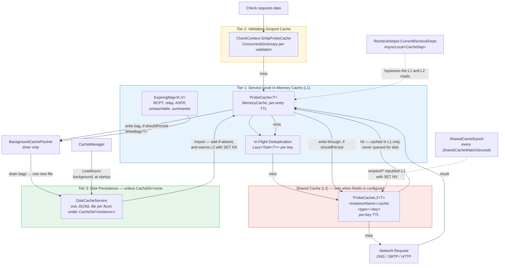
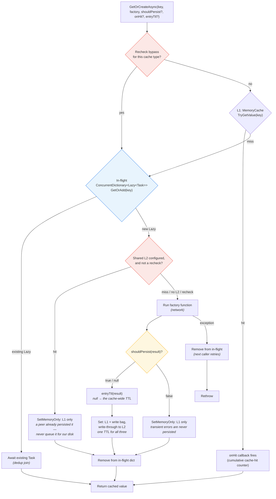

# Caching Architecture

EDNSV uses a multi-tier caching system to minimize redundant network requests across checks and across multiple domain validations. This document covers the caching layers, in-flight deduplication, disk persistence, the recheck bypass mechanism, and how transient failures are handled differently from definitive ones.

## Cache Tiers


```mermaid
flowchart TD
    subgraph Tier1["Tier 1: Service-Level In-Memory Cache (L1)"]
        direction TB
        PC["ProbeCache&lt;T&gt;<br/><i>MemoryCache, per-entry TTL</i>"]
        DEDUP["In-Flight Deduplication<br/><i>Lazy&lt;Task&lt;T&gt;&gt; per key</i>"]
        EM["ExpiringMap&lt;K,V&gt;<br/><i>RCPT, relay, AXFR,<br/>unreachable, summaries</i>"]
        PC --> DEDUP
    end

    subgraph Tier2["Tier 2: Validation-Scoped Cache"]
        direction TB
        SMTPC["CheckContext.SmtpProbeCache<br/><i>ConcurrentDictionary per validation</i>"]
    end

    subgraph TierL2["Shared Cache (L2) — only when Redis is configured"]
        direction TB
        REDIS["ProbeCacheL2&lt;T&gt;<br/><i>&lt;InstanceName&gt;:cache:&lt;type&gt;:&lt;key&gt;<br/>per-key TTL</i>"]
    end

    subgraph Tier3["Tier 3: Disk Persistence — unless CacheDir=none"]
        direction TB
        DCACHE["DiskCacheService<br/><i>one JSONL file per flush,<br/>under CacheDir/&lt;instance&gt;/</i>"]
    end

    CHECK["Check requests data"] --> SMTPC
    SMTPC -->|miss| PC
    PC -->|miss| DEDUP
    DEDUP -->|miss| REDIS
    REDIS -->|"hit — cached in L1 only,<br/>never queued for disk"| PC
    REDIS -->|miss| NET["Network Request<br/><i>DNS / SMTP / HTTP</i>"]
    NET -->|result| PC
    PC -->|"write-through, if shouldPersist"| REDIS

    PC -->|"write bag, if shouldPersist"| BG["BackgroundCacheFlusher<br/><i>timer only</i>"]
    EM -->|"WriteBag&lt;T&gt;"| BG
    BG -->|"drain bags → one new file"| DCACHE

    CM["CacheManager"] -->|"LoadAsync<br/><i>background, at startup</i>"| DCACHE
    DCACHE -->|"Import — add-if-absent,<br/>and warms L2 with SET NX"| PC

    WATCH["SharedCacheEpoch<br/><i>every SharedCacheWatchSeconds</i>"] -.->|"emptied? republish L1<br/>with SET NX"| REDIS

    RH["RecheckHelper.CurrentRecheckDeps<br/><i>AsyncLocal&lt;CacheDep&gt;</i>"] -.->|"bypasses the L1 and L2 reads"| PC

    style Tier1 fill:#e8f4fd,stroke:#1a73e8
    style Tier2 fill:#fef7e0,stroke:#f9ab00
    style TierL2 fill:#fce8e6,stroke:#ea4335
    style Tier3 fill:#e6f4ea,stroke:#34a853
```

## Tier 1: ProbeCache\<T\> (In-Memory)

The core caching primitive, defined in `src/Ednsv.Core/Services/ProbeCache.cs`. Each service maintains multiple ProbeCache instances for different query types.

### How It Works


```mermaid
flowchart TD
    REQ["GetOrCreateAsync(key, factory, shouldPersist?, onHit?, entryTtl?)"] --> RECHECK{"Recheck bypass<br/>for this cache type?"}
    RECHECK -->|yes| INFLIGHT
    RECHECK -->|no| MEMCACHE{"L1: MemoryCache<br/>TryGetValue(key)"}
    MEMCACHE -->|hit| HITCB["onHit callback fires<br/>(cumulative cache-hit counter)"]
    HITCB --> RETURN["Return cached value"]
    MEMCACHE -->|miss| INFLIGHT{"In-flight<br/>ConcurrentDictionary&lt;Lazy&lt;Task&gt;&gt;<br/>GetOrAdd(key)"}
    INFLIGHT -->|existing Lazy| AWAIT["Await existing Task<br/><i>(dedup join)</i>"]
    INFLIGHT -->|new Lazy| L2{"Shared L2 configured,<br/>and not a recheck?"}
    L2 -->|hit| L2HIT["SetMemoryOnly: L1 only<br/><i>a peer already persisted it —<br/>never queue it for our disk</i>"]
    L2HIT --> CLEANUP
    L2 -->|"miss / no L2 / recheck"| FACTORY["Run factory function<br/><i>(network)</i>"]
    FACTORY --> PERSIST{"shouldPersist(result)?"}
    PERSIST -->|true / null| TTL["entryTtl(result)<br/><i>null → the cache-wide TTL</i>"]
    TTL --> SET["Set: L1 + write bag,<br/>write-through to L2<br/><i>one TTL for all three</i>"]
    PERSIST -->|false| MEMONLY["SetMemoryOnly: L1 only<br/><i>transient errors are never persisted</i>"]
    SET --> CLEANUP["Remove from in-flight dict"]
    MEMONLY --> CLEANUP
    CLEANUP --> RETURN
    AWAIT --> RETURN

    FACTORY -->|exception| REMOVE["Remove from in-flight<br/><i>(next caller retries)</i>"]
    REMOVE --> THROW["Rethrow"]

    style RECHECK fill:#fce8e6,stroke:#ea4335
    style INFLIGHT fill:#e8f4fd,stroke:#1a73e8
    style L2 fill:#fce8e6,stroke:#ea4335
    style PERSIST fill:#fef7e0,stroke:#f9ab00
```

### In-Flight Deduplication

When multiple checks request the same DNS record simultaneously, only **one** network request is made. The mechanism:

1. `ConcurrentDictionary<string, Lazy<Task<T>>>` holds in-flight requests
2. `GetOrAdd` ensures only one `Lazy` is stored per key (even when `GetOrAdd`'s value-factory is invoked concurrently — only the stored `Lazy.Value` is ever materialised)
3. All concurrent callers for the same key `await` the same `Task`
4. On completion (success or failure), the in-flight entry is removed
5. On failure, the next caller retries with a fresh factory call

### `shouldPersist` Predicate (Always-Cache, Maybe-Persist)

`GetOrCreateAsync` accepts an optional `shouldPersist: Func<TValue, bool>` predicate that decides whether the result is added to the **write bag**. The predicate does **not** control in-memory caching — every successful factory result is written to MemoryCache so duplicate calls within the same process are still deduped:

| `shouldPersist` returns | L1 (MemoryCache) | Write bag (disk) | Shared Redis L2 |
|-------------------------|------------------|------------------|-----------------|
| `true` (or predicate is null) | written via `Set()` | queued | written through |
| `false` | written via `SetMemoryOnly()` | **skipped** | **skipped** |

The predicate gates the shared L2 as well as the disk bag — a transient error must not
be published to peers any more than it should reach disk.

This is how transient failures are kept out of the on-disk cache while still avoiding repeated network calls for the rest of the current process. Service-level predicates:

| Service / cache | Persist when |
|-----------------|--------------|
| `DnsResolverService._queryCache` | `response != EmptyResponse.Instance` (skip timeouts/SocketExceptions/DNS errors) |
| `DnsResolverService._serverQueryCache` | same — skip `EmptyResponse` |
| `DnsResolverService._ptrCache` | reverse-lookup actually succeeded |
| `SmtpProbeService._probeCache` | `result.Connected` OR error is not `"Connection timed out"` (cache definitive failures, skip transient timeouts) |
| `SmtpProbeService._portCache` | port was open OR at least one attempt got a definitive refusal |
| `HttpProbeService._getCache` / `_getWithHeadersCache` | `result.Success || result.StatusCode > 0` (any HTTP status counts as definitive; only network-level failures with status 0 are skipped) |

Predicates that aren't supplied (`AXFR`, and the RCPT/relay caches, which are an `ExpiringMap`) follow the same intent in their own code: only definitive results are stored.

### `onHit` Callback

`GetOrCreateAsync` also accepts an optional `onHit: Action`. Services use it to drive the cumulative `CacheHits` counter — wiring the increment into the cache itself avoids miscounts when callers (e.g. `QuerySpeculativeAsync`) bypass `GetOrCreateAsync` and call `TryGet` directly.

### Write Bag

A separate `ConcurrentDictionary<string, BagEntry<TValue>>` holds values **queued for the next flush**. `Set()` writes to both MemoryCache and the bag; `SetMemoryOnly()` writes only to MemoryCache.

What the bag *excludes* is the point of its design. Three kinds of value are cached but never queued:

- results that fail `shouldPersist` (transient errors, which must not outlive the process);
- values read from the shared **Redis L2** — whichever instance fetched them has already written them to its own disk, and persisting them here duplicates that work onto ours;
- entries **imported from disk at startup** — they are on disk by definition.

That last exclusion is the one that mattered: an import that fed back into the write queue would have every entry read at startup re-serialised and rewritten on every flush for the life of the process — which is the amplification this design exists to remove.

A flush snapshots the bag, writes those records, and removes **exactly what it wrote**, matched by reference. Nothing leaves the bag until the file has landed, so a failed write simply retries next tick, and a fresher value that arrived for the same key mid-write survives. `BagEntry` states its reference equality explicitly rather than inheriting it: `ConcurrentDictionary.TryRemove(KeyValuePair)` compares values with `EqualityComparer<T>.Default`, so any value-based equality there would let a flush silently delete the newer entry that replaced the one it persisted.

The four caches that live in an `ExpiringMap` rather than a `ProbeCache` — RCPT probes, relay tests, AXFR results and unreachable-server counts — carry a `WriteBag<T>` for the same reason. Serialising them whole on each flush would mean a flush always found something to write, which defeats the dirty-flag behaviour below.

### Value-Type Variant

`ProbeCacheValue<TValue>` handles value types (bool, int) using an internal `Box` wrapper, since MemoryCache requires reference types. It carries the same `shouldPersist` semantics as the reference-type variant.

## Tier 2: Validation-Scoped Cache

`CheckContext.SmtpProbeCache` is a `ConcurrentDictionary<string, SmtpProbeResult>` scoped to a single validation. It is:

- **Populated during prefetch** — SMTP probes run during the prefetch phase and results are stored here
- **Read by concurrent checks** — checks call `ctx.GetOrProbeSmtpAsync(host, port)` which checks this cache first
- **Isolated per validation** — each `ValidateAsync()` call gets a fresh CheckContext, preventing cross-validation interference

This tier exists because during recheck mode, the service-level ProbeCache is bypassed. The validation-scoped cache ensures SMTP probes from the current validation's prefetch phase are still reusable by its checks.

## Tier 3: Disk Persistence

`DiskCacheService` (`src/Ednsv.Core/Services/DiskCacheService.cs`) persists probe results under `CacheDir` (defaults to `<DataDir>/cache`; `DataDir` itself defaults to `.ednsv-data`).

### One immutable file per flush

Each flush writes everything queued since the last one into a single new file:

```
<CacheDir>/<instance>/cache.<utc>.<nonce>.jsonl
```

written once via `AtomicFile` (temp + rename) and never touched again. There are no appends, no rotation and no compaction — nothing is re-serialised on a later flush just because it is still cached.

`<instance>` is the pod name (`HOSTNAME`, falling back to the machine name), so replicas sharing a mount never write the same file. That matters: a single file per cache type meant N pods doing a read-modify-write of one file on their own timers, quietly dropping each other's entries, with no coordination covering it.

Consequences, all of which remove work rather than adding it:

- no torn or interleaved lines — every file is written whole and atomically;
- no conflict when a CLI run shares a hostname with the web service; they write different filenames;
- exactly one line per key per file, because the bag dedupes within a flush;
- the sweep needs no exception for "the file being written right now" — there isn't one.

### Record format

One self-describing record per line, so all cache types share a file:

```json
{"t":"dns","k":"q:example.com:MX","w":"2026-07-25T02:00:00Z","e":"2026-07-25T02:30:00Z","v":{…}}
```

| field | meaning |
|-------|---------|
| `t` | cache type — `dns`, `dns-srv`, `ptr`, `smtp`, `port`, `rcpt`, `relay`, `http-get`, `http-get-headers`, `axfr`, `unreachable`, `domain-results` |
| `k` | the cache's own key, written and read back verbatim |
| `w` | when the value was fetched — orders entries across instances on merge |
| `e` | when it stops being usable |
| `v` | the serialised value |

**Both timestamps are needed.** `w` orders; `e` decides liveness. They cannot be collapsed into one, because with DNS TTL gating a value fetched later can expire sooner than one fetched earlier. And `w` must be per-record rather than taken from the filename: two instances flushing at different moments can hold entries fetched in the opposite order.

### DNS record-TTL gating

By default every cached DNS answer gets the full `CacheTtlHours`, regardless of what the zone published — so a domain rotating records every thirty seconds is served from cache for hours.

Set `DnsCacheMinTtlSeconds` above zero and the query, server-query and PTR caches instead bound each entry by `clamp(minimum record TTL, DnsCacheMinTtlSeconds, CacheTtlHours)`. The floor stops short-TTL domains forcing a refetch on nearly every validation; the cap must remain the ceiling, because the sweep deletes a record file at `fileTime + CacheTtlHours` and a longer-lived entry could be swept while still considered live.

An **empty answer section** falls back to the floor. That is not an edge case to shrug at: NXDOMAIN and NODATA are real responses, they are cached, and their answer sections are always empty. The minimum comes from `InitialTimeToLive`, not `TimeToLive` — the latter counts down while DnsClient holds the record, which would shorten every entry by however long the response sat around.

**It ships off** (`DnsCacheMinTtlSeconds=0`). This release is "stop rewriting everything, and 2 hours instead of 24"; gating is a second, separately observable change to enable once the effect of the shorter cap has been seen on its own.

### Load

The load runs on a **background task**, not before the app starts serving — awaiting it made startup latency scale with replica count, since on a shared mount every instance reads every other instance's folder and a rolling deploy has all of them doing it at once. `/health/ready` deliberately does not wait; the first validations after a deploy run cold.

Every `*.jsonl` under the cache directory is scanned, keeping the entry with the latest `w` per `(t, k)`. Two expiry rules apply: a record is dropped if its own `e` has passed, and equally if `w` is older than the reader's configured `CacheTtlHours` — a process running without a TTL stamps no expiry of its own, and the reader's setting must still bound how stale a value it accepts.

The scan reads each line's envelope with a `Utf8JsonReader` and **skips the `v` payload**, so scanning is O(all lines) in cheap work while the expensive part — `DnsCacheSerializer.DeserializeResponse` rebuilding a full `IDnsQueryResponse`, which dominates the load — is O(live keys).

Imports are **add-if-absent**. Because the instance is already serving, a validation can fetch and cache a key before the loader reaches it; that value came off the network just now and the disk copy did not. A fetch still in flight counts as present. Imported entries carry their own `e` into MemoryCache rather than getting a fresh TTL, so a nearly-dead entry is not resurrected for another full period.

When Redis is configured, each imported entry is also published to the shared L2 with `SET NX` and its **remaining** life. `NotExists` keeps a cluster-wide restart idempotent and stops instances holding overlapping views of the same files racing to publish their own copies over each other's.

An unparseable line is skipped rather than failing its file; an unreadable file rather than failing the load.

### Flush — the timer, and nothing else

```
every FlushIntervalSeconds:
    snapshot each cache's bag
    if all empty -> return                 # the bag IS the dirty flag
    serialise every snapshot into one file, temp + rename
    on success: remove exactly the entries written, matched by reference
    on failure: leave the bags untouched; the next tick retries
```

There is no explicit flush endpoint and no flush-on-completion. An ungraceful crash loses at most one interval, which is why the interval is ten minutes rather than an hour; a graceful shutdown flushes via an `ApplicationStopping` hook bounded by `CacheShutdownFlushSeconds`.

An idle process writes nothing at all, because the bags are empty.

### Sweep

Runs on the background load and on each flush tick, best-effort.

Record files are deleted by **filename arithmetic alone**: every entry in a file was written no later than the file was, so once `fileTime + CacheTtlHours` is past, nothing in it can still be live. The rule applies to this instance's files exactly as to any other's. Only `*.jsonl` inside an instance folder is ever considered, so an operator who points `CacheDir` at a shared location — or at the data directory itself, alongside `config.json` and `users.json` — never has unrelated files taken with them.

A **folder** is removed only when it is empty, is not ours, and its own mtime is past the cutoff. The age gate makes this safe against an instance that has just started and not yet flushed — creating the folder sets a fresh mtime. Note the timing: removing the last file updates the parent's mtime, so the clock only starts once the folder is already empty, and a dead instance's folder lingers for roughly twice the TTL. Every flush calls `Directory.CreateDirectory` regardless, because a *live* instance idle longer than the TTL writes no files, ages out, and has its folder legitimately removed.

Directory mtime is reliable on POSIX but not on SMB/Azure Files, where servers may not update it on entry changes; there the gate degrades to near-immediate removal, which the `CreateDirectory` guard already covers.

Pod-name reuse is not a hazard in either direction: Deployment names are never reused, so an orphaned folder is definitively dead; StatefulSet names are, and a restarting pod simply finds its own still-valid entries.

### Turning expiry off

`CacheTtlHours=0` disables expiry: values never expire in memory, per-entry expiry is not stamped, and the load reads whatever is on disk without a staleness cutoff.

**Files are still swept, after a 24-hour floor.** The two tiers are not symmetric, and the difference is easy to miss:

- **Memory is self-bounding.** Both memory primitives are keyed — `MemoryCache` in a `ProbeCache`, a `ConcurrentDictionary` in an `ExpiringMap` — so the working set is the number of *distinct* keys, bounded by the domains checked. Refetching a key replaces its entry.
- **Disk is append-only by design.** Every flush writes a new immutable file, so a key fetched again later appears *again* in a later file rather than replacing anything. Rechecks refetch on purpose, and each instance writes its own copy of what it fetched. Nothing collapses those duplicates — the sweep is the only thing that ever removes them.

So switching the sweep off along with expiry would grow the directory without bound while memory stayed flat. `DiskCacheService.UncappedRetention` is the floor that prevents it; at a ten-minute flush that is 145 files per instance, which is where the file-count arithmetic below still lands comfortably. Startup logs the floor rather than leaving it to be discovered from a file listing.

Only *retention* is capped. Reading stays uncapped, so whatever survives on disk is loaded in full.

### File count

Live files per instance are `CacheTtlHours / FlushIntervalSeconds + 1` — **13 at the defaults** (2h / 600s). Across ten replicas that is ~130 files in ten folders. An operator running `CacheTtlHours=24` with 30-minute flushes gets 49 per instance. Total opens grow with replicas × retention; that product is the number to watch.

### Optional Redis L2 (distributed mode)

When `Ednsv.Web` runs with `Redis:ConnectionString` configured, `ProbeCache<T>` gains an optional shared **L2** behind the per-pod L1 `MemoryCache`: on an L1 miss it reads `{InstanceName}:cache:{type}:{key}` from Redis, and successful results (those passing `shouldPersist`) are write-through to both L1 and the L2. It is best-effort — any Redis error transparently falls through to the network — and unused in the default single-instance mode. See [horizontal-scaling.md](horizontal-scaling.md) → *Probe cache (L1 + Redis L2)*.

#### Recovering an emptied L2

A Redis restart without persistence, a `FLUSHALL`, or a failover to an empty replica leaves the shared cache cold — and **it does not refill on its own in any useful timeframe**. Every instance is still serving happily from its own L1 and disk tier and has no reason to refetch anything, so the L2 stays degraded until entries age out of L1 naturally. That silently breaks the recovery the recommended deployment leans on: a rescheduled pod with a pod-local cache directory is supposed to come back warm *from the L2*.

`SharedCacheEpoch` notices. A single nonce key (`{InstanceName}:cache-epoch`, deliberately outside the `cache:` namespace) is established at startup and re-read every `SharedCacheWatchSeconds` (default 30). That is deliberately far more frequent than the disk flush and has its own key: the check is a single `GET` — a rounding error against the hundreds of L2 operations one validation already performs — and it is what bounds how long the shared cache stays cold after a flush. Borrowing the flush interval would also have left `CacheDir=none`, where no flusher runs at all, taking its recovery latency from a setting that governs nothing. If it has vanished, everything else vanished with it; if it has *changed*, another instance has already noticed a flush and re-established it. Either way the response is the same: republish everything held in L1, with `SET NX` and each entry's remaining life.

**Memory is the source, not disk** — and the first reason is the one that decides it:

- **L1 is a superset of what disk would offer.** The startup load imports every instance's live records into L1, so afterwards L1 holds those *plus* everything fetched since, including the last flush interval's worth that has not reached disk yet.
- **It needs no file I/O.** Re-reading and re-parsing every file on the mount, on every instance, is the expensive half of the alternative and buys nothing.
- **It works where disk cannot.** A deployment running `CacheDir=none` has no disk tier at all, and its L1 is then the only copy of those results in existence. That is what makes skipping the disk tier a sound default alongside Redis.

`MemoryCache` cannot be enumerated on .NET 8, so `ProbeCache` keeps a parallel key → expiry index. It exists only when there is a shared tier to warm **and** something that will warm it — no Redis, or `SharedCacheWatchSeconds=0`, and the index is never allocated at all, so those deployments pay nothing for it. Both halves of that condition matter: the watch tick is the only thing that prunes the index, so keeping it with the watch off would accumulate every distinct key the process had ever cached, expired ones included, for the life of the process, and nothing would ever read it. The consequence is that turning the watch back on takes a restart, which the startup warning says.

The index is a *hint* rather than a second source of truth: every use re-checks the key against MemoryCache and drops it if it has gone, which makes a stale entry harmless — eviction callbacks fire lazily and cannot keep an index exact. The periodic prune removes expired keys, without which the index would track every key ever cached rather than the live set.

Two further details are load-bearing:

- **Every instance re-warms, not just the one that noticed.** Each holds only what it has fetched and imported, so a single warmer would republish a fraction of the fleet's knowledge. The redundant overlap costs N idempotent `SET NX` passes over the same keys, once, and cannot clobber a fresher value.
- **An unreachable Redis is never mistaken for an empty one**, or an outage would trigger a re-warm on every tick for as long as it lasted. A failed read bails immediately, and a missing key is acted on only when the follow-up write succeeds, which proves the connection was live. (`GetDatabase()` is no help here: with `abortConnect=false` the multiplexer hands back a database whether or not a server is reachable, so the failure surfaces on the command.)

It is a cheap heuristic for the case that actually hurts, not a consistency mechanism. Under an `allkeys-*` eviction policy the nonce can be evicted while other keys survive, producing a re-warm that was not needed — harmless, because the warm is add-if-absent. A partial eviction that spares the nonce goes unnoticed.

## Service Cache Inventory

Two shapes appear here: a `ProbeCache<T>`, which owns a MemoryCache, an in-flight dedup
map, a write bag and an optional Redis L2; and an `ExpiringMap<K,V>`, usually paired
with a `WriteBag<T>`, which owns none of that and is read with a direct `TryGetValue`.
The difference that remains is the shared L2 and the in-flight dedup — both expire on
`CacheTtlHours`, and both honour the recheck bypass.

### DnsResolverService
| Cache | Type | Key format | Recheck |
|-------|------|-----------|---------|
| `_queryCache` | `ProbeCache<IDnsQueryResponse>` | `q:domain:queryType` | `CacheDep.Dns` |
| `_ptrCache` | `ProbeCache<List<string>>` | `ptr:ip` | `CacheDep.Ptr` |
| `_serverQueryCache` | `ProbeCache<IDnsQueryResponse>` | `sq:server:domain:queryType` | `CacheDep.ServerDns` |
| `_axfrCache` + `_axfrBag` | `ExpiringMap<(ip,domain), bool>` | `ip\|domain` on disk | `CacheDep.Axfr` |
| `_axfrResponseCache` | `ExpiringMap<(ip,domain), IDnsQueryResponse>` | tuple | `CacheDep.Axfr` — not persisted |
| `_unreachableServerCounts` + `_unreachableBag` | `ExpiringMap<string, (count, lastFailure)>` | server IP | `CacheDep.ServerDns` — see *Unreachable-server decay* |
| `_serverClients` | `ExpiringMap<string, LookupClient>` | server IP | n/a — a client pool, not results |

### SmtpProbeService
| Cache | Type | Key format | Recheck |
|-------|------|-----------|---------|
| `_probeCache` | `ProbeCache<SmtpProbeResult>` | `smtp:host:port` | `CacheDep.Smtp` |
| `_portCache` | `ProbeCacheValue<bool>` | `port:host:port` | `CacheDep.Port` |
| `_rcptCache` + `_rcptBag` | `ExpiringMap<string, (accepted, response)>` | `host\|email` | `CacheDep.Rcpt` |
| `_relayCache` + `_relayBag` | `ExpiringMap<string, (isRelay, description)>` | `relay:host\|domain` | `CacheDep.Smtp` |

### HttpProbeService
| Cache | Type | Key format | Recheck |
|-------|------|-----------|---------|
| `_getCache` | `ProbeCache<GetResult>` | `url` (or `url\nAccept:<media-type>` for `GetWithAcceptAsync`) | `CacheDep.Http` |
| `_getWithHeadersCache` | `ProbeCache<GetWithHeadersResult>` | `url` | `CacheDep.Http` |

`DomainResultStore` holds one more: `ExpiringMap<string, DomainResultSummary>` keyed by
lowercased domain, plus its own `WriteBag`.

Only `_probeCache`, `_queryCache`, `_serverQueryCache`, `_ptrCache`, `_getCache` and
`_getWithHeadersCache` have a Redis L2; `_portCache` and the `ExpiringMap` caches are L1
and disk only, so they are never shared between instances.

### ExpiringMap

Seven caches are not a `ProbeCache`, and until recently that meant they were plain
`ConcurrentDictionary` fields with **no expiry at all**: an entry lived for the life of
the process, so the working set grew with every distinct key the process had ever seen.
The two AXFR caches were the worst of it — a zone transfer response is the largest thing
this service holds, kept per `(nameserver, domain)` — and `_serverClients` held a
`LookupClient`, and its socket pool, per nameserver IP ever queried.

**`ExpiringMap<K,V>` is a `MemoryCache` plus this project's three cache rules.** Expiry
itself is entirely the platform's: exact on read, plus a sweep for keys nobody reads
again, which MemoryCache triggers from a cache operation, rate-limits by
`ExpirationScanFrequency` (one minute by default) and dispatches to the thread pool.

Two things MemoryCache has no primitive for are covered by a lock over the compound
write: add-if-absent, which the import path needs so exactly one of two racing importers
stores; and the read-modify-write the unreachable-server counter needs, on a path only
reached once a DNS query has already failed. Reads and plain `Set` stay lock-free.
Enumerating the live set is the one thing MemoryCache genuinely cannot do before .NET 9,
and nothing in production asks it to — which is also why `ProbeCache` has to keep a
parallel key index for the Redis re-warm.

What the wrapper is for is the three rules that are this project's rather than the
platform's, each of which has been a bug when it lived at the call sites instead:

1. **The recheck bypass** — a validation rechecking this cache type must read a miss.
   Omitted at four call sites until recently; see below.
2. **A null TTL means no expiry**, which is what `CacheTtlHours=0` means everywhere else.
3. **An import keeps the expiry stamped on its record** rather than a fresh full TTL, so
   a nearly-dead entry read from disk is not resurrected — and one already past its
   expiry is refused outright.

`Count` on these maps is therefore **what MemoryCache is holding, expired-but-unswept
entries included** — the memory question. Whether a particular entry is still live is a
question for a read, which is why the tests assert through one.

`_serverClients` is a pool rather than a cache, so expiry there means only that a client
unused for a whole TTL is rebuilt on next use — a trade of one socket-pool
reconstruction against unbounded retention.

### Recheck reaches these too

`ExpiringMap.TryGetValue` takes the same `CacheDep` flag as `ProbeCache.TryGet` and
returns a miss for the types the current validation is rechecking. Four caches were
outside that mechanism until recently, and each was a different shade of the same
defect:

- **`_rcptCache`** — `CacheDep.Rcpt` existed, `RecheckHelper` mapped the **Postmaster**
  and **Abuse** categories to it, and nothing anywhere read it. Rechecking either
  finding re-ran the check against the same cached verdict.
- **`_relayCache`** — no flag of its own, and the one its category declares
  (`CacheDep.Smtp`, via `CheckCategory.SMTP`) refreshed the handshake beside it while
  the relay verdict was reused.
- **The AXFR caches** — `CheckCategory.ZoneTransfer` declared only `CacheDep.Dns`, which
  names neither of them. `CacheDep.Axfr` is new and is the only flag that reaches them;
  putting them behind `Dns` would have every recheck of anything re-run zone transfers
  against every nameserver.
- **The unreachable-server breaker** — not a cache read at all, but it sits *in front*
  of `_serverQueryCache` and returns `EmptyResponse` without querying. A recheck run
  straight after the failure that prompted it falls inside the five-minute decay window,
  so every server that had just failed was skipped rather than retried — the bypass
  behind it never got a chance to matter. It now yields to `CacheDep.ServerDns`.

**The write side matters as much as the read.** These caches wrote add-if-absent, which
is correct only while entries cannot be replaced: after a bypassed read the fresh answer
would find the stale entry still present, be handed to the caller, and be dropped — every
recheck paying for a probe and changing nothing, for ever. They write unconditionally
now, into the write bag as well as memory, so the refreshed verdict also reaches disk.

One exception, and it is not an oversight: a zone transfer that never happened is not
recorded. `EmptyResponse` means the TCP attempt failed, which is indistinguishable from
a refused *transfer* once reduced to a bool — so caching it would record "not
vulnerable" for a server nobody reached, and on a recheck would overwrite a real finding
with it. Same intent as `shouldPersist` everywhere else.

### Unreachable-server decay

`DnsResolverService` tracks server failures in `_unreachableServerCounts` keyed by IP, storing both a failure count and `lastFailure` timestamp. Once a server fails `MaxRetries` (default 3) times, subsequent queries are short-circuited to `EmptyResponse.Instance` — but only while the most-recent failure is within the **5-minute decay window** (`_unreachableDecay`). After the window expires, the next call retries the server normally and the counter is cleared on the first successful response. This prevents transient outages from permanently blacklisting a recursive resolver across the lifetime of a long-running process. The decay window governs only whether the *skip* applies; the entry itself expires on `CacheTtlHours` like any other cached value, so the map tracks servers seen recently rather than every server ever queried.

## CacheManager

`CacheManager` (`src/Ednsv.Core/Services/CacheManager.cs`) orchestrates the cache lifecycle and implements `IAsyncDisposable`:

1. **LoadAsync(retryErrors)** — Reads the disk cache into the service caches via `Import()`, including domain summaries. With `retryErrors=true`, drops cached entries whose stored result indicates a transient failure so they are reprobed. The web host runs this on a background task; the CLI awaits it, since a single-shot run needs the cache before it starts.
2. **StartBackgroundFlusher(interval)** — Starts the periodic flusher (default `FlushIntervalSeconds=600`), which also runs the sweep on each tick.
3. **FlushAsync()** — Routes through the flusher's lock when one is active; falls back to `DiskCacheService.SaveAsync` for CLI single-shot mode.
4. **SaveDomainResult(domain, summary)** — Records a validation result. Synchronous and in-memory: it updates the map immediately and queues the write for the next flush, like every other cache. Deliberately not a write-through per completed validation, which would be a read-modify-write of one file under a semaphore — the amplification this design removes everywhere else.
5. **GetRecheckDeps(domain, minSeverity)** — Reads the domain summaries to determine which cache types to bypass for a recheck. Returns `CacheDep.None` if the domain has no recorded prior result.
6. **WarmSharedCache()** — Republishes everything held in L1 into the shared Redis cache, for use when that cache has been emptied. Returns the number of keys published. See *Recovering an emptied L2*.
7. **PruneSharedCacheIndex()** — Drops shared-cache index entries whose keys have expired. Cheap, and needed on a timer because MemoryCache expires lazily and never says so.
8. **DisposeAsync()** — Disposes the flusher (which performs its final flush) or, without one, performs a direct save.

The web host registers these singletons as pre-created instances, and the DI container only disposes what it **constructs** — so an explicit `ApplicationStopping` hook performs the shutdown flush. Without it every deploy silently discarded whatever had been gathered since the last periodic flush.

### Turning the disk tier off

`CacheDir=none` disables it entirely: no load, no flusher, no sweep, and — importantly — **nothing queued in the write bags**. That gate belongs on the caches themselves, not just the flusher, or the bags would grow for the life of the process with nothing draining them.

Only the literal string `none` disables it. A blank value resolves to the default path, deliberately: `GetValue<string>` returns the *empty string* for a JSON `null`, so anything looser would turn the disk cache off for every deployment whose settings file merely mentions the key.

Startup logs a warning when `CacheDir=none` **and** no Redis is configured. That is L1-only: the cache dies with the process and every restart is fully cold. Reasonable on a dev box, almost certainly a misconfiguration in production.

With Redis configured it is not a warning — it logs at Information, because `none` is then the **recommended** multi-pod shape. The shared-cache watch still runs, so an emptied Redis is republished from memory; see [horizontal-scaling.md](horizontal-scaling.md) → *Skip the disk cache once Redis is present*.

## Recheck System

The recheck feature re-runs previously failing checks against fresh data, leaving every other cached result in place.


```mermaid
flowchart LR
    REQ["--recheck warning"] --> CM["CacheManager.GetRecheckDeps()"]
    CM --> DR["Read the domain summaries<br/><i>Previous issues for domain</i>"]
    DR --> MAP["RecheckHelper.GetDependenciesForIssues()<br/><i>Map categories → CacheDep flags</i>"]
    MAP --> FLAGS["CacheDep flags<br/><i>e.g., Dns | Smtp | Http</i>"]
    FLAGS --> AL["AsyncLocal&lt;CacheDep&gt;<br/><i>Flows through async calls</i>"]
    AL --> BYPASS["ProbeCache.TryGet() bypasses<br/>MemoryCache for flagged types"]
    BYPASS --> FRESH["Fresh network request<br/><i>the L2 read is skipped too</i>"]
    FRESH --> WRITE["Write back to L1, the write bag<br/>and the L2<br/><i>available to other users and pods</i>"]
```

### How It Works

1. **Determine deps**: `CacheManager.GetRecheckDeps()` reads the domain's previous results and maps failing check categories to `CacheDep` flags using `RecheckHelper.GetDependencies()`.

2. **Set context**: `DomainValidator.ValidateAsync` sets `RecheckHelper.CurrentRecheckDeps.Value` (an `AsyncLocal<CacheDep>`) at the start of the validation and clears it back to `CacheDep.None` in the finally section. Because it is `AsyncLocal`, each concurrent validation in the web API gets its own value with no cross-bleed, and the deps automatically flow through `await` boundaries into the singleton DNS/SMTP/HTTP services.

3. **Bypass on read**: `ProbeCache.TryGet()`, `ProbeCacheValue.TryGet()` and `ExpiringMap.TryGetValue()` all check `RecheckHelper.CurrentRecheckDeps.Value.HasFlag(recheckFlag)` before consulting the cache. When the flag is set, the read is a miss — and `GetOrCreateAsync` skips the **shared L2 read** as well, so a recheck cannot be satisfied by a peer's cached copy. The L2 *write-back* still happens, so a forced recheck refreshes the shared cache for everyone.

4. **Fresh query**: The factory function runs, making a real network request.

5. **Write back**: The fresh result is stored in MemoryCache, and — when `shouldPersist` returns true — queued in the write bag and written through to the shared L2. Other concurrent validations benefit immediately, and the next non-recheck request serves the new value from cache.


### CacheDep Flags

```
None = 0
Dns = 1         — Standard DNS queries
ServerDns = 2   — Server-specific DNS queries
Ptr = 4         — PTR lookups
Smtp = 8        — SMTP handshake probes
Port = 16       — Port reachability
Rcpt = 32       — RCPT verification
Http = 64       — HTTP GET requests
Axfr = 128      — Zone-transfer verdicts and the transfers themselves
All = 255       — All cache types
```

`Axfr` is deliberately its own bit rather than part of `Dns`: an attempt is a TCP query
per nameserver with a ten-second budget, and nearly every category declares `Dns`, so
sharing the bit would make every recheck of anything re-run zone transfers wherever the
feature is enabled.

### Category → Dependency Mapping (examples)

| Category | Dependencies |
|----------|-------------|
| MX | Dns, Smtp, Ptr |
| SPF | Dns |
| DMARC | Dns |
| SMTP | Dns, Smtp, Port |
| MTA-STS | Dns, Http |
| Postmaster | Rcpt |
| Delegation | Dns, ServerDns, Ptr |
| ZoneTransfer | Dns, Axfr |

### CLI vs Web Behavior

CLI and web API use the **same** AsyncLocal bypass. Both flow `validator.RecheckDeps` into `RecheckHelper.CurrentRecheckDeps` and rely on the cache reads returning `false` for matching cache types. There is no separate "imported-only" tracking and no physical cache invalidation on the recheck path — fresh results simply overwrite stale ones.
