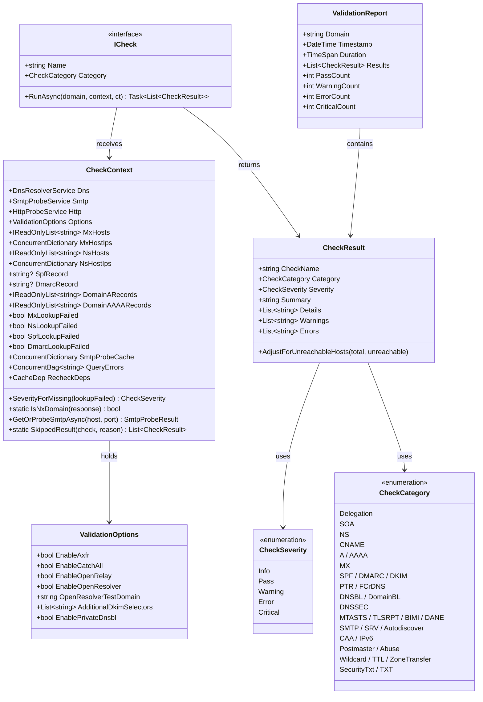
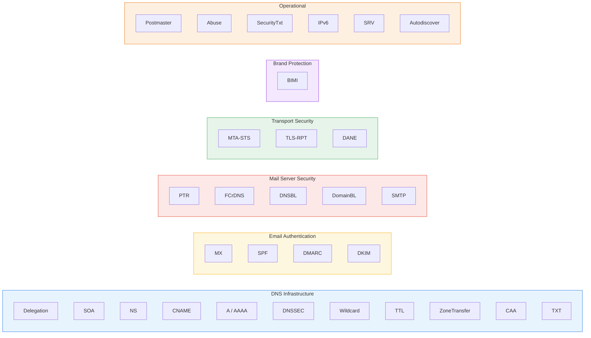

# Check Framework & Categories

This document describes the check system — how individual checks are structured, how they share state, and how they are organized into categories.

## Core Types



## The ICheck Interface

Every check implements `ICheck` (defined in `src/Ednsv.Core/Checks/ICheck.cs`):

```csharp
public interface ICheck
{
    string Name { get; }
    CheckCategory Category { get; }
    Task<List<CheckResult>> RunAsync(string domain, CheckContext context, CancellationToken cancellationToken = default);
}
```

A single check can return **multiple** CheckResult objects (e.g., a check might report both findings and warnings).

### Cancellation

`DomainValidator` wraps every check invocation in a `CancellationTokenSource` (45 s for foundation/concurrent phases, 30 s for the deferred-retry phase) and passes the token into `RunAsync`. When the token fires:

- The check should observe `cancellationToken` on long awaits (DNS / SMTP / HTTP calls) so the running task tears down promptly instead of holding network resources for the full timeout.
- Throwing `OperationCanceledException` while `cts.IsCancellationRequested` is treated by the validator as a **timeout** rather than a check failure: the check is queued for the deferred retry phase (Phase 4) instead of being recorded as an error.
- This replaced the older `Task.WhenAny(checkTask, Task.Delay(timeout))` pattern, which left the original task running in the background after a timeout and made every long-running check leak its DNS/TCP slot until natural completion.

Concrete checks generally call cancellable service methods (e.g. `Dns.QueryAsync` returns once the underlying `LookupClient` honours its 15 s per-query timeout). The token is propagated where it materially shortens shutdown; non-cancellable internal awaits are still bounded by the service-level timeouts.

## CheckContext: Shared State

`CheckContext` is the shared data container passed to every check. It provides:

**Service References** — access to DNS, SMTP, and HTTP services for making queries.

**Shared State** (populated by foundation checks, read-only during concurrent phase):
- `MxHosts` / `MxHostIps` — MX hostnames and their resolved IPs
- `NsHosts` / `NsHostIps` — NS hostnames and their resolved IPs
- `SpfRecord` / `DmarcRecord` — Raw SPF and DMARC record strings
- `DomainARecords` / `DomainAAAARecords` — Domain's A and AAAA records

The host-list properties are typed `IReadOnlyList<string>` (not `List<string>`) so that concurrent checks cannot accidentally mutate shared state once foundation has handed it over. Foundation checks build a local `List<string>` and assign the completed list to the property. The IP dictionaries remain `ConcurrentDictionary<string, List<string>>` because PTR-style fan-outs can extend them in parallel during prefetch.

**Lookup Failure Flags** — indicate whether a foundation lookup had a transient failure (SERVFAIL/timeout) vs simply returning no records:
- `MxLookupFailed`, `NsLookupFailed`, `SpfLookupFailed`, `DmarcLookupFailed`
- Used by `SeverityForMissing(lookupFailed)`: returns `Warning` if the lookup failed (uncertain), `Info` if the record is definitively absent
- NXDOMAIN is treated as definitive absence, NOT as a lookup failure. `CheckContext.IsNxDomain(IDnsQueryResponse)` is a static helper that handles both real `LookupClient` responses (`Header.ResponseCode == NotExistentDomain`) and the disk-cache `CachedDnsResponse` (which only carries `ErrorMessage`).

**Per-Validation SMTP Cache** — `SmtpProbeCache` (ConcurrentDictionary) stores SMTP probe results from the prefetch phase. Checks should use `GetOrProbeSmtpAsync()` to read from this cache rather than calling the service directly. This is essential during recheck mode, where the service-level `_probeCache` is bypassed via `AsyncLocal`; the validation-scoped cache still lets concurrent checks within one validation reuse the prefetch's probe result.

**Per-Validation Recheck Deps** — `RecheckDeps` (`Services.RecheckHelper.CacheDep`) is set once at the top of `ValidateAsync` from `validator.RecheckDeps` and copied into the `AsyncLocal<CacheDep>` that the service caches consult.

**Per-Validation Diagnostics** — `QueryErrors` (ConcurrentBag) collects per-validation DNS errors. Each call to `ValidateAsync` writes its own `ConcurrentBag` into the `DnsResolverService.CurrentQueryErrors` AsyncLocal so that errors emitted by the singleton DNS service are routed back to the originating validation rather than into a process-wide bag (which would bleed errors between concurrent web requests). The final report surfaces these — falling back to `Dns.QueryErrors` only for legacy CLI flows that don't set the AsyncLocal.

**`SkippedResult` helper** — `CheckContext.SkippedResult(check, reason)` returns a single `Info`-severity `CheckResult` used by checks gated on `EnableSmtpProbes` / `EnableHttpProbes` / `EnableDnsbl` / `EnableDirectDns` so a skipped check still appears in the report rather than silently disappearing.

## Severity Levels

| Level | Meaning |
|-------|---------|
| **Info** | Informational — record absent or advisory finding |
| **Pass** | Check passed successfully |
| **Warning** | Potential issue or uncertain result (transient failure) |
| **Error** | Definite misconfiguration or failure |
| **Critical** | Severe issue that likely causes mail delivery failure |

The `AdjustForUnreachableHosts()` method downgrades a `Pass` to `Warning` when some or all MX hosts were unreachable during SMTP probing.

## Check Categories

31 categories organized into functional groups:



## Check Module Map

Each check file in `src/Ednsv.Core/Checks/` contains multiple related checks:

| File | Categories | Key Checks |
|------|-----------|------------|
| `BasicRecordChecks.cs` | A, AAAA, CNAME | ARecordCheck, AAAARecordCheck, CnameChainCheck |
| `DelegationChecks.cs` | Delegation | AuthoritativeNsCheck, DelegationChainCheck, DelegationConsistencyCheck |
| `DkimChecks.cs` | DKIM | DkimSelectorsCheck, ArcCheck |
| `DmarcChecks.cs` | DMARC | DmarcRecordCheck, DmarcPctAnalysisCheck, DmarcInheritanceCheck, DmarcReportUriValidationCheck, and more |
| `ExtendedChecks.cs` | CAA, DANE, SecurityTxt | CaaRecordCheck, DaneCheck, DaneTlsaCertMatchCheck, SecurityTxtCheck, ProviderVerificationTxtCheck, CertificateTransparencyCheck |
| `HighValueChecks.cs` | MTA-STS, TLS-RPT, BIMI, DNSSEC, ZoneTransfer | MtaStsCheck, TlsRptCheck, BimiCheck, DnssecCheck, NsecZoneWalkCheck, ZoneTransferCheck |
| `MiscChecks.cs` | Wildcard, TTL, TXT, SRV, Autodiscover | WildcardDnsCheck, TtlSanityCheck, DuplicateTxtRecordCheck, AllTxtRecordsCheck, SrvRecordsCheck, AutodiscoverCheck |
| `MxChecks.cs` | MX | MxRecordsCheck, MxIpDetectionCheck, MxPrivateIpCheck, MxCnameCheck, NullMxCheck, MxPriorityDistributionCheck, MxBackupSecurityCheck |
| `NsChecks.cs` | NS | NsRecordsCheck, NsMinimumCountCheck, NsLameDelegationCheck, NsNetworkDiversityCheck, DuplicateNsIpCheck, OpenRecursiveResolverCheck |
| `PtrAndBlacklistChecks.cs` | PTR, FCrDNS, DNSBL, DomainBL | ReverseDnsCheck, MxReverseDnsCheck, ForwardConfirmedRdnsCheck, IpBlocklistCheck, ExtendedDnsblCheck, DomainBlocklistCheck |
| `SecurityChecks.cs` | DNSSEC, SMTP | SmtpTlsCertCheck, SmtpTlsVersionCheck, DnsPropagationCheck |
| `SmtpChecks.cs` | SMTP, IPv6, Postmaster, Abuse | SmtpBannerCheck, EhloCapabilitiesCheck, SmtpStarttlsEnforcementCheck, SubmissionPortsCheck, SmtpIpv6ConnectivityCheck, PostmasterAddressCheck, AbuseAddressCheck, and more |
| `SpfChecks.cs` | SPF | SpfRecordCheck, SpfExpansionCheck, SpfLookupCountCheck, SpfIncludeDepthCheck, SpfMacrosCheck, MxCoveredBySpfCheck, SubdomainSpfGapCheck, and more |

## Foundation vs. Concurrent Checks

### Foundation Checks (6, sequential)

These **write** to CheckContext shared state. They run in a fixed order because later checks depend on earlier ones:

1. **AuthoritativeNsCheck** — resolves authoritative nameservers, populates `NsHosts`/`NsHostIps`
2. **ARecordCheck** — resolves domain A records, populates `DomainARecords`
3. **AAAARecordCheck** — resolves domain AAAA records, populates `DomainAAAARecords`
4. **MxRecordsCheck** — resolves MX records, populates `MxHosts`/`MxHostIps`
5. **SpfRecordCheck** — parses SPF TXT record, populates `SpfRecord`
6. **DmarcRecordCheck** — parses DMARC record, populates `DmarcRecord`

### Concurrent Checks (81, parallel)

These **read** from CheckContext shared state. They are independent of each other and run with `MaxDegreeOfParallelism = 12`. Examples:

- **DelegationChainCheck** reads `NsHosts` to validate the delegation chain
- **SpfExpansionCheck** reads `SpfRecord` to expand and analyze SPF mechanisms
- **SmtpTlsCertCheck** reads `MxHosts` and uses `GetOrProbeSmtpAsync()` to check certificates
- **IpBlocklistCheck** reads `MxHostIps` to query DNS blocklists

## ValidationOptions

Optional features controlled per-validation:

| Option | Default | Description |
|--------|---------|-------------|
| `EnableAxfr` | false | Attempt zone transfer (AXFR) to discover DKIM selectors |
| `EnableCatchAll` | false | Test if domain accepts mail to random addresses |
| `EnableOpenRelay` | false | Test if MX hosts relay mail for external domains |
| `EnableOpenResolver` | false | Test if NS hosts answer recursive queries |
| `OpenResolverTestDomain` | `www.google.com` | Probe target used by the open-resolver test |
| `AdditionalDkimSelectors` | empty | DKIM selector list (replaces the built-in seed when non-empty) |
| `ForceDkimSelectors` | false | When true, `AdditionalDkimSelectors` overrides per-domain config |
| `PerDomainDkimSelectors` | empty | Per-domain DKIM selector overrides keyed by lowercase bare domain |
| `EnablePrivateDnsbl` | false | Query blocklists requiring registered resolvers (Spamhaus, etc.) |
| `EnableSmtpProbes` | true | Run SMTP/STARTTLS probes; skipped checks emit `Info` via `SkippedResult` |
| `EnableHttpProbes` | true | Run HTTP/HTTPS probes (MTA-STS, BIMI, security.txt, CT, autodiscover) |
| `EnableDnsbl` | true | Issue DNS-based blocklist queries |
| `EnableDirectDns` | true | Allow direct-to-authoritative / public-resolver queries (propagation, lame delegation, glue, AXFR, etc.) |
| `EnableDoh` | false | Use DNS-over-HTTPS for the propagation check (routes via `HTTPS_PROXY`) |

`ValidationOptions` also carries the operator-editable **probe data lists**
(propagation resolvers, DNSBL/RHSBL zones, ARC selectors, survey subdomains,
SRV names, VMC issuers, crt.sh base URL). Each falls back to `ProbeDefaults`
when left empty. These are seeded from and edited via the runtime config — see
[configuration.md → Runtime probe data lists](configuration.md#runtime-probe-data-lists-configjson).
