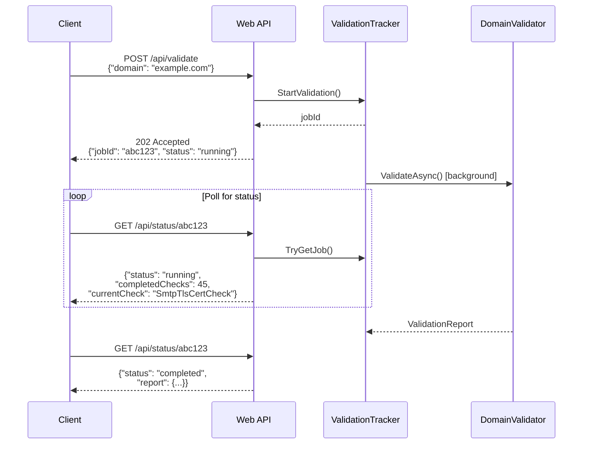

# Deployment Modes & API

EDNSV can be run as a command-line tool for batch processing or as a web service with a REST API and web UI.

## CLI Mode

**Entry point**: `src/Ednsv.Cli/Program.cs`

### Basic Usage

```bash
# Validate a single domain
dotnet run --project src/Ednsv.Cli -- example.com

# Validate multiple domains
dotnet run --project src/Ednsv.Cli -- example.com gmail.com google.com

# Validate from a file (one domain per line, or CSV)
dotnet run --project src/Ednsv.Cli -- --domains-file domains.txt
```

### Output Formats

```bash
# JSON output
dotnet run --project src/Ednsv.Cli -- example.com --format json

# HTML report
dotnet run --project src/Ednsv.Cli -- example.com --format html --output report.html

# Markdown
dotnet run --project src/Ednsv.Cli -- example.com --format markdown

# Per-domain reports + index + cross-domain issues
dotnet run --project src/Ednsv.Cli -- --domains-file domains.txt --output-dir results/
```

### Key Options

| Option | Description |
|--------|-------------|
| `--format text\|json\|html\|markdown` | Output format (default: text) |
| `--output <file>` | Write output to file |
| `--output-dir <dir>` | Per-domain reports, index file, cross-domain issues |
| `--verbose` | Show check category explanations |
| `--trace` | Detailed DNS/SMTP/cache timing diagnostics |
| `--mask-trace` / `--no-mask-trace` | Privacy masking for trace output (default: on) |
| `--mask-salt <salt>` | Deterministic hash salt for consistent masks |
| `--cache <dir>` | Enable disk cache (default: `.ednsv-cache/`) |
| `--recheck warning\|error\|critical` | Re-validate previously failing checks |
| `--dns-server <ip,...>` | Custom DNS server(s), comma-separated |
| `--dkim-selectors <sel,...>` | Additional DKIM selectors to probe |
| `--axfr` | Attempt zone transfers for DKIM discovery |
| `--catch-all` | Test for catch-all mail acceptance |
| `--open-relay` | Test MX hosts for open relay |
| `--open-resolver` | Test NS hosts for open recursive resolution |
| `--private-dnsbl` | Include blocklists requiring registered resolvers |
| `--list-checks` | Show detailed descriptions of all check categories |

### Cache Workflow

```bash
# First run: cold cache, all queries go to network
dotnet run --project src/Ednsv.Cli -- gmail.com --cache .ednsv-cache/

# Second run: warm cache, most queries served from disk
dotnet run --project src/Ednsv.Cli -- gmail.com --cache .ednsv-cache/

# Recheck only previously failing checks
dotnet run --project src/Ednsv.Cli -- gmail.com --cache .ednsv-cache/ --recheck warning
```

## Web API Mode

**Entry point**: `src/Ednsv.Web/Program.cs`

### Starting the Server

```bash
dotnet run --project src/Ednsv.Web
```

### Configuration

Environment variables or command-line configuration:

| Setting | Default | Description |
|---------|---------|-------------|
| `CacheDir` | `.ednsv-cache` | Disk cache directory |
| `CacheTtlHours` | 24 | In-memory cache TTL |
| `FlushIntervalSeconds` | 120 | Background flush interval |
| `DnsServer` | system | Custom DNS server(s), comma-separated |
| `DkimSelectors` | (none) | Default DKIM selectors, comma-separated |
| `Trace` | false | Enable trace logging |
| `MaskTrace` | true | Enable trace masking |
| `MaskSalt` | (random) | Deterministic salt for trace masking |

### API Endpoints



#### POST /api/validate

Start an async validation job.

**Request body**:
```json
{
  "domain": "example.com",
  "recheckSeverity": "warning",
  "options": {
    "enableAxfr": false,
    "enableCatchAll": false,
    "additionalDkimSelectors": ["custom1"]
  }
}
```

**Response** (202 Accepted):
```json
{
  "jobId": "abc123def456",
  "domain": "example.com",
  "status": "running"
}
```

#### GET /api/status/{jobId}

Poll job status with real-time progress.

**Response**:
```json
{
  "jobId": "abc123def456",
  "domain": "example.com",
  "status": "running",
  "currentCheck": "SmtpTlsCertCheck",
  "completedChecks": 45,
  "results": {
    "pass": 30,
    "info": 5,
    "warning": 8,
    "error": 2,
    "critical": 0
  },
  "dns": {
    "queries": 120,
    "cacheHits": 85,
    "sent": 35,
    "received": 35
  },
  "smtp": {
    "probesStarted": 3,
    "probesDone": 3,
    "portsStarted": 6,
    "portsDone": 6
  },
  "elapsed": 12.5,
  "report": null
}
```

When `status` is `"completed"`, the `report` field contains the full `ValidationReport`.

#### GET /api/validate/{domain}

Synchronous convenience endpoint. Runs validation and returns the full report directly. Times out after 3 minutes (HTTP 504).

Optional query parameter: `?recheck=warning|error|critical`

#### GET /api/cache/stats

Returns DNS cache statistics:
```json
{
  "dnsCacheSize": 1250,
  "dnsCacheHits": 4500,
  "dnsCacheMisses": 800
}
```

#### POST /api/cache/flush

Triggers an immediate disk cache flush.

#### GET /api/checks

Returns the list of check category descriptions (from `CheckDescriptions.Categories`).

### ValidationTracker

The `ValidationTracker` class manages async job state:

- Jobs stored in `ConcurrentDictionary<string, ValidationJob>`
- Job IDs are 12-character hex strings from `Guid.NewGuid()`
- Each job snapshots service counter baselines at start — status endpoint computes deltas
- Live severity counters updated via `Interlocked.Increment` as checks complete
- On completion, domain results are saved for recheck decisions and a cache flush is requested

### Web UI

A single-page web application at `src/Ednsv.Web/wwwroot/index.html`:

- Dark theme with vanilla JavaScript (no framework dependencies)
- Submits domain via POST /api/validate
- Polls GET /api/status/{jobId} for real-time progress
- Displays results with severity filtering
- Supports recheck functionality

## CI/CD

**Configuration**: `.github/workflows/ci.yml`

**Triggers**: Push to any branch, PR to main

**Pipeline**:
1. `dotnet restore` — install NuGet dependencies
2. `dotnet build --configuration Release` — compile all projects
3. `dotnet test --configuration Release` — run xUnit tests (cache, masking)
4. **Integration tests** — validate real domains (google.com, gmail.com, cnn.com, example.com) with JSON output parsing
5. **Cache integration tests** — cold run, warm run, speedup measurement, recheck with cache clearing
6. **Multi-domain tests** — cache reuse verification across domains
7. **Build log archival** — logs pushed to `build-logs` orphan branch

## Build Commands

```bash
# Restore dependencies
dotnet restore

# Build
dotnet build --configuration Release

# Run tests
dotnet test --configuration Release

# Run CLI
dotnet run --project src/Ednsv.Cli -- example.com

# Run web server
dotnet run --project src/Ednsv.Web
```
