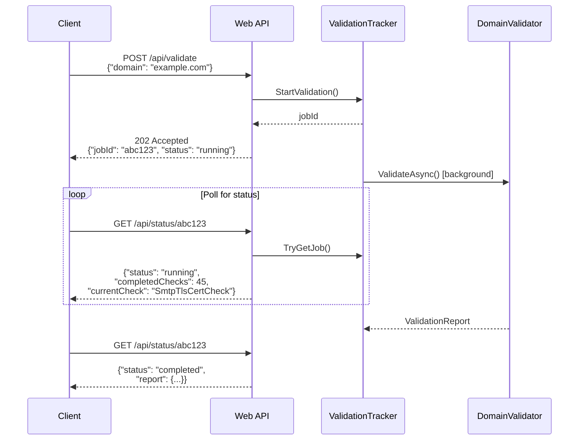

# Deployment Modes & API

EDNSV can be run as a command-line tool for batch processing or as a web service with a REST API and web UI.

## CLI Mode

**Entry point**: `src/Ednsv.Cli/Program.cs`

### Basic Usage

```bash
# Validate a single domain
dotnet run --project src/Ednsv.Cli -- example.com

# Validate multiple domains
dotnet run --project src/Ednsv.Cli -- example.com gmail.com google.com

# Validate from a file (one domain per line, or CSV)
dotnet run --project src/Ednsv.Cli -- --domains-file domains.txt
```

### Output Formats

```bash
# JSON output
dotnet run --project src/Ednsv.Cli -- example.com --format json

# HTML report
dotnet run --project src/Ednsv.Cli -- example.com --format html --output report.html

# Markdown
dotnet run --project src/Ednsv.Cli -- example.com --format markdown

# Per-domain reports + index + cross-domain issues
dotnet run --project src/Ednsv.Cli -- --domains-file domains.txt --output-dir results/
```

### Key Options

| Option | Description |
|--------|-------------|
| `--format text\|json\|html\|markdown` | Output format (default: text) |
| `--output <file>` | Write output to file |
| `--output-dir <dir>` | Per-domain reports, index file, cross-domain issues |
| `--verbose` | Show check category explanations |
| `--trace` | Detailed DNS/SMTP/cache timing diagnostics |
| `--mask-trace` / `--no-mask-trace` | Privacy masking for trace output (default: on) |
| `--mask-salt <salt>` | Deterministic hash salt for consistent masks |
| `--cache <dir>` | Enable disk cache (default: `.ednsv-cache/`) |
| `--recheck warning\|error\|critical` | Re-validate previously failing checks |
| `--dns-server <ip,...>` | Custom DNS server(s), comma-separated |
| `--dkim-selectors <sel,...>` | Additional DKIM selectors to probe |
| `--axfr` | Attempt zone transfers for DKIM discovery |
| `--catch-all` | Test for catch-all mail acceptance |
| `--open-relay` | Test MX hosts for open relay |
| `--open-resolver` | Test NS hosts for open recursive resolution |
| `--private-dnsbl` | Include blocklists requiring registered resolvers |
| `--list-checks` | Show detailed descriptions of all check categories |

### Cache Workflow

```bash
# First run: cold cache, all queries go to network
dotnet run --project src/Ednsv.Cli -- gmail.com --cache .ednsv-cache/

# Second run: warm cache, most queries served from disk
dotnet run --project src/Ednsv.Cli -- gmail.com --cache .ednsv-cache/

# Recheck only previously failing checks
dotnet run --project src/Ednsv.Cli -- gmail.com --cache .ednsv-cache/ --recheck warning
```

## Web API Mode

**Entry point**: `src/Ednsv.Web/Program.cs`

### Starting the Server

```bash
dotnet run --project src/Ednsv.Web
```

### Configuration

Environment variables or command-line configuration. See [configuration.md](configuration.md) for the full list, including authentication, log formatting, and proxy settings.

| Setting | Default | Description |
|---------|---------|-------------|
| `DataDir` | `.ednsv-data` | Root for persistent state; cache lives in `<DataDir>/cache/` |
| `CacheTtlHours` | 24 | TTL for cached DNS/SMTP/HTTP results |
| `FlushIntervalSeconds` | 120 | Background flush interval |
| `DnsServer` | system | Custom DNS server(s), comma-separated |
| `DkimSelectors` | (built-in seed) | Default DKIM selectors, comma-separated |
| `EnableSmtpProbes` / `EnableHttpProbes` / `EnableDnsbl` | `true` | Server-side defaults for the validator UI; per-request body overrides |
| `EnableDirectDns` | `true` | Allow checks to talk directly to authoritative nameservers / public resolvers |
| `EnableDoh` | `false` | Use DNS-over-HTTPS for the propagation check (routes via `HTTPS_PROXY`) |
| `Trace` | `false` | Enable trace logging (per-check timing, cache hits, semaphore waits) |
| `MaskTrace` | `true` | Hash domains/recipients/IPs in trace output |
| `MaskSalt` | (random) | Deterministic salt for `MaskTrace` |
| `AuthTokenHash` / `EDNSV_AUTH_TOKEN_HASH` | `none` | Root-token hash; `none` disables auth |

### API Endpoints



#### POST /api/validate

Start an async validation job.

**Request body**:
```json
{
  "domain": "example.com",
  "recheckSeverity": "warning",
  "options": {
    "enableAxfr": false,
    "enableCatchAll": false,
    "additionalDkimSelectors": ["custom1"]
  }
}
```

**Response** (202 Accepted):
```json
{
  "jobId": "abc123def456",
  "domain": "example.com",
  "status": "running"
}
```

#### GET /api/status/{jobId}

Poll job status with real-time progress.

**Response**:
```json
{
  "jobId": "abc123def456",
  "domain": "example.com",
  "status": "running",
  "currentCheck": "SmtpTlsCertCheck",
  "completedChecks": 45,
  "results": {
    "pass": 30,
    "info": 5,
    "warning": 8,
    "error": 2,
    "critical": 0
  },
  "dns": {
    "queries": 120,
    "cacheHits": 85,
    "sent": 35,
    "received": 35,
    "totalCacheHits": 9421,
    "totalCacheMisses": 1830,
    "totalCacheSize": 2104
  },
  "smtp": {
    "probesStarted": 3,
    "probesDone": 3,
    "portsStarted": 6,
    "portsDone": 6
  },
  "elapsed": 12.5,
  "duration": null,
  "report": null
}
```

`dns.queries` / `cacheHits` / `sent` / `received` are **per-job deltas** computed by subtracting the baseline snapshot taken when the validator was constructed. `totalCacheHits` / `totalCacheMisses` / `totalCacheSize` are the cumulative process-wide counters, useful for tracking warm-cache behaviour across many concurrent jobs. `elapsed` is wall-clock time since the job started; `duration` is null until the job finishes and then carries the validator's own measurement.

When `status` is `"completed"`, the `report` field contains the full `ValidationReport`.

#### GET /api/validate/{domain}

Synchronous convenience endpoint. Runs validation and returns the full report directly. Times out after 3 minutes (HTTP 504).

Optional query parameter: `?recheck=warning|error|critical`

#### GET /api/cache/stats

Returns DNS cache statistics:
```json
{
  "dnsCacheSize": 1250,
  "dnsCacheHits": 4500,
  "dnsCacheMisses": 800
}
```

#### POST /api/cache/flush

Triggers an immediate disk cache flush.

#### GET /api/checks

Returns the list of check category descriptions (from `CheckDescriptions.Categories`).

### ValidationTracker

The `ValidationTracker` class (in `src/Ednsv.Web/Program.cs`) manages async job state:

- Jobs stored in `ConcurrentDictionary<string, ValidationJob>`
- Job IDs are 12-character hex strings from `Guid.NewGuid().ToString("N")[..12]`
- Each job snapshots service counter baselines at start — status endpoint computes per-job deltas while still exposing the cumulative totals
- Live severity counters updated via `Interlocked.Increment` as checks complete
- On completion, domain results are saved for recheck decisions and a non-blocking `cache.RequestFlush()` runs in the background
- Implements `IDisposable`. A 5-minute `Timer` evicts completed/failed jobs older than 1 hour from the dictionary so long-running web servers don't accumulate every job they ever ran in memory
- The whole `Task.Run` body runs inside a structured logger scope (`JobId`, `Username`, `Endpoint`, `Domain`) so trace lines emitted from the singleton DNS/SMTP/HTTP services — captured via `TraceContext` AsyncLocal — automatically carry the right job identifier even though the services are shared

### Web UI

A single-page web application at `src/Ednsv.Web/wwwroot/index.html`:

- Dark theme with vanilla JavaScript (no framework dependencies)
- Submits domain via POST /api/validate
- Polls GET /api/status/{jobId} for real-time progress
- Displays results with severity filtering
- Supports recheck functionality

## Network egress (outbound ports)

EDNSV validates third-party infrastructure, so it makes outbound connections to
**arbitrary internet hosts** (both IPv4 and IPv6). IPv6-only probes self-skip when the
host has no IPv6 route. If `HTTPS_PROXY` is set, all HTTPS (443) egress goes through the
proxy while DNS and SMTP go direct (see [Configuration → proxy](configuration.md#httphttps-proxy)).

### Core — needed for a full validation

| Port | Protocol | Purpose | Destinations |
|------|----------|---------|--------------|
| **53** | UDP + TCP | All DNS: record lookups, DNSBL, propagation, direct-to-nameserver checks (lame delegation, SOA-serial, glue, parent delegation), AXFR (TCP, opt-in). TCP/53 is also the truncation fallback. | Configured resolver (web default = OS resolvers; CLI default = Google `8.8.8.8`/`8.8.4.4`); direct-DNS checks also hit `8.8.8.8`/`1.1.1.1`/`9.9.9.9` and arbitrary authoritative nameservers |
| **25** | TCP | SMTP probing: banner/EHLO/STARTTLS, RCPT (postmaster@, abuse@), open-relay, IPv6 connectivity | Arbitrary MX hosts |
| **443** | TCP | HTTPS: MTA-STS policy, BIMI logo + VMC, security.txt, Certificate Transparency (crt.sh), DoH (`dns.google`, `cloudflare-dns.com`) | `mta-sts.{domain}`, `{domain}`, `crt.sh`, BIMI/VMC hosts, `dns.google`, `cloudflare-dns.com` — or the `HTTPS_PROXY` host |

### Secondary — conditional

| Port | Protocol | Purpose | When |
|------|----------|---------|------|
| **587** | TCP | Submission-port reachability + STARTTLS detail | Submission-ports check (default with SMTP probes) |
| **465** | TCP | SMTPS (implicit-TLS) port reachability | Submission-ports check (default with SMTP probes) |
| **80** | TCP | HTTP — only when a **BIMI record publishes an `http://` logo (`l=`) or VMC (`a=`) URL** (fetched as-published, with a "should use HTTPS" warning), or when an HTTPS fetch redirects to `http://` | Domain has an http BIMI URL, or a redirect drops to http |

> The BIMI logo (`l=`) and VMC (`a=`) are the only URLs taken verbatim from DNS data and
> fetched as-is; every other HTTP request uses a hardcoded `https://` URL. DMARC/TLS-RPT
> `https` report URIs are parsed and noted but never fetched.

### Reducing the set

The network-category toggles narrow egress: `--no-smtp` drops 25/587/465; `--no-http`
drops 443/80; `--no-direct-dns` limits 53 to the configured resolver only; `--restricted`
(no-smtp + no-http + no-dnsbl + no-direct-dns) leaves **only UDP/TCP 53 to the configured
resolver**. A locked-down deployment can allow just 53 to its resolver plus 443 to
`HTTPS_PROXY` so MTA-STS/BIMI/DoH still work.

## CI/CD

**Configuration**: `.github/workflows/ci.yml`

**Triggers**: Push to any branch, PR to main

**Pipeline**:
1. `dotnet restore` — install NuGet dependencies
2. `dotnet build --configuration Release` — compile all projects
3. `dotnet test --configuration Release` — run xUnit tests (cache, masking)
4. **Integration tests** — validate real domains (google.com, gmail.com, cnn.com, example.com) with JSON output parsing
5. **Cache integration tests** — cold run, warm run, speedup measurement, recheck with cache clearing
6. **Multi-domain tests** — cache reuse verification across domains
7. **Build log archival** — logs pushed to `build-logs` orphan branch

## Build Commands

```bash
# Restore dependencies
dotnet restore

# Build
dotnet build --configuration Release

# Run tests
dotnet test --configuration Release

# Run CLI
dotnet run --project src/Ednsv.Cli -- example.com

# Run web server
dotnet run --project src/Ednsv.Web
```
