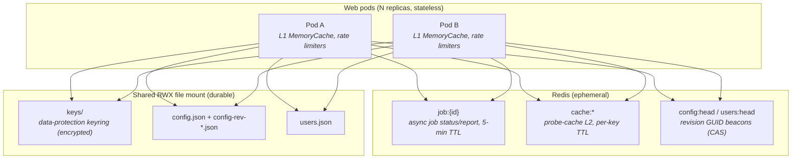

# Horizontal Scaling

EDNSV was originally designed as a single long-lived process with in-memory
singletons and a local data directory. This document describes how the web
service scales **horizontally** across multiple replicas (e.g. a Kubernetes
Deployment with `replicas > 1` behind a load balancer), what state moves where,
and how to configure it.

> **CLI is unaffected.** Everything here concerns `Ednsv.Web`. The CLI remains a
> single-process tool with a local disk cache.

## TL;DR

Horizontal scaling is **opt-in** and driven entirely by whether a Redis
connection string is configured:

| `Redis:ConnectionString` | Mode | Behaviour |
|--------------------------|------|-----------|
| **unset** (default) | Single-instance | In-memory job registry, on-disk probe cache, in-process config lock — exactly as before. Safe for `replicas: 1`. |
| **set** | Distributed | Async jobs and the probe-cache L2 live in Redis; config/user writes coordinate through a Redis beacon. Safe for `replicas: N`. |

Two backing stores are used, each chosen for its durability characteristics:

- **Redis** — *ephemeral, possibly untrusted.* Holds only derivable/disposable
  state: the async job registry and the shared probe-cache L2, plus small
  coordination keys. A Redis flush costs a cold cache and forces clients to
  resubmit in-flight jobs; it never loses durable data.
- **Shared RWX file mount** — *durable.* Holds slow-moving state that must
  survive a Redis restart: the data-protection keyring, `config.json` (+ revision
  history) and `users.json`.

## What state lives where



| Surface | Source of truth | Redis role | Notes |
|---------|-----------------|-----------|-------|
| **Async jobs** (`POST /api/validate` → `GET /api/status/{id}`) | Redis | primary store | Any pod can serve any poll. Hard dependency in distributed mode. |
| **Probe cache** (DNS/SMTP/HTTP) | derivable (network) | L2 read/write-through | L1 memory → Redis L2 → network. Best-effort; Redis errors fall through to the network. |
| **Config** (`config.json` + history) | RWX file mount | `config:head` beacon (CAS + staleness) | On-demand reload when the beacon GUID changes; atomic promote via beacon CAS. |
| **Users/tokens** (`users.json`) | RWX file mount | `users:head` beacon | Same pattern as config. |
| **Data-protection keys** | RWX file mount | — (not in Redis) | Read-mostly; encrypted at rest with a config secret. Only used by the OIDC session cookie. |
| **L1 cache, rate limiters, unreachable-server decay** | per-pod | — | Deliberately per-pod. Aggregate upstream QPS scales with replica count (accepted). |

## Data-protection keys

The data-protection keyring is only used to protect the **OIDC SSO session
cookie** (`ednsv-session`), and only when external auth (OIDC/JWT) is enabled.
The `ednsv-auth` token cookie is not data-protected, so token auth is already
pod-agnostic.

For multiple pods to validate each other's session cookies, they must share one
keyring. EDNSV persists the keyring to `<DataProtection:KeysPath>` (default
`<DataDir>/keys`), which should be the **shared RWX mount**. The keyring is
**not** stored in Redis because Redis is non-durable — losing the ring would
invalidate every active session and force all users to re-authenticate.

### Encrypting the keyring at rest

Because the shared mount may be readable by more than the app, the keyring can be
encrypted at rest with a secret you inject via configuration:

- Set `DataProtection:KeyEncryptionSecret` to an **arbitrary random string of at
  least 32 characters** (any characters — it is treated as opaque UTF-8; there is
  no hex/base64 requirement). Shorter values are rejected at startup.
- EDNSV derives a 256-bit AES key from the secret (HKDF-SHA256) and encrypts each
  key-ring element with AES-GCM. Without the secret the on-disk key blobs are
  unusable.
- If the setting is omitted, keys are written unencrypted (rely on mount
  permissions / encryption-at-rest instead). A warning is logged.

Rotate the secret only when you can tolerate existing sessions being invalidated.

## Async job registry

In distributed mode the async validation registry moves from an in-process
dictionary into Redis under `job:{id}`:

- `POST /api/validate` writes the initial job and runs the validation on the
  accepting pod; progress counters and status are written to Redis as checks
  complete.
- `GET /api/status/{id}` reads from Redis, so **any pod** can serve the poll —
  upstream API clients don't need sticky sessions.
- Jobs expire automatically: a running job's TTL is refreshed on each progress
  update (a stuck/abandoned job simply expires); on completion the TTL is set to
  `JobRetentionMinutes` (default **5**) from completion. This replaces the old
  in-memory cleanup timer.

The full `ValidationReport` is stored inside the job blob. Jobs are ephemeral, so
a Redis flush just means an in-flight client resubmits — acceptable by design.

## Probe cache (L1 + Redis L2)

The existing two-tier cache gains a shared L2:

1. Check the per-pod **L1** `MemoryCache` (unchanged).
2. On an L1 miss, check the **Redis L2** (`cache:{type}:{key}`); on a hit,
   populate L1 and return.
3. On an L2 miss, run the network query, then write-through to **both** L1 and L2
   (subject to the existing `shouldPersist` predicate — transient errors stay L1
   only, never hitting Redis).

Cross-pod in-flight de-duplication is intentionally **not** implemented: at worst
a few duplicate upstream queries happen the first time a key is requested
concurrently on different pods. Caching is a load optimisation, not a correctness
mechanism, so any Redis error transparently falls through to the network. Redis
entries carry a native per-key TTL derived from `CacheTtlHours`.

## Config & user writes (beacon CAS)

Config and user records remain durable files on the shared mount. To coordinate
edits across pods without a lockable filesystem, each store carries a **head
revision GUID** promoted via a Redis beacon:

- Revisions keep their existing integer ids and per-revision files
  (`config-history/config-rev-{id}.json`, indexed by `config-history.json` — see
  [configuration.md](configuration.md) → *Runtime config revision history*). The
  scheme is unchanged; distribution adds coordination, not a new on-disk format.
- A single beacon key (`config:head` / `users:head`) holds an opaque head GUID
  token. Promotion is an atomic compare-and-set (StackExchange.Redis
  `Condition.StringEqual` transaction): a save succeeds only if the head token
  still equals the one the editor loaded; otherwise it returns **409 Conflict**
  and the client re-fetches and re-applies. A write attempted while Redis is
  unreachable returns **503**.
- Reads are on-demand: each config-consuming request does a sub-millisecond
  `GET config:head`; if it differs from the pod's cached token, the pod re-reads
  the file from the mount. No polling, no pub/sub — a change is visible on the
  next access on any pod.

The head GUID is the identity used for concurrency; the sequential revision ids
shown in the history UI are unchanged and remain the human-facing reference.

## Egress identity

SMTP/PTR/FCrDNS and registered-resolver DNSBL results depend on the source IP.
With multiple pods you may present a **pool of egress IPs**. Ensure the whole
pool is allowlisted anywhere you rely on registered-resolver blocklists
(`--private-dnsbl` equivalents) and that PTR/reputation expectations account for
several source addresses. No application change is required.

## Rate limiting

DNS token-bucket / concurrency caps and the HTTP concurrency cap remain
**per-pod**. Aggregate upstream load therefore scales with replica count — this
is intentional and bounded by your HPA `maxReplicas`. There is no distributed
rate limiter.

## Failure model

| Event | Effect |
|-------|--------|
| **Redis restart / flush** (non-durable) | In-flight async jobs are lost (clients resubmit); probe cache goes cold and refills. No durable data lost. |
| **Redis unreachable** (distributed mode) | Async job API is unavailable; the readiness probe reports the pod not-ready so it sheds load. Sync validation and session auth (keyring on the mount) keep working. Config/user *reads* still work from disk; *writes* return 503. |
| **Shared mount unavailable** | Config/user/keyring reads fail — treated as a fatal infrastructure problem (as today for the local data dir). |

Redis is therefore a **required dependency for the async job API** and an
**optional accelerator** for everything else. It is wired into the readiness
probe so Kubernetes stops routing traffic to a pod that has lost Redis.

## Configuration reference

All settings are read at startup (env vars or `appsettings.json`). Redis-related
settings have no effect unless `Redis:ConnectionString` is set.

| Setting | Default | Description |
|---------|---------|-------------|
| `Redis:ConnectionString` | *(unset)* | StackExchange.Redis connection string. Unset → single-instance mode. Set → distributed mode. May contain a `{AccessKey}` placeholder (see `Redis:AccessKey`). |
| `Redis:AccessKey` | *(unset)* | Secret injected into `Redis:ConnectionString` at startup by replacing the literal `{AccessKey}` placeholder. Keeps the key out of `appsettings.json` (supply via env var / mounted secret). |
| `Redis:InstanceName` | `ednsv` | Key prefix for all EDNSV keys in Redis (namespacing on a shared Redis). |
| `JobRetentionMinutes` | `5` | Minutes a completed/failed async job is retained in Redis before expiry. |
| `DataProtection:KeysPath` | `<DataDir>/keys` | Directory for the data-protection keyring. Point at the shared RWX mount for multi-pod OIDC. |
| `DataProtection:KeyEncryptionSecret` | *(unset)* | ≥32-char opaque secret used to encrypt the keyring at rest (AES-GCM via HKDF). Unset → keyring written unencrypted (warning logged). |

### Example: distributed deployment

```jsonc
{
  "DataDir": "/data",                       // shared RWX mount
  "Redis": {
    "ConnectionString": "redis-svc:6379,ssl=True,password={AccessKey}",
    "AccessKey": "<inject via env var Redis__AccessKey / k8s Secret>",
    "InstanceName": "ednsv"
  },
  "JobRetentionMinutes": 5,
  "DataProtection": {
    "KeysPath": "/data/keys",               // shared RWX mount
    "KeyEncryptionSecret": "<inject a 32+ char random secret via a k8s Secret>"
  }
  // ...auth, DNS, probe tuning as per configuration.md
}
```

Autoscale on CPU (HPA). Scaling up inherently increases aggregate upstream probe
load, which is expected.

## Migration path

Each step is independently shippable:

1. **Data-protection keyring on the shared mount** (+ optional encryption secret)
   — fixes OIDC sessions across pods.
2. **Redis-backed job registry** — makes the async API pod-agnostic for upstream
   clients.
3. **Redis L2 cache** — restores cross-pod cache hits.
4. **Config/user beacon coordination** — makes admin edits safe across pods.

Until step 2 is deployed, the async API requires session affinity (sticky
sessions) on `jobId`; after it, stickiness can be dropped.
