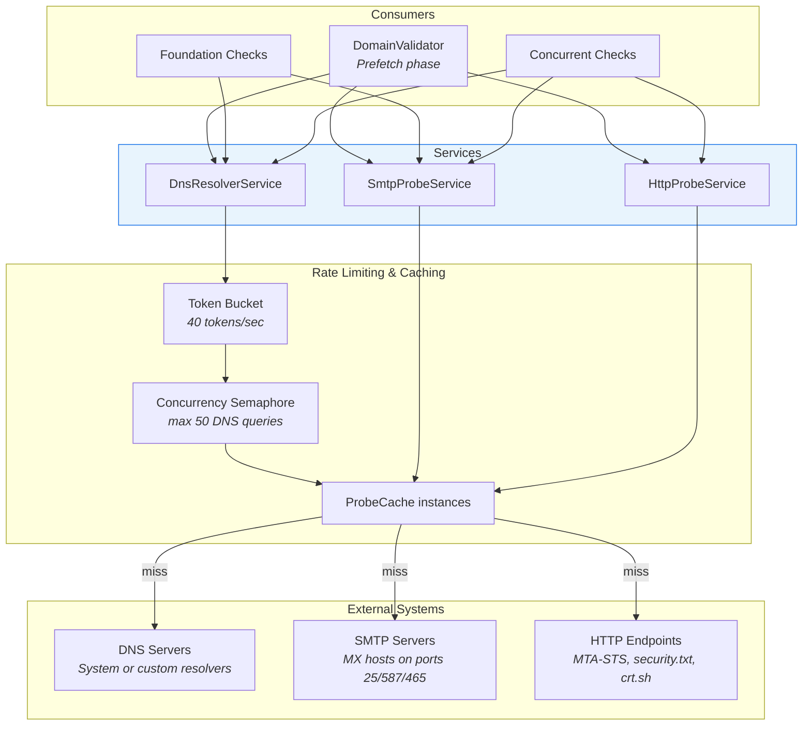
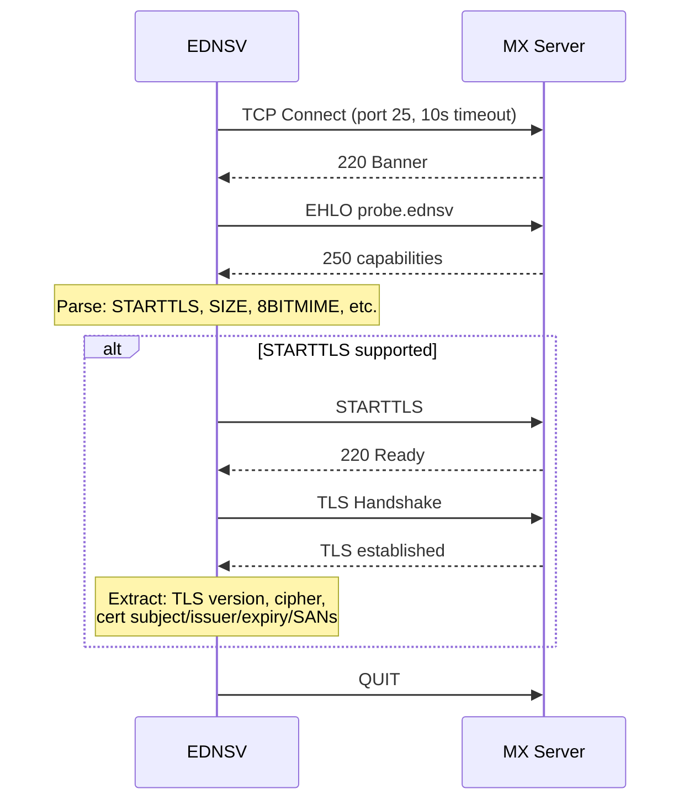
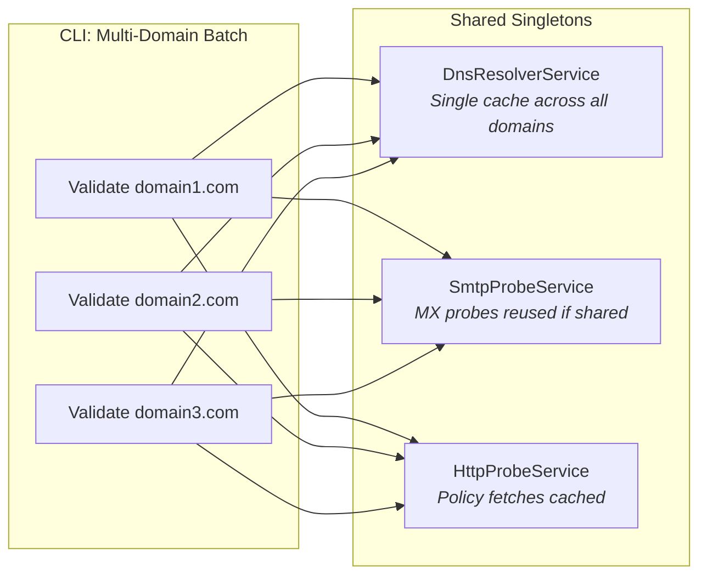

# Service Layer

The service layer provides DNS, SMTP, and HTTP capabilities to the check framework. Services are designed as thread-safe singletons that can be shared across multiple concurrent validations.

## Service Architecture



## DnsResolverService

**File**: `src/Ednsv.Core/Services/DnsResolverService.cs`

The DNS service executes queries against configured nameservers with rate limiting, caching, and unreachable server tracking.

### Rate Limiting

DNS queries are rate-limited to prevent overwhelming resolvers:

| Parameter | Default | Purpose |
|-----------|---------|---------|
| Token rate | 40/sec | Sustained query rate |
| Max concurrency | 50 | Maximum parallel DNS queries |

The `RateLimitedAsync()` wrapper enforces both limits. Trace output logs wait times: `"rate-wait:Xms concurrency-wait:Yms network:Zms"`.

### Caches

Three ProbeCache instances:

| Cache | Contents | Key |
|-------|----------|-----|
| `_queryCache` | Standard DNS responses | `domain:queryType` |
| `_ptrCache` | PTR lookup results | `ip` |
| `_serverQueryCache` | Server-specific queries | `server:domain:queryType` |

### Key Methods

| Method | Description |
|--------|-------------|
| `QueryAsync(domain, queryType)` | Standard cached DNS query |
| `QuerySpeculativeAsync(domain, queryType, timeout)` | Short-timeout query for non-critical lookups |
| `QueryServerAsync(server, domain, queryType)` | Query a specific nameserver |
| `QueryDnsblAsync(ip, zone)` | Blocklist lookup |
| `ResolveAAsync(host)` | Resolve A records, returns `List<string>` IPs |
| `ResolveAAAAAsync(host)` | Resolve AAAA records |
| `ResolvePtrAsync(ip)` | Reverse DNS lookup |
| `GetMxRecordsAsync(domain)` | Get MX records, sorted by preference |
| `GetNsRecordsAsync(domain)` | Get NS records |
| `GetTxtRecordsAsync(domain)` | Get TXT records |
| `GetSoaRecordAsync(domain)` | Get SOA record |
| `ResolveCnameChainAsync(domain)` | Follow CNAME chain (max 10 hops) |
| `TestZoneTransferAsync(server, domain)` | Attempt AXFR zone transfer |
| `ExtractDkimSelectorsFromAxfrAsync(...)` | Extract DKIM selectors from AXFR data |

### Nameserver Configuration

- **Default**: Uses OS-configured system resolvers via `CreateWithSystemResolvers()`
- **Custom**: Accepts a list of `IPAddress` objects. Multiple servers enable load balancing.
- **Unreachable tracking**: After `MaxRetries` failures, a server is marked unreachable and skipped for subsequent queries.

### Diagnostic Counters

| Counter | Description |
|---------|-------------|
| `CacheSize` | Number of entries in query cache |
| `CacheHits` | Total cache hits |
| `CacheMisses` | Total cache misses (network queries) |
| `ResponsesReceived` | Successful network responses |
| `QueryErrors` | List of query error messages |

## SmtpProbeService

**File**: `src/Ednsv.Core/Services/SmtpProbeService.cs`

The SMTP service connects to mail servers, performs TLS handshakes, and extracts certificate details.

### SMTP Handshake Flow



### SmtpProbeResult

The result of a probe captures comprehensive connection details:

| Field | Description |
|-------|-------------|
| `Connected` | Whether TCP connection succeeded |
| `Banner` | SMTP greeting banner |
| `SupportsStartTls` | Whether STARTTLS is advertised |
| `TlsProtocol` | Negotiated TLS version (e.g., Tls13) |
| `TlsCipherSuite` | Negotiated cipher suite |
| `CertSubject` | Certificate subject CN |
| `CertIssuer` | Certificate issuer |
| `CertExpiry` | Certificate expiration date |
| `CertSans` | Subject Alternative Names |
| `SmtpMaxSize` | Advertised maximum message size |
| `Error` | Error message if probe failed |
| `ConnectTimeMs` | TCP connection latency |
| `BannerTimeMs` | Time to receive banner |
| `EhloTimeMs` | EHLO response latency |
| `TlsTimeMs` | TLS handshake latency |

### Retry Logic

- Up to **3 attempts** per probe (configurable via `SetMaxRetries()`)
- Prefers TLS-successful results: if attempt 1 gets TLS but attempt 2 doesn't, keeps attempt 1
- Connection timeout: **10 seconds**
- Port probe timeout: **5 seconds**

### Caches

| Cache | Contents | Key |
|-------|----------|-----|
| `_probeCache` | Full SMTP handshake results | `host:port` |
| `_portCache` | Port reachability (bool) | `host:port` |
| `_rcptCache` | RCPT verification results | `host:email` |
| `_relayCache` | Open relay test results | `host\|from\|to` |

### Additional Capabilities

| Method | Description |
|--------|-------------|
| `ProbePortAsync(host, port)` | Quick TCP port check (587, 465) |
| `TestRcptAsync(host, from, to)` | RCPT TO address verification |
| `TestRelayAsync(host, from, to)` | Open relay test |

## HttpProbeService

**File**: `src/Ednsv.Core/Services/HttpProbeService.cs`

Simple HTTP/HTTPS GET with caching and retry support.

### Methods

| Method | Returns | Description |
|--------|---------|-------------|
| `GetAsync(url, maxRetries)` | `(bool success, string content, int statusCode)` | GET with optional retries |
| `GetWithHeadersAsync(url)` | `(bool success, string content, string contentType)` | GET with Content-Type extraction |

### Caches

| Cache | Contents | Key |
|-------|----------|-----|
| `_getCache` | GET results (success, content, status) | `url` |
| `_getWithHeadersCache` | GET results with Content-Type | `url` |

### Usage

Used primarily for:
- **MTA-STS policy** (`https://mta-sts.{domain}/.well-known/mta-sts.txt`)
- **security.txt** (`https://{domain}/.well-known/security.txt`)
- **Certificate Transparency** (`https://crt.sh/?q={domain}&output=json`)
- **BIMI SVG logos** and VMC certificates
- **Autodiscover** endpoints

## Service Sharing

Services are designed to be shared across multiple domain validations:



When multiple domains share MX infrastructure (e.g., all using Google Workspace), SMTP probes and DNS resolutions from the first domain are cached and reused for subsequent domains.

**CLI**: The `DomainValidator` constructor accepts shared service instances:
```csharp
var dns = new DnsResolverService();
var smtp = new SmtpProbeService();
var http = new HttpProbeService();
// Reuse across domains
var validator = new DomainValidator(dns, smtp, http);
await validator.ValidateAsync("domain1.com");
await validator.ValidateAsync("domain2.com"); // benefits from cached MX probes
```

**Web API**: Services are registered as singletons in the DI container and shared across all concurrent requests.

## TraceMasker

**File**: `src/Ednsv.Core/Services/TraceMasker.cs`

An optional privacy layer that hashes sensitive data in trace output:

| Data Type | Example Input | Example Output |
|-----------|---------------|----------------|
| Hostnames | `mx1.google.com` | `h:a3f7b2` |
| IP addresses | `142.250.80.26` | `ip:c8e1d4` |
| Email addresses | `postmaster@example.com` | `e:9b2f71` |
| DKIM selectors | `selector1._domainkey.example.com` | `dkim:d4a823._domainkey.h:7f1e09` |

- Uses SHA256 hashing with an optional static salt
- Deterministic: same input + salt = same hash across runs
- Applied to trace callbacks via `DomainValidator.TraceMask` property
- Also applied to result masking via `TraceMasker.MaskResult()` for check output
