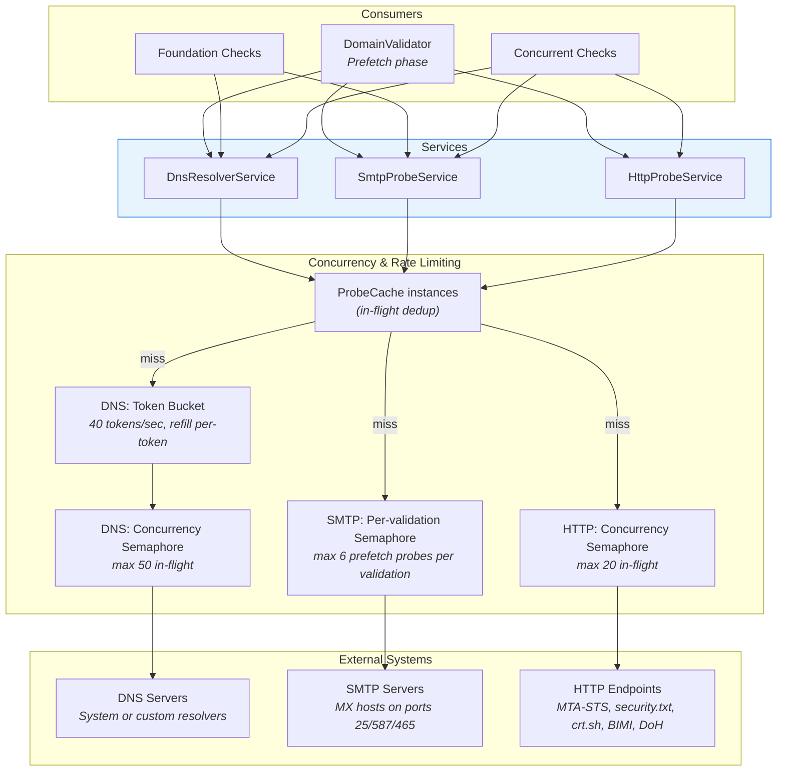
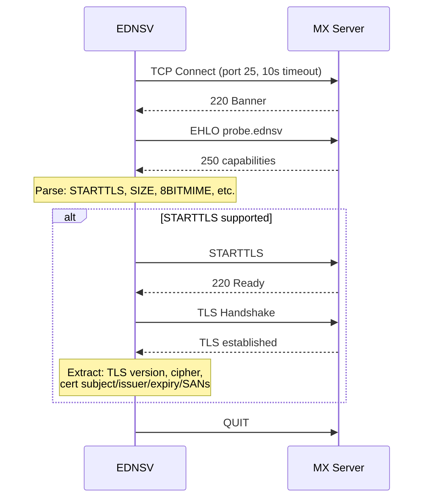
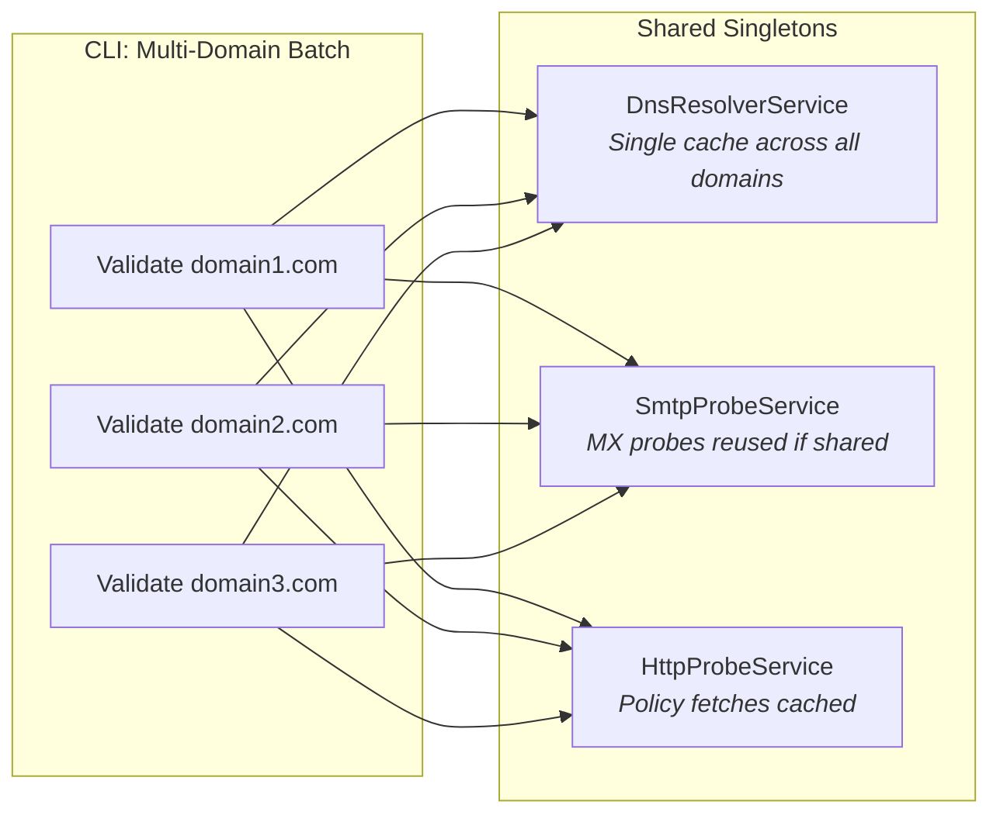

# Service Layer

The service layer provides DNS, SMTP, and HTTP capabilities to the check framework. Services are designed as thread-safe singletons that can be shared across multiple concurrent validations.

## Service Architecture



### Concurrency limits at a glance

| Surface | Mechanism | Default | Purpose |
|---------|-----------|---------|---------|
| DNS sustained QPS | Token bucket (`SemaphoreSlim` + 1 s `Timer`) | 40 tokens/sec | Bound the rate at which queries hit upstream resolvers |
| DNS in-flight | `SemaphoreSlim` | 50 | Cap concurrent DNS sockets when a resolver is slow |
| SMTP prefetch probes | `SemaphoreSlim` (per validation) | `min(mxHosts.Count, 6)` | Avoid overwhelming a single provider's MX fleet during prefetch |
| HTTP in-flight | `SemaphoreSlim` | 20 | Bound concurrent outbound HTTP requests (MTA-STS, BIMI, CT, DoH) |
| Concurrent checks | `Parallel.ForEachAsync` | 12 | Cap parallelism in Phase 3 of the validation pipeline |

In addition, every service ProbeCache deduplicates concurrent requests for the **same key** down to a single network call (see [Caching Architecture](caching-architecture.md)).

## DnsResolverService

**File**: `src/Ednsv.Core/Services/DnsResolverService.cs`

The DNS service executes queries against configured nameservers with rate limiting, caching, and unreachable server tracking.

### Rate Limiting

DNS queries are gated by two semaphores, both enforced by a single `RateLimitedAsync()` wrapper:

| Parameter | Default | Mechanism | Purpose |
|-----------|---------|-----------|---------|
| Token rate | 40/sec | `SemaphoreSlim` of `tokensPerSecond`, refilled every 1 s by a `Timer` | Bound sustained QPS independent of response time |
| Max concurrency | 50 | `SemaphoreSlim` of `maxConcurrency` | Cap simultaneous in-flight DNS queries |

`RefillTokens()` releases tokens **one at a time** in a `for` loop (up to `_tokensPerSecond`) and short-circuits on `SemaphoreFullException`. This avoids a TOCTOU race between reading `CurrentCount` and calling `Release(N)` — under load the previous "compute deficit, release in bulk" form could throw and skip an entire refill cycle.

Trace output (when enabled) logs wait times per query: `"rate-wait:Xms concurrency-wait:Yms network:Zms"`.

### LookupClients

Four `LookupClient` instances are constructed up front so different query types use the right timeouts:

| Client | Timeout | Retries | Use |
|--------|---------|---------|-----|
| `_client` | 15 s | 2 | Standard `QueryAsync` and reverse lookups |
| `_dnsblClient` | 3 s | 1 | `QueryDnsblAsync` — blocklists, where unresponsive hosts shouldn't pollute the error log |
| `_speculativeClient` | 3 s | 1 | `QuerySpeculativeAsync` — optional probes (DKIM selectors, SRV) where timeout means "skip" |
| `_directClient` | 15 s | 2 | `UseCache=false` — direct queries that must not hit the LookupClient cache |

### Caches

| Cache | Type | Key |
|-------|------|-----|
| `_queryCache` | `ProbeCache<IDnsQueryResponse>` | `q:domain:queryType` |
| `_ptrCache` | `ProbeCache<List<string>>` | `ptr:ip` |
| `_serverQueryCache` | `ProbeCache<IDnsQueryResponse>` | `sq:server:domain:queryType` |
| `_axfrResponseCache` | `ConcurrentDictionary` | `(ip, domain)` tuple |
| `_unreachableServerCounts` | `ConcurrentDictionary` | server-IP, value `(count, lastFailure)` |

`shouldPersist` predicates keep `EmptyResponse.Instance` (timeouts, network errors, DNS errors) out of the disk export log while still caching them in MemoryCache for the rest of the current process.

### Unreachable-server decay

When a server-specific query (`QueryServerAsync`) fails, the IP is bumped in `_unreachableServerCounts` together with the current `DateTime.UtcNow`. The next call short-circuits to `EmptyResponse.Instance` only when both:

1. `count >= MaxRetries` (default 3), and
2. `DateTime.UtcNow - lastFailure < _unreachableDecay` (5 minutes).

Once the decay window passes, the next call retries the server normally; on success the entry is removed. This replaces the older "permanent until process restart" blacklist that left transiently-down resolvers blacklisted for the entire run.

### Key Methods

| Method | Description |
|--------|-------------|
| `QueryAsync(domain, queryType)` | Standard cached DNS query |
| `QuerySpeculativeAsync(domain, queryType)` | 3 s timeout query — used by prefetch and DKIM probes; reads cache first |
| `QueryServerAsync(server, domain, queryType)` | Query a specific nameserver (also gated by unreachable-server decay) |
| `QueryDnsblAsync(query, queryType)` | Blocklist lookup with 3 s timeout — failures don't pollute error log |
| `ResolveAAsync(host)` / `ResolveAAAAAsync(host)` | Resolve A / AAAA records as IP strings |
| `ResolvePtrAsync(ip)` | Reverse DNS lookup; only successful responses persist to disk |
| `GetMxRecordsAsync(domain)` | MX records sorted by preference |
| `GetNsRecordsAsync(domain)` | NS records |
| `GetTxtRecordsAsync(domain)` / `GetTxtRecordsSpeculativeAsync(domain)` | TXT — full vs speculative variants |
| `GetSoaRecordAsync(domain)` | SOA |
| `ResolveCnameChainAsync(domain)` | Follow CNAME chain (max 10 hops) |
| `TestZoneTransferAsync(server, domain)` | Attempt AXFR zone transfer |
| `ExtractDkimSelectorsFromAxfrAsync(...)` | Extract DKIM selectors from AXFR data |

### Nameserver Configuration

- **Default constructor**: Falls back to Google Public DNS (`8.8.8.8` + `8.8.4.4`).
- **Custom**: Accepts a `IReadOnlyList<IPAddress>` of resolvers. Multiple servers enable load balancing.
- **System resolvers**: `DnsResolverService.CreateWithSystemResolvers()` uses the OS resolver chain (the web service uses this when no `DnsServer` setting is configured).

### Per-validation error routing

`DnsResolverService.CurrentQueryErrors` is a `static readonly AsyncLocal<ConcurrentBag<string>?>`. `DomainValidator.ValidateAsync` writes the per-validation `CheckContext.QueryErrors` bag into it on entry and clears it on exit. `AddError(...)` writes to the AsyncLocal bag when set, otherwise to the shared `QueryErrors` field — so concurrent web validations don't cross-contaminate, while CLI runs (which never set the AsyncLocal) keep working unchanged.

### Diagnostic Counters

All counters use `Interlocked.Increment` — they are append-only and never reset by the service itself, so the web API can subtract per-validation baselines to compute deltas:

| Counter | Description |
|---------|-------------|
| `CacheSize` | Sum of entries across `_queryCache`, `_ptrCache`, `_serverQueryCache` |
| `CacheHits` | Cumulative cache hits (driven by `ProbeCache.GetOrCreateAsync`'s `onHit` callback) |
| `CacheMisses` | Cumulative cache misses — incremented inside the factory before the network call |
| `ResponsesReceived` | Cumulative network responses (success or error) |
| `QueryErrors` | Shared error list for CLI fallback; per-validation bag flows via AsyncLocal |

## SmtpProbeService

**File**: `src/Ednsv.Core/Services/SmtpProbeService.cs`

The SMTP service connects to mail servers, performs TLS handshakes, and extracts certificate details.

### SMTP Handshake Flow



### SmtpProbeResult

The result of a probe captures comprehensive connection details:

| Field | Description |
|-------|-------------|
| `Connected` | Whether TCP connection succeeded |
| `Banner` | SMTP greeting banner |
| `SupportsStartTls` | Whether STARTTLS is advertised |
| `TlsProtocol` | Negotiated TLS version (e.g., Tls13) |
| `TlsCipherSuite` | Negotiated cipher suite |
| `CertSubject` | Certificate subject CN |
| `CertIssuer` | Certificate issuer |
| `CertExpiry` | Certificate expiration date |
| `CertSans` | Subject Alternative Names |
| `SmtpMaxSize` | Advertised maximum message size |
| `Error` | Error message if probe failed |
| `ConnectTimeMs` | TCP connection latency |
| `BannerTimeMs` | Time to receive banner |
| `EhloTimeMs` | EHLO response latency |
| `TlsTimeMs` | TLS handshake latency |

### Retry Logic

- Up to **3 attempts** per SMTP probe, **2 attempts** per port probe (`PortMaxRetries`); both `MaxRetries` values are statically settable via `SmtpProbeService.SetMaxRetries()` (called by `DnsResolverService.DoubleRetries()` in CLI batch mode).
- Prefers TLS-successful results: if attempt 1 completes TLS but attempt 2 doesn't, the cached result is attempt 1.
- Stops retrying as soon as a probe both connects and either negotiates TLS or definitively reports it isn't supported.
- Connection timeout: **10 seconds** (banner / EHLO / TLS handshake / QUIT also 10 s via `stream.ReadTimeout`).
- Port probe timeout: **5 seconds**.
- `ProbeCache.shouldPersist` keeps transient timeouts out of the on-disk cache: `_probeCache` persists when the probe connected or the error is anything other than `"Connection timed out"`; `_portCache` persists when the port was reachable or at least one attempt got a definitive refusal (`allTimedOut == false`).

### Caches

| Cache | Type | Key |
|-------|------|-----|
| `_probeCache` | `ProbeCache<SmtpProbeResult>` | `smtp:host:port` |
| `_portCache` | `ProbeCacheValue<bool>` | `port:host:port` |
| `_rcptCache` | `ConcurrentDictionary<string, (accepted, response)>` | `host\|email` |
| `_relayCache` | `ConcurrentDictionary<string, (isRelay, description)>` | `relay:host\|domain` |

`_rcptCache` and `_relayCache` are raw `ConcurrentDictionary` (not ProbeCache) because their entries are written only after a definitive server-level response — the dedup path uses simple `TryGetValue` / `TryAdd`. Transient errors and connection timeouts are deliberately not cached so the next call retries.

### Diagnostic Counters

| Counter | Description |
|---------|-------------|
| `ProbesStarted` / `ProbesCompleted` | SMTP handshake probes initiated / finished |
| `PortsStarted` / `PortsCompleted` | Submission-port reachability probes initiated / finished |

`ResetCounters()` zeroes all four via `Interlocked.Exchange` — used by tests; the web API subtracts baselines instead of resetting so concurrent jobs don't disturb each other's counts.

### Additional Capabilities

| Method | Description |
|--------|-------------|
| `ProbePortAsync(host, port)` | Quick TCP port check (587, 465) — gated by `_portCache` |
| `ProbeRcptAsync` / `ProbeRcptDetailedAsync` | RCPT TO address verification (postmaster/abuse/catch-all) |
| `TestRelayAsync(host, domain)` | Open relay test — sends MAIL FROM/RCPT TO with foreign addresses |

## HttpProbeService

**File**: `src/Ednsv.Core/Services/HttpProbeService.cs`

HTTP/HTTPS GET with caching, retry support, and a concurrency cap.

### Concurrency

A single `SemaphoreSlim(20, 20)` (`_concurrencyLimiter`) is acquired around every outbound `HttpClient.GetAsync` / `SendAsync`. Without this cap, a domain with many probe targets (BIMI logos, MTA-STS, security.txt, CT, autodiscover, DoH propagation lookups) could fan out enough sockets to starve the rest of the validator. `HttpClient` itself is a singleton with a 10 s `Timeout` and a `HttpClientHandler` configured with `AllowAutoRedirect=true` and a permissive certificate callback (raw cert validation is handled in dedicated checks).

### Retry Logic

- Up to `MaxRetries` attempts per URL (default 3, doubled to 6 by `DoubleRetries()`); `GetAsync` accepts an explicit override per call (used by `DomainValidator` to give MTA-STS 3 retries while security.txt and CT logs get 1).
- A response that produces any HTTP status counts as "definitive" and persists to disk; only network-level failures with status 0 are kept in-memory only via `shouldPersist`.

### Methods

| Method | Returns | Description |
|--------|---------|-------------|
| `GetAsync(url, maxRetries?)` | `(bool success, string content, int statusCode)` | GET with optional retry override |
| `GetWithAcceptAsync(url, accept, maxRetries?)` | `(bool success, string content, int statusCode)` | GET with a custom `Accept` header (used for `application/dns-json` DoH); cache key is `url\nAccept:<media-type>` so it doesn't collide with the plain `GetAsync` entry |
| `GetWithHeadersAsync(url)` | `(bool success, string content, int statusCode, string? contentType)` | GET that also returns the response Content-Type (used by BIMI for SVG validation) |

### Caches

| Cache | Type | Key |
|-------|------|-----|
| `_getCache` | `ProbeCache<GetResult>` | `url` (or `url\nAccept:<media-type>` for `GetWithAcceptAsync`) |
| `_getWithHeadersCache` | `ProbeCache<GetWithHeadersResult>` | `url` |

### Usage

Used primarily for:
- **MTA-STS policy** (`https://mta-sts.{domain}/.well-known/mta-sts.txt`)
- **security.txt** (`https://{domain}/.well-known/security.txt`)
- **Certificate Transparency** (`https://crt.sh/?q={domain}&output=json`)
- **BIMI SVG logos** and VMC certificates
- **Autodiscover** endpoints
- **DNS-over-HTTPS propagation** (Google + Cloudflare JSON DoH endpoints, when `EnableDoh=true`)

## Service Sharing

Services are designed to be shared across multiple domain validations:



When multiple domains share MX infrastructure (e.g., all using Google Workspace), SMTP probes and DNS resolutions from the first domain are cached and reused for subsequent domains.

**CLI**: The `DomainValidator` constructor accepts shared service instances:
```csharp
var dns = new DnsResolverService();
var smtp = new SmtpProbeService();
var http = new HttpProbeService();
// Reuse across domains
var validator = new DomainValidator(dns, smtp, http);
await validator.ValidateAsync("domain1.com");
await validator.ValidateAsync("domain2.com"); // benefits from cached MX probes
```

**Web API**: Services are registered as singletons in the DI container and shared across all concurrent requests.

### Per-validation isolation under shared services

Singleton services would normally bleed state between concurrent web requests; three pieces of `AsyncLocal` keep validations isolated even though every request talks to the same `DnsResolverService` / `SmtpProbeService` / `HttpProbeService` instances:

| AsyncLocal | Owner | Purpose |
|------------|-------|---------|
| `RecheckHelper.CurrentRecheckDeps` | static | Per-validation cache-bypass flags consulted by `ProbeCache.TryGet` |
| `DnsResolverService.CurrentQueryErrors` | static | Per-validation DNS error bag — `AddError` writes here when set |
| `TraceContext.Sink` / `.Phase` / `.Check` | static | Per-validation trace sink and phase/check labels surfaced via the logger scope |

Each is set at the top of `DomainValidator.ValidateAsync` and cleared back in the cleanup block at the end of the method.

## TraceMasker

**File**: `src/Ednsv.Core/Services/TraceMasker.cs`

An optional privacy layer that hashes sensitive data in trace output:

| Data Type | Example Input | Example Output |
|-----------|---------------|----------------|
| Hostnames | `mx1.google.com` | `h:a3f7b2` |
| IP addresses | `142.250.80.26` | `ip:c8e1d4` |
| Email addresses | `postmaster@example.com` | `e:9b2f71` |
| DKIM selectors | `selector1._domainkey.example.com` | `dkim:d4a823._domainkey.h:7f1e09` |

- Uses SHA256 hashing with an optional static salt
- Deterministic: same input + salt = same hash across runs
- Applied to trace callbacks via `DomainValidator.TraceMask` property
- Also applied to result masking via `TraceMasker.MaskResult()` for check output
