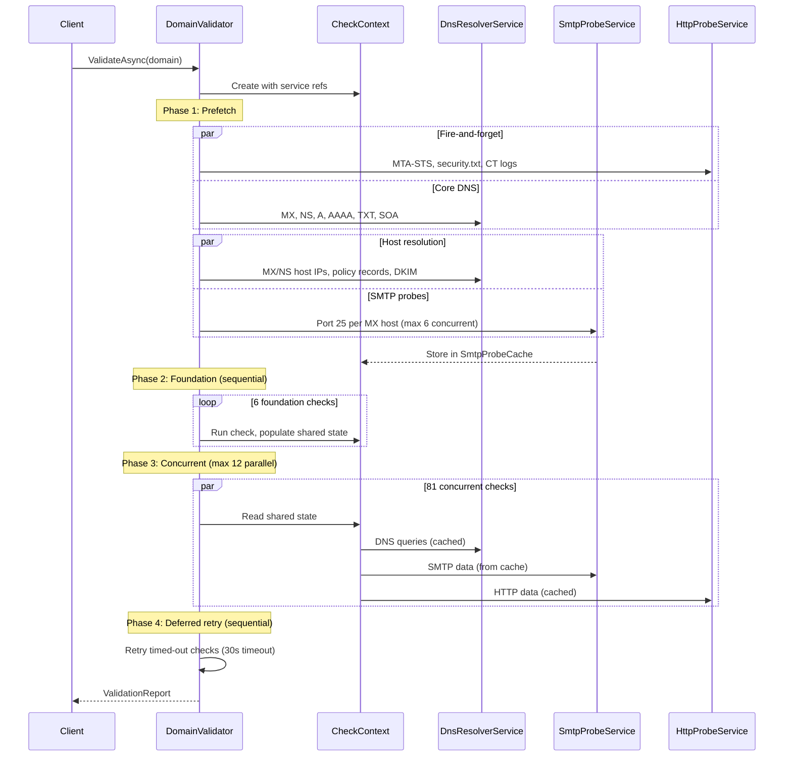

# Validation Pipeline & Data Flow

This document describes how EDNSV processes a domain validation from input to report output. The pipeline is implemented in `DomainValidator.ValidateAsync()` (`src/Ednsv.Core/DomainValidator.cs`).

## Pipeline Overview

```mermaid
flowchart TD
    INPUT["Domain Input"] --> SETUP["Create CheckContext<br/><i>Set recheck deps, init shared state</i>"]

    SETUP --> HTTP_BG["Fire-and-Forget HTTP Prefetch<br/><i>MTA-STS, security.txt, CT logs</i>"]
    SETUP --> PREFETCH

    subgraph PREFETCH["Phase 1: Prefetch"]
        direction TB
        P1["Core DNS Queries<br/><i>MX, NS, A, AAAA, TXT, SOA</i>"]
        P1 --> P2["Parallel Resolution<br/><i>MX/NS host IPs, policy records,<br/>DKIM selectors, PTR lookups</i>"]
        P2 --> P3["SMTP Probes<br/><i>Port 25 + submission ports 587/465<br/>Max 6 concurrent per validation</i>"]
    end

    PREFETCH --> FOUNDATION

    subgraph FOUNDATION["Phase 2: Foundation Checks (Sequential)"]
        direction TB
        F1["AuthoritativeNsCheck"] -->|"ctx.NsHosts, ctx.NsHostIps"| F2["ARecordCheck"]
        F2 -->|"ctx.DomainARecords"| F3["AAAARecordCheck"]
        F3 -->|"ctx.DomainAAAARecords"| F4["MxRecordsCheck"]
        F4 -->|"ctx.MxHosts, ctx.MxHostIps"| F5["SpfRecordCheck"]
        F5 -->|"ctx.SpfRecord"| F6["DmarcRecordCheck"]
        F6 -->|"ctx.DmarcRecord"| DONE_F["Foundation Complete"]
    end

    FOUNDATION --> CONCURRENT

    subgraph CONCURRENT["Phase 3: Concurrent Checks (Parallel, max 12)"]
        direction TB
        C1["81 checks run in parallel"]
        C1 --> C2{"Completed<br/>within 45s?"}
        C2 -->|Yes| C3["Collect results"]
        C2 -->|No| C4["Add to deferred retry list"]
    end

    CONCURRENT --> RETRY

    subgraph RETRY["Phase 4: Deferred Retry (Sequential)"]
        direction TB
        R1["Retry timed-out checks<br/><i>30s timeout, one at a time</i>"]
        R1 --> R2{"Completed?"}
        R2 -->|Yes| R3["Collect results"]
        R2 -->|No| R4["Report as Warning:<br/>'Check timed out'"]
    end

    RETRY --> AGG["Result Aggregation<br/><i>Ordered by original check position</i>"]
    AGG --> ERRORS["Surface DNS Query Errors<br/><i>Up to 20 errors shown</i>"]
    ERRORS --> REPORT["ValidationReport<br/><i>Domain, Timestamp, Duration, Results[]</i>"]

    style PREFETCH fill:#e8f4fd,stroke:#1a73e8
    style FOUNDATION fill:#fef7e0,stroke:#f9ab00
    style CONCURRENT fill:#e6f4ea,stroke:#34a853
    style RETRY fill:#fce8e6,stroke:#ea4335
```

## Phase Details

### Phase 1: Prefetch

Primes service caches before checks begin, minimizing network latency during the actual check execution. Implemented in `DomainValidator.PrefetchAsync()`.

**Fire-and-forget HTTP** (runs in background throughout the pipeline):
- `https://mta-sts.{domain}/.well-known/mta-sts.txt` (3 retries, email-critical)
- `https://{domain}/.well-known/security.txt` (1 retry, informational)
- `{crtShBaseUrl}?q={domain}&output=json` (1 retry, informational; base URL defaults to `https://crt.sh/`, configurable via the runtime config)

**DNS Phase 1** (concurrent):
- MX, NS, A, AAAA, TXT, SOA records for the domain

**DNS Phase 2** (concurrent, after Phase 1 completes):
- A/AAAA resolution for each MX and NS host
- Policy records: `_dmarc.`, `_mta-sts.`, `_smtp._tls.`, `_bimi.`
- Security records: CAA, CNAME, DS, DNSKEY
- DKIM selectors: `default`, `google`, `selector1`, `selector2` + custom
- PTR lookups for domain IPs

**SMTP Probes** (concurrent with DNS Phase 2, **per-validation** semaphore of `min(mxHosts.Count, 6)`):
- Port 25 probe per MX host (full handshake: CONNECT, BANNER, EHLO, STARTTLS, cert extraction)
- Port 587/465 reachability probes (fire-and-forget)
- Results stored in `CheckContext.SmtpProbeCache` for reuse by checks
- Prefetch is skipped entirely when `Options.EnableSmtpProbes == false`; only MX-host A-record resolution still runs so DNS-only checks (rDNS, blocklists) can proceed
- Trace logs include semaphore wait times (`[SMTP] SEMAPHORE WAIT host:25 waited Xms`) so probe-storm regressions are easy to spot

### Phase 2: Foundation Checks

Six checks run **sequentially** in fixed order. Each populates shared state in `CheckContext` that downstream checks depend on:

| Order | Check | Populates |
|-------|-------|-----------|
| 1 | `AuthoritativeNsCheck` | `ctx.NsHosts`, `ctx.NsHostIps` |
| 2 | `ARecordCheck` | `ctx.DomainARecords` |
| 3 | `AAAARecordCheck` | `ctx.DomainAAAARecords` |
| 4 | `MxRecordsCheck` | `ctx.MxHosts`, `ctx.MxHostIps` |
| 5 | `SpfRecordCheck` | `ctx.SpfRecord` |
| 6 | `DmarcRecordCheck` | `ctx.DmarcRecord` |

Each foundation check has a **45-second timeout**. If it times out, it is added to the deferred retry list (Phase 4).

Foundation checks also set **lookup failure flags** (`MxLookupFailed`, `NsLookupFailed`, etc.) when DNS responses indicate transient failures (SERVFAIL, timeout). Downstream checks use `ctx.SeverityForMissing()` to report Warning (uncertain) vs Info (definitively absent) based on these flags.

### Phase 3: Concurrent Checks

81 checks run in parallel using `Parallel.ForEachAsync` with `MaxDegreeOfParallelism = 12`. All concurrent checks are **read-only** on the shared state populated by foundation checks.

Each check is wrapped in a `CancellationTokenSource(45s)`; the token is passed into `ICheck.RunAsync(domain, context, ct)`. When the timeout fires, the running task observes the token and tears down its DNS/SMTP/HTTP awaits instead of being orphaned. The validator distinguishes:

- `OperationCanceledException` while `cts.IsCancellationRequested` → **timeout** → check queued for the deferred retry phase
- Any other exception → CheckResult with `Severity.Error` and the exception message

This replaced the older `Task.WhenAny(checkTask, Task.Delay(45s))` pattern, which kept the timed-out task running in the background and held its DNS/TCP slot until natural completion. Results are collected into a `ConcurrentBag` and then reordered to match the original check registration order for consistent output.

### Phase 4: Deferred Retry

Timed-out checks from both Phase 2 and Phase 3 get a second attempt, run **sequentially** with a **30-second `CancellationTokenSource`**. By this point, service caches are warmer (other checks may have resolved the same resources), so previously slow checks often complete quickly.

If a check still times out on retry, it produces a Warning result: "Check timed out — retried once".

### Result Aggregation

After all phases complete:
1. Results are ordered by the original check registration order.
2. DNS query errors from the validation are surfaced as a final Warning result (up to 20 errors shown). The error list comes from the per-validation `context.QueryErrors` bag (populated via the `DnsResolverService.CurrentQueryErrors` AsyncLocal), falling back to the shared `Dns.QueryErrors` for legacy CLI flows.
3. The `ValidationReport` is assembled with domain name, timestamp, duration, and all results.
4. Per-validation contexts are cleared in `finally`-style cleanup at the end of `ValidateAsync`:
   - `RecheckHelper.CurrentRecheckDeps.Value = CacheDep.None`
   - `DnsResolverService.CurrentQueryErrors.Value = null`
   - `TraceContext.Phase = null` / `TraceContext.Check = null` / `TraceContext.Sink = null`

Because all of these are `AsyncLocal`, each concurrent web validation operates against its own slots — there is no cross-bleed between simultaneous `/api/validate` jobs even though they share the singleton DNS/SMTP/HTTP services.

## Data Flow Sequence

## Timeout Strategy

| Phase | Timeout | Mechanism | On Timeout |
|-------|---------|-----------|------------|
| Foundation check | 45 s | `CancellationTokenSource` | Deferred to retry phase |
| Concurrent check | 45 s | `CancellationTokenSource` | Deferred to retry phase |
| Deferred retry | 30 s | `CancellationTokenSource` | Warning: "Check timed out" |
| Web API sync endpoint | 3 min | `CancellationTokenSource.CreateLinkedTokenSource(ct).CancelAfter(...)` | HTTP 504 |

The shorter retry timeout (30 s vs 45 s) reflects that service caches are warmer by the retry phase, so checks should complete faster if the data is available at all.

All timeouts now use `CancellationTokenSource` directly — the older `Task.WhenAny(check, Task.Delay(...))` pattern was removed because it left timed-out checks running in the background, holding DNS/TCP/HTTP slots until natural completion. Cancellation tokens propagate through `await` boundaries into the singleton services so the work actually stops.
